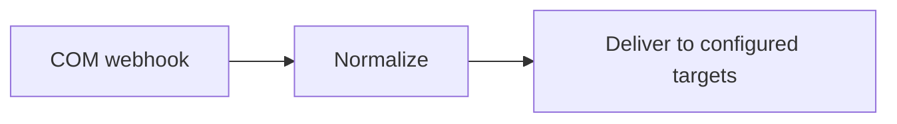
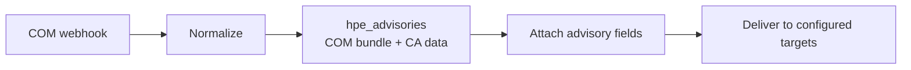
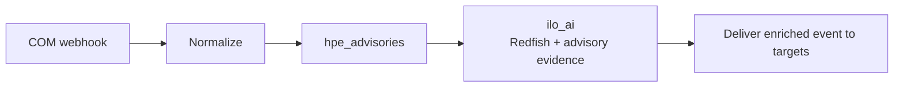
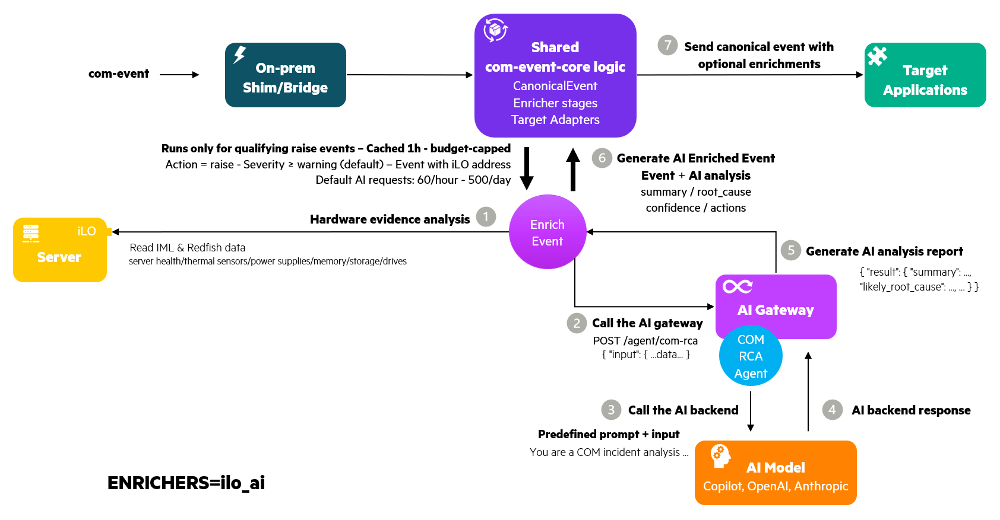
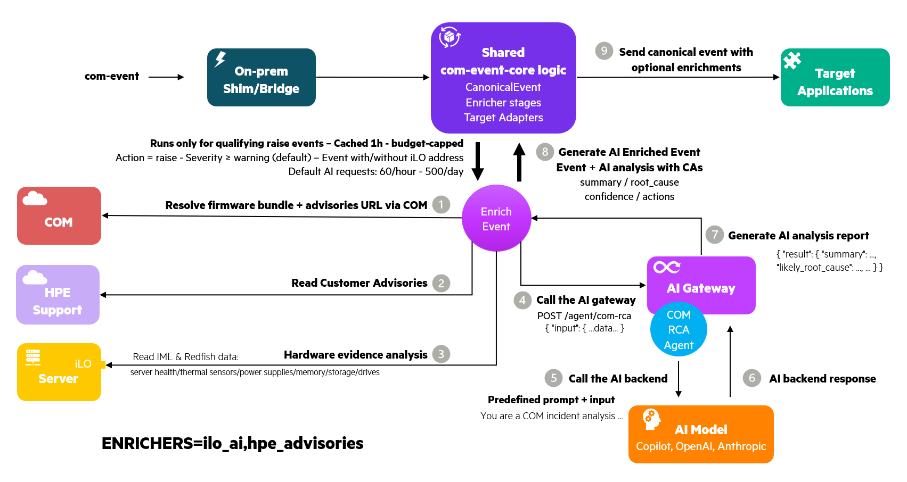
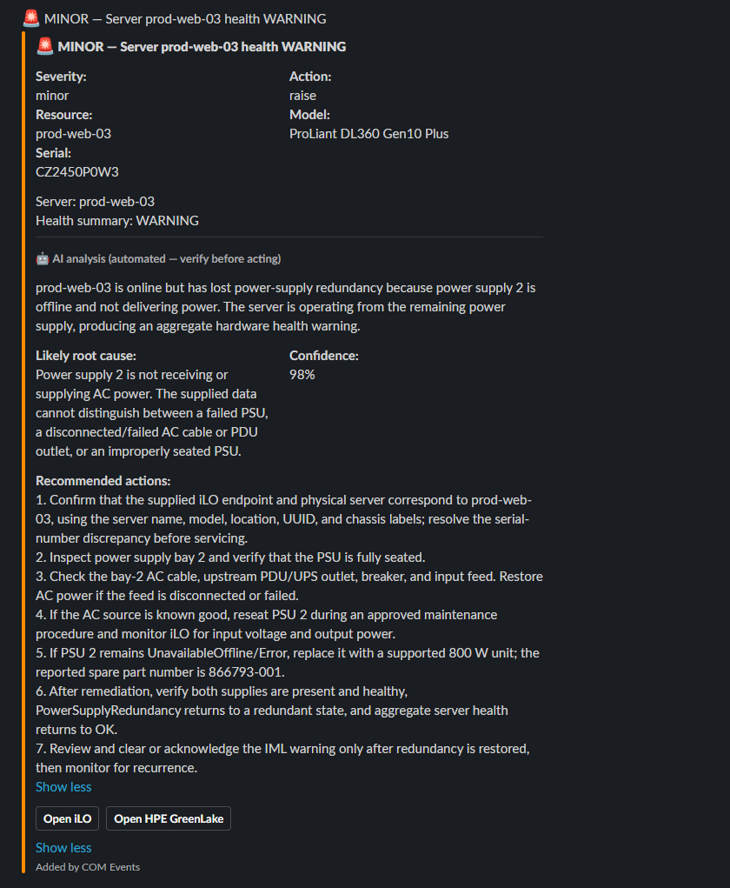
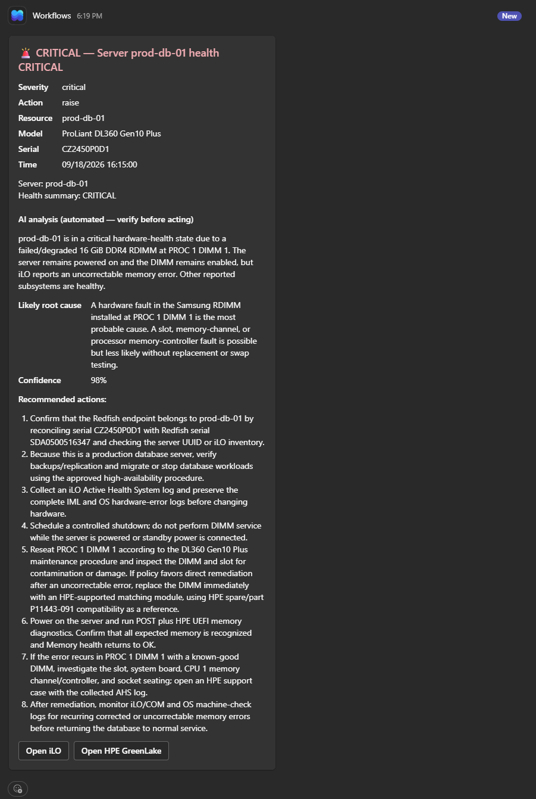
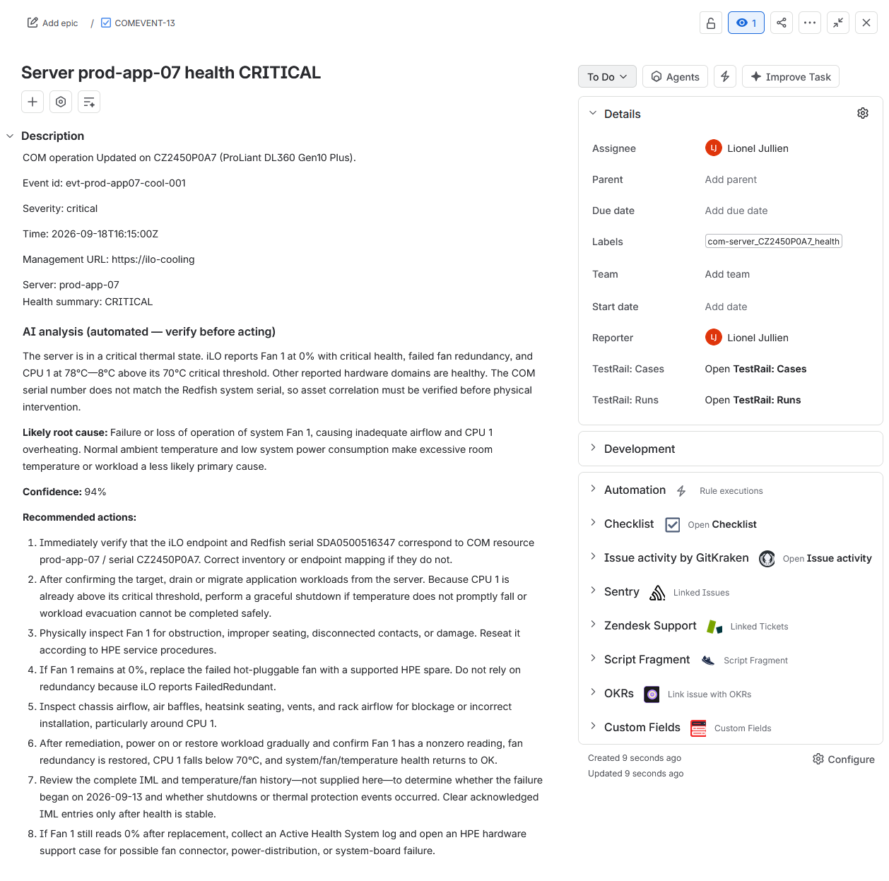

# HPE COM Event Integrations

Securely integrate **HPE Compute Ops Management (COM)** webhook events with **ITSM, ITOM, SIEM, SOAR, ChatOps, incident-response, and observability platforms** such as **HaloITSM**, **Jira Service Management, Splunk, Microsoft Sentinel, OBM, DataDog, Microsoft Teams, Slack, or any webhook-compatible target**.

The framework provides webhook validation, authentication, payload normalization, de-duplication, reliable delivery, raise/clear event correlation, and multiple deployment options, including an architecture that requires **no inbound network ports to be opened**.

The framework uses a shared `CanonicalEvent` model and a **rich, growing library of pluggable target adapters**: small, reusable components that translate normalized COM events into the API or webhook format expected by each destination. A single COM event can be **delivered simultaneously to multiple targets**, allowing the same event to trigger different workflows across ITSM, SIEM, monitoring, and collaboration platforms. COM-specific processing is implemented only once, while the same normalization, correlation, retry, and delivery logic is reused across all configured destinations. **New adapters can typically be added in minutes rather than days, with only a small amount of target-specific code.**

It also brings **AI-assisted incident investigation and remediation** to those deliveries: an optional stage where an AI agent analyzes the collected hardware evidence for a COM event and produces a structured incident report, observed facts kept separate from hypothesis, a likely root cause, a confidence assessment, and recommended diagnostic and remediation steps, attached to the ticket or chat message **before it is even created**. This turns event-driven operations from "a server is unhealthy" into "here's what's likely wrong, how sure we are, and what to do next." See [AI-assisted incident investigation and remediation](#ai-assisted-incident-investigation-and-remediation).

It ships as **ready-to-run, multi-architecture container images** published to **GitHub Container Registry (GHCR)** and configured entirely through environment variables and secrets: deploy quickly by passing your own parameters, with no code changes and nothing to build first.


> **Reference implementation**
>
> This repository provides open-source reference/sample implementations for HPE Compute Ops Management event integrations. It is **not an officially supported HPE product**. It is intended to demonstrate, accelerate, and simplify COM integration patterns and can be forked or adapted for specific environments.


---

## At a glance


Two deployment models are available:

- **Relay + Shim**: use a managed public cloud edge and keep the customer network outbound-only.
- **Bridge**: run a single all-in-one receiver when you can expose an HTTPS endpoint that COM can reach.

Both models share the same normalisation, de-duplication, correlation, and target-adapter logic from `com-event-core`.

---

## Contents

- [Why this project?](#why-this-project)
- [What it provides](#what-it-provides)
- [How it works](#how-it-works)
- [Typical use cases](#typical-use-cases)
- [Quick start](#quick-start)
- [Deployment models](#deployment-models)
- [Which deployment should I choose?](#which-deployment-should-i-choose)
- [Supported integrations](#supported-integrations)
- [AI-assisted incident investigation and remediation](#ai-assisted-incident-investigation-and-remediation)
- [When should I use a native COM integration?](#when-should-i-use-a-native-com-integration)
- [Monitoring resources](#monitoring-resources)
- [Projects in this repository](#projects-in-this-repository)
- [Container images](#container-images)
- [Documentation](#documentation)
- [Roadmap](#roadmap)
- [License](#license)

---

# Why this project?

COM can send server-health transitions and alerts to HTTPS endpoints through webhooks.

In theory, a target that supports webhooks could receive those events directly. In practice, enterprise integrations usually require more than simply forwarding an HTTP payload.

| Challenge | Why direct webhook delivery is often insufficient |
|---|---|
| **Compatibility** | A target may support webhooks without supporting COM's verification handshake, shared-secret authentication, or payload structure. |
| **Payload transformation** | ITSM, ITOM, SIEM, monitoring, and incident-response products usually expect their own API or event schema. |
| **Reliability** | Production delivery commonly requires retry, buffering, retention, de-duplication, and safe handling of target outages. |
| **Event lifecycle** | A fault and its later recovery need to be correlated so the item opened by the raise can be resolved or closed. |
| **Security** | Hosting a public receiver can require inbound firewall access, certificate management, credential protection, and clear operational ownership. |
| **Fan-out** | The same COM event may need to create an incident, feed a SIEM, and notify an operations channel at the same time. |

This repository provides that integration layer once, with shared logic that can be reused across all supported targets.

---

# What it provides

## COM webhook compatibility

The receiver handles the COM webhook contract, including:

- verification handshake
- shared-secret authentication
- request validation and input hardening
- COM payload parsing

## Normalised event model

Every COM event is first converted into a neutral `CanonicalEvent`, and only then handed to a target adapter for delivery:

```text
COM-specific processing
        |
        v
  CanonicalEvent
        |
        v
Target-specific adapter
```

This keeps COM-specific parsing in one place and isolates it from the API details of each destination platform (ServiceNow, Jira, OpsRamp, Splunk, Datadog, and others). Each adapter only needs to understand the `CanonicalEvent`, not the COM webhook format.

## Pluggable adapters

A target adapter is a small component that translates a `CanonicalEvent` into the request expected by a specific destination platform. Adding an integration is primarily that mapping:

```text
CanonicalEvent -> target API
```

The COM receiver does not need to be redesigned for every new target.

## De-duplication

Repeated or redelivered COM events are suppressed so retries do not create duplicate tickets or alerts.

## Raise / clear correlation

A stable `correlation_key` ties a problem event to its recovery event.

Targets that support stateful objects can therefore close or resolve the object opened by the original raise.

## Reliable delivery

Depending on the deployment model:

- **Relay + Shim** uses Azure Service Bus or AWS SQS as the durable queue.
- **Bridge** can use an on-disk spool.

This allows receive and delivery to be decoupled and provides retry when a target is temporarily unavailable.

## Multi-target fan-out

A single COM event can be delivered independently to several different target adapters.

## Ready-to-deploy containerized solution

The Relay, Shim, and Bridge are packaged as ready-to-run container images, so deployment is quick and consistent across environments. All settings are supplied through configuration: the same images run everywhere without code changes.

- **Fast deployment**: prebuilt images start with a single run command; nothing to compile or package first.
- **Consistent runtime**: the same image behaves identically across development, test, and production.
- **Minimal host dependencies**: no language runtime or libraries to install on the host; only a container engine is required.
- **Simple upgrades**: move to a new version by pulling an updated image tag.
- **Easy rollback**: return to a previous version by redeploying an earlier image tag.
- **Portable deployment**: the same images run on-premises or on supported cloud platforms; only the supplied configuration changes.
- **Automation-friendly**: configuration through environment variables and secrets fits naturally into CI/CD and infrastructure-as-code workflows.

All deployment-specific behavior is supplied through configuration, including:

- COM shared secret
- deployment mode
- Azure / AWS queue settings
- target selection
- target credentials
- server conditions to monitor
- de-duplication settings
- delivery and timeout settings


## Secure outbound-only option

With **Relay + Shim**, the public endpoint lives in Azure or AWS and the on-premises shim consumes from the queue using outbound connectivity.

With this model, **no inbound network path is required into the customer environment**. (The **Bridge** model does require inbound HTTPS, since COM connects to it directly.)

---

# How it works

The core architecture intentionally separates COM-specific logic from target-specific logic.


A new integration generally does **not** require changing the COM webhook receiver.

Instead, a target adapter maps:


This keeps the COM contract, de-duplication, correlation, and delivery behavior consistent across adapters.

---

# Typical use cases

- Create or update a ticket, incident, or issue in an ITSM or incident-response platform (ServiceNow, Jira, PagerDuty, GitHub, and others) when a COM-managed server becomes unhealthy.
- Automatically resolve or close that item when COM reports the condition has recovered.
- Forward COM hardware and server events to a SIEM, ITOM/AIOps, or observability platform (Splunk, OpsRamp, Datadog, Dynatrace, Grafana, and others) for search, correlation, audit, or operational monitoring.
- Post operational notifications to a ChatOps channel such as Microsoft Teams or Slack.
- Integrate COM with a platform that does not natively understand the COM webhook contract.
- Deliver COM events to an internal application **without opening inbound firewall ports**.
- Fan one COM event stream out to several operational systems at once, for example, open a ServiceNow incident, feed the same event to Splunk for audit, and post a Slack notification to the operations channel.
- Insert custom transformation, filtering, authentication, or enrichment between COM and the target.

---

# Quick start

**Need the simplest deployment?**

→ [`com-event-bridge`](com-event-bridge/)

**Need an outbound-only customer architecture with no inbound port into the customer network?**

→ [`com-event-relay`](com-event-relay/)

**Want to understand event normalisation or add a target adapter?**

→ [`com-event-core`](com-event-core/)

**Want the fastest path from an empty environment to a working COM-to-target pipeline?**

Follow an end-to-end deployment runbook:

- [Azure relay + on-prem shim](com-event-relay/docs/Deploy-End-to-End-to-Azure.md)
- [AWS relay + on-prem shim](com-event-relay/docs/Deploy-End-to-End-to-AWS.md)
- [Bridge (single-box on-prem)](com-event-bridge/docs/Deploy-End-to-End-On-Prem.md)

---

# Deployment models

## 1. Relay + Shim

Recommended when the target resides in a restricted or private customer network.


### Benefits

- No inbound port into the customer network
- Cloud-managed public HTTPS edge
- Durable cloud queue
- Receive and delivery are decoupled
- Target outages do not require COM to retry directly
- Public receive and target delivery are decoupled and can be operated independently
- Suitable for private/internal targets

### Trade-offs

- Requires Azure or AWS
- Requires a cloud queue
- Two components are deployed: relay and shim
- Cloud resources introduce some operational cost

See [`com-event-relay`](com-event-relay/) for deployment details and [`end-to-end Azure deployment runbook`](com-event-relay/docs/Deploy-End-to-End-to-Azure.md) and [`end-to-end AWS deployment runbook`](com-event-relay/docs/Deploy-End-to-End-to-AWS.md) for step-by-step instructions to deploy the solution from scratch.

---

## 2. Bridge

Recommended when you can expose a public HTTPS endpoint that COM can reach and want the smallest deployment footprint.


The bridge performs the complete pipeline in one process:

```text
receive
  -> authenticate
  -> normalise
  -> de-duplicate
  -> correlate
  -> transform
  -> forward
```

### Benefits

- Single container
- No managed-cloud dependency
- Simple deployment model
- Optional on-disk spool for durable retry
- Full delivery path remains under your control

### Trade-offs

- You operate the public edge
- Requires public DNS
- Requires a CA-signed TLS certificate
- Requires inbound HTTPS connectivity to the bridge
- You own host and certificate lifecycle
- A single bridge does not provide the same queue-level resilience or horizontal receive/deliver scaling as Relay + Shim

The repository includes nginx + certbot support to help operate the public TLS edge.

See [`com-event-bridge`](com-event-bridge/) for deployment details and [`end-to-end deployment runbook`](com-event-bridge/docs/Deploy-End-to-End-On-Prem.md) for step-by-step instructions to deploy the Bridge solution from scratch.


---

# Which deployment should I choose?


| Option | Use it when |
|---|---|
| **Relay + Shim** | You want the public edge in Azure/AWS, a durable queue, or no inbound network path into the customer environment. |
| **Bridge** | You can host the public HTTPS endpoint yourself and prefer a single all-in-one deployment. |
| **Native COM integration** | COM already provides a native integration for the target and that integration meets the requirement. |

---

## Why host the relay in Azure or AWS?

COM is a SaaS service and must send its webhook to a publicly reachable HTTPS endpoint.

That endpoint normally requires:

| Requirement | Managed-cloud relay |
|---|---|
| Public HTTPS URL | Provided by the managed application service |
| Valid TLS certificate | Managed by the platform |
| HTTPS ingress | Managed by the platform |
| Public host | Managed service rather than a customer-operated Internet-facing server |
| Scaling | Platform-managed |
| Durable buffering | Azure Service Bus or AWS SQS |

With the **Relay + Shim** architecture, only the cloud relay is publicly exposed. The on-premises shim connects outward to consume queued events and deliver them to the internal target.

This means there is **no inbound connection from COM into the customer network**.

---

## Which component does what?

| Feature | Bridge | Cloud Relay | On-prem Shim |
|---|---:|---:|---:|
| COM verification handshake | ✅ | ✅ | — |
| Shared-secret validation | ✅ | ✅ | — |
| Request/input hardening | ✅ | ✅ | — |
| Enqueue to durable cloud queue | — | ✅ | — |
| Consume from cloud queue | — | — | ✅ |
| Normalise to `CanonicalEvent` | ✅ | — | ✅ |
| De-duplication | ✅ | — | ✅ |
| Raise / clear correlation | ✅ | Event identity only | ✅ |
| Target adapter execution | ✅ | — | ✅ |
| Retry | ✅ via spool | Queue-driven | ✅ via redelivery |
| Durable buffer | Local spool | Cloud queue | Consumes cloud queue |
| Public HTTPS endpoint | ✅ you operate | ✅ platform-managed | — |
| Inbound customer-network path | Required | — | **Not required** |

For the exact count of queues, spools, and dedup stores per component (and
what changes, or doesn't, when AI enrichment is enabled), see [Durable state:
queues, spools, and dedup
stores](com-event-core/README.md#durable-state-queues-spools-and-dedup-stores)
in `com-event-core`.

---

# Supported integrations

This project ships with a rich set of built-in target adapters spanning **ITSM**, **ITOM / AIOps**, **SIEM**, **observability / monitoring**, and **incident-response / ChatOps**, plus a **generic webhook**, so a single COM event stream can drive service-management, operations, security, and collaboration platforms at the same time.

## Where the adapters live

All target adapters are implemented once in [`com-event-core`](com-event-core/) and reused by both deployment models, `com-event-relay` and `com-event-bridge`, so a fix or new mapping is inherited by both.

## Supported platforms

For the full list of supported platforms and their per-adapter details, category, role, authentication, whether COM offers a native integration, how a clear is delivered, and validation status, see the [supported-adapters table in `com-event-core`](com-event-core/README.md#supported-adapters), the single source of truth.

> ⚠️ **Reference implementations.** Every adapter is fully implemented against its target's API: connectivity, field mapping, authentication, and raise/clear handling are all in place. What is still pending for most is **validation against a live product**: the **GitHub**, **Slack**, **Teams**, and **Jira** adapters have been exercised end-to-end against a real target so far (raise *and* clear); the others have not yet been tested against a live instance (standing up every one of these platforms in a lab isn't feasible, and several also require paid licenses). Validate each adapter against your own environment before production use.
>
> 🙋 Contributions and live-tenant validation feedback are welcome. 

> 🚨 If you face any issue with an adapter integration, please [open an issue](https://github.com/jullienl/HPE-COM-Event-Integrations/issues) in the project.


**Target not listed?** You have two options:

- **Use the generic `webhook` adapter** to POST the `CanonicalEvent` as JSON to any HTTP endpoint, no code required.
- **Add your own adapter** if the target needs a specific API or payload shape, see [adding a new target](com-event-core/README.md#adding-a-new-target).


## Selecting one or more targets

Target adapters are selected with the `TARGETS` environment variable. Specify a single adapter or a comma-separated list to deliver each COM event to multiple destinations:

```bash
TARGETS=<name>
TARGETS=<name>,<name>,<name>
```

For example, to deliver events to Splunk, Microsoft Teams, and Jira Service Management:

```bash
TARGETS=splunk,teams,jira
```

Each adapter reads its own connection settings, URLs, credentials, tokens, and other target-specific parameters, from environment variables or mounted secret files. See [`com-event-core`](com-event-core/) and the individual project READMEs for configuration details.

### Multi-target delivery behavior

Each target is processed independently. De-duplication and raise/clear state are tracked per adapter, so the failure of one destination does not cause successful deliveries to be repeated.

If one target is temporarily unavailable:

1. deliveries to the other targets remain successful
2. the failed adapter is retried
3. successful deliveries are not duplicated

For reliable multi-target delivery, use the **Relay + Shim** queue or **Bridge spool mode**. Bridge `sync` mode is best-effort and does not provide durable retry.

> **Current limitation:** Multiple instances of the same adapter type, for example, two generic webhook targets or two Slack destinations, are not yet supported because adapters currently use global environment-variable names. Per-instance adapter configuration is listed in the [Roadmap](#roadmap).

---

# AI-assisted incident investigation and remediation

Optional, **off by default**, and layered on top of every target adapter above: before an event is delivered, an AI agent can analyze the hardware evidence collected for it and produce a structured incident report that lands **inside** the ticket, issue, or chat message at creation, not bolted on afterward.

The report keeps **observed facts**, the specific signals found in the data, separate from **hypothesis**: it proposes a likely root cause, assesses its own confidence in that cause, and recommends further diagnostic checks and concrete remediation actions, without presenting an unverified guess as a definitive conclusion. Intelligent, event-driven operations, not just event forwarding.

### How the analysis is built

COM provides the event and the affected server's state transition, but the
event alone does not contain the full hardware diagnosis. For an eligible
server raise event, the on-premises shim or bridge uses the iLO address carried
by the event to collect additional evidence from multiple Redfish resources,
including overall server health, thermal sensors, power supplies, memory,
storage and drives. It also reads the Integrated Management Log (IML) and keeps
the relevant non-OK entries.

The collected evidence is bounded to the most relevant component data and IML
messages, then sent to the AI analyzer together with the original COM event.
The analyzer uses this broader hardware context to produce the summary, likely
root cause, confidence, and recommended actions that are added to the ticket,
issue, or chat message. This gives the analysis component-level and historical
evidence that is not available in the COM event by itself.

### Choose an enrichment mode

`ENRICHERS` is configured on the on-premises Shim or Bridge. It is unset by
default, while `TARGETS` selects the destination adapters. For Bridge
deployments, enrichment requires `DELIVERY_MODE=spool` with a durable
`SPOOL_PATH`; enrichment configuration errors fail startup, while per-event
enrichment failures fail open and do not block delivery.

| Configuration | Prerequisites | Result |
|---|---|---|
| Unset or empty | Normal delivery configuration | Delivers the normalized event without advisory, iLO, or AI enrichment. |
| `hpe_advisories` | `COM_BASE_URL` plus COM client credentials or `COM_PAT` | Resolves firmware-bundle advisories and compliance for eligible server raises; adds advisory fields and matched references. It does not call the AI analyzer or populate `analysis_*`. |
| `ilo_ai` | `AI_ANALYZER_URL`, iLO credentials, and a reachable event management URL | Collects bounded Redfish evidence and calls the analyzer; adds `analysis_summary`, `analysis_root_cause`, `analysis_confidence`, and `analysis_actions`. |
| `hpe_advisories,ilo_ai` | All prerequisites above | Adds advisory context and sends it with Redfish evidence to the analyzer. Enricher priority guarantees `hpe_advisories` runs before `ilo_ai`, regardless of the order in the setting. |

Examples:

```bash
# Baseline delivery; enrichment disabled
unset ENRICHERS

# Advisory context only; no AI call
ENRICHERS=hpe_advisories

# AI analysis from Redfish evidence only
ENRICHERS=ilo_ai

# Advisory context plus AI analysis
ENRICHERS=hpe_advisories,ilo_ai
```

**Baseline pipeline**



**Advisory-only pipeline**



**Combined advisory and AI pipeline**



### What happens when iLO or the analyzer is unavailable?

AI analysis is fail-open and is optional enrichment, not a prerequisite for
delivery:

- If the iLO is unreachable or the iLO credentials are incorrect, the event is
  still delivered, but no AI analysis report is produced because the analyzer
  is not called.
- If an individual Redfish resource is missing or a component request fails,
  the remaining evidence can still be sent to the analyzer, so the report may
  contain less information.
- If the analyzer itself is unavailable or returns an invalid response, the
  event is still delivered without AI analysis.
- If the analyzer returns only some report fields, adapters render only those
  fields. Missing summary, root-cause, confidence, or recommended-action data
  is omitted rather than shown as an empty section.

This prevents a BMC outage, incorrect password, or AI-service outage from
blocking the underlying COM event or turning it into a delivery retry loop.

### Latency, throughput, and backpressure

Enrichment is called **serially, one raise event at a time**, by the same
single worker thread that already drains the Bridge's spool or the Shim's
queue, so there is no worker pool or concurrent enrichment. Several mechanisms
bound how much that costs, and it never blocks the COM webhook response
itself: `DELIVERY_MODE=spool` already acks COM with `202` before enrichment
runs, which is why `ENRICHERS` refuses to start with `DELIVERY_MODE=sync`.

- **Gating** skips the analyzer entirely for clears, low-severity events, and
  events with no `mgmt_url`.
- **Caching** (`AI_CACHE_TTL_SECONDS`, default 1h) reuses a repeat raise's
  result instead of calling the analyzer again.
- **Budget caps** (`AI_MAX_ANALYSES_PER_HOUR` / `AI_MAX_ANALYSES_PER_DAY`) trip
  a circuit breaker that skips analysis, at near-zero cost, once exhausted.
- **A per-call timeout** (`AI_TIMEOUT`, default 90s) bounds a hung analyzer
  instead of blocking the worker forever.

None of this adds a new queue, spool, or dedup store: the cache and budget
counter above live in memory in the enrichment process and are lost on
restart, so enabling `ENRICHERS` never changes the queue/spool/dedup counts
described for the [Relay + Shim](#which-component-does-what) or
[Bridge](com-event-bridge/README.md) deployment models.

If the analyzer is merely *slow* rather than down, the worker still spends up
to `AI_TIMEOUT` seconds per raise, so the backlog can drain slower than events
arrive:

- **Bridge**: the on-disk spool keeps growing, bounded by `SPOOL_MAX_BYTES`
  (default 50 MB). Once full, new events are rejected (`503`), and since COM
  never retries a failed delivery, those events are lost. A single bridge has
  no built-in way to add worker concurrency (one SQLite spool, one writer).
- **Shim**: messages queue up in the durable cloud queue instead, safely, but
  consumer lag grows. Running additional shim replicas against the same queue
  (Service Bus/SQS both support multiple consumers) adds real concurrency here.

Splitting monitored conditions across separate deployments (see
[Splitting monitors across multiple deployments](#splitting-monitors-across-multiple-deployments))
also isolates this: a slow analyzer call for one condition then only stalls
that deployment's worker, not delivery for every other condition.

A ready-to-run analyzer for it, the [AI Gateway](https://github.com/jullienl/ai-gateway) (a separate, standalone repo): it can run on **GitHub Copilot, OpenAI, or Anthropic**, picked per request, so it fits whichever of those you already have rather than requiring a new subscription. Any service that implements the same small HTTP contract works in its place, see [bring your own model](https://github.com/jullienl/ai-gateway#no-github-copilot-license-bring-your-own-model) for a minimal analyzer built on any other provider.

→ **[AI analysis enrichment](com-event-core/README.md#ai-analysis-enrichment)** in `com-event-core` is the full write-up: enabling `ENRICHERS=ilo_ai` or `ENRICHERS=hpe_advisories,ilo_ai`, running the gateway, the exact fields returned, and what shows up in the ticket.



### Customer Advisories enrichment flow

The CA-aware flow resolves the firmware bundle and advisory data through COM
before sending the combined event, Redfish, and advisory evidence to the AI
gateway.



### What it looks like

Three raise events, each with a different injected hardware fault, delivered with their AI analysis attached at creation:

| Slack — power fault | Teams — memory fault | Jira — cooling fault |
|---|---|---|
|  |  |  |

---

# When should I use a native COM integration?

If COM already provides a native integration for the target **and it meets your requirements**, that path is normally the simplest option.

Today, this is particularly relevant for **ServiceNow** and **OpsRamp**.

Use the native integration when:

- the native integration's connectivity and workflow requirements meet your needs
- the native payload and behavior meet your requirements
- you do not need an additional buffering or transformation layer

Use this framework when you need capabilities such as:

- **no inbound firewall port into the customer environment**
- durable buffering and retry
- custom payload transformation or enrichment
- de-duplication
- raise/clear lifecycle correlation
- fan-out to several targets
- a target without native COM support
- a single shared integration architecture across multiple target products

Even for ServiceNow or OpsRamp, Relay + Shim can be useful when the internal endpoint must remain private.

---

# Monitoring resources

The framework normalises three COM resource families: server snapshots, alert
lifecycle events, and a generic fallback for anything else. Servers are the
richest case: one webhook snapshot can evaluate several independent
conditions at once, each with its own raise/clear lifecycle, controlled by
`SERVER_MONITORS`.

## Description

| Resource | Delivered COM `type` | Behavior |
|---|---|---|
| Server | `compute-ops-mgmt/server` | Evaluates configured conditions such as health, power, connection, and subscription |
| Alert | `compute-ops-mgmt/alert` | Raises on alert creation and clears when the alert is resolved/deleted |
| Generic | Other resource types | Delivered as a generic raise event |

## Server conditions

A COM server webhook delivers the server's **full current state**, not a diff
of what changed. `SERVER_MONITORS` tells the framework which conditions
inside that snapshot to turn into raise/clear events:

```bash
SERVER_MONITORS=health,power,connection,subscription
```

`health` is the default when `SERVER_MONITORS` is unset.

| Condition | Raises when | Clears when | Canonical severity |
|---|---|---|---|
| `health` *(default)* | Hardware health summary leaves `OK` | Health summary returns to `OK` | Mapped from COM's own health value |
| `power` | Server powers off | Server powers back on | `warning` |
| `connection` | Server disconnects from COM | Server reconnects to COM | `major` |
| `subscription` | Subscription leaves `SUBSCRIBED`, or expires | Subscription is `SUBSCRIBED` and not expired | `minor` |

### Monitoring more than one condition at a time

Each enabled condition is evaluated independently and gets its own
correlation identity:

```text
server:<serial>:health
server:<serial>:power
server:<serial>:connection
server:<serial>:subscription
```

So, for example, `SERVER_MONITORS=health,power` on one server raises and
clears a health incident and a power incident independently: recovering
power never closes a health incident, and vice versa.

Because a server webhook is a full-state snapshot, **every enabled condition
is re-evaluated on every delivery**, not only the one that actually changed.
A healthy condition therefore produces a repeated clear candidate on every
snapshot:

- De-duplication suppresses the repeated no-op clears for **stateful**
  targets (ServiceNow, Jira, GitHub, and others): they search for an open
  item to close and silently do nothing when none exists.
- **Post-only chat adapters** (Slack, Teams) have no such lookup: they
  simply post. So with `SERVER_MONITORS=health,power`, a snapshot with
  critical health but healthy power posts both a critical **health** message
  and a `Resolved` **power** message, on every delivery. This is accurate
  (power really is healthy), just noisier in chat.

**Recommendation:** enable only the conditions you actually want alerts on,
rather than all four by default.

### Splitting monitors across multiple deployments

Running one shim/bridge deployment **per monitored condition**, instead of
one deployment with `SERVER_MONITORS=health,power,connection,subscription`,
is a supported pattern. It does not, by itself, reduce total message volume
(see above); it's worth it when you want:

- **Per-condition target routing.** `TARGETS` and every adapter's
  configuration (`SLACK_WEBHOOK_URL`, `GITHUB_REPO`, and so on) apply
  uniformly to every condition a deployment evaluates, and adapters read
  fixed global environment variables, so one process cannot send `health` to
  one Slack channel and `power` to another (see [Current
  limitations](com-event-core/README.md#current-limitations)). Two
  deployments, each with its own `SERVER_MONITORS` and adapter config, can.
- **No cross-condition noise in a shared channel.** If each deployment only
  enables the conditions it should alert on, a post-only chat adapter (Slack,
  Teams) never posts a `Resolved` message for a condition nobody asked that
  channel about.
- **Isolating AI-enrichment latency.** Enrichment runs serially on a single
  worker thread per deployment; a slow analyzer call triggered by one
  condition can delay delivery for every other condition sharing that
  process. Separate deployments isolate that blast radius, see [Latency,
  throughput, and
  concurrency](com-event-core/README.md#latency-throughput-and-concurrency)
  in `com-event-core`.
- **Independent failure domains.** A stuck target, a full spool, or an
  exhausted AI budget for one condition's deployment doesn't affect another.

**What it costs:** each split-out deployment needs its own pair of COM
webhook subscriptions (raise + clear) for that transition, its own
container/process, and its own secrets, adding more moving parts to deploy
and monitor than one deployment with several conditions enabled. For
**Relay + Shim**, each split deployment also needs its **own queue**: a
queue is drained by competing consumers, so pointing two differently
configured shims at the *same* queue means each message is delivered to only
one of them, silently dropping whichever condition that shim doesn't
monitor. See [Multiple Shim consumers](com-event-relay/README.md#multiple-shim-consumers)
for the underlying constraint. The **Bridge**'s spool is already local to
each process, so this doesn't apply there.

**When one deployment is enough:** every monitored condition should go to
the same target(s) and you don't need to isolate AI-enrichment latency.
Enabling only the conditions you care about (see above) already removes the
chat-noise problem without splitting anything.

## COM event lifecycle

For lifecycle-aware integrations, configure COM to send both:

1. the **problem transition**
2. the **recovery transition**

to the same relay or bridge endpoint.

The framework then assigns a stable correlation key, conceptually:

```text
server:<serial>:<condition>
```

or:

```text
alert:<id>
```

A later clear can therefore resolve the exact object created by the raise.

De-duplication also includes the event action, so a raise and its clear are never mistaken for the same delivery.

For the exact COM webhook filters and lifecycle examples, see the project documentation and [`com-event-core`](com-event-core/).

---

# Projects in this repository

- [`com-event-relay`](com-event-relay/): cloud relay + outbound-only shim; use when the internal target must **not** be directly reachable from COM.
- [`com-event-bridge`](com-event-bridge/): single-box all-in-one receiver; use when you can host the public HTTPS endpoint yourself and want the smallest footprint.
- [`com-event-core`](com-event-core/): shared package (`CanonicalEvent`, normalisation, de-duplication, raise/clear correlation, all built-in adapters) used by both deployment models, so a fix or new mapping is made once and inherited by both.

---

# Container images

CI builds multi-architecture images for `amd64` and `arm64` and publishes them to GHCR.

```text
ghcr.io/jullienl/com-event-relay
ghcr.io/jullienl/com-event-shim
ghcr.io/jullienl/com-event-bridge
```

The images are self-contained. Building from the repository root includes the local `com-event-core` package, so a separate package publication step is not required.

---

# Documentation

## End-to-end deployment runbooks

Use the deployment runbooks for the fastest path from an empty environment to a working COM-to-target pipeline:

- [`Azure end-to-end deployment`](com-event-relay/docs/Deploy-End-to-End-to-Azure.md): Azure relay + on-prem shim
- [`AWS end-to-end deployment`](com-event-relay/docs/Deploy-End-to-End-to-AWS.md): AWS relay + on-prem shim
- [`Bridge end-to-end deployment`](com-event-bridge/docs/Deploy-End-to-End-On-Prem.md): single-box on-prem deployment

Each flow covers the public receiver, COM webhooks, raise/clear behavior, and target delivery.

## Reference documentation

- [`ARCHITECTURE.md`](ARCHITECTURE.md): implementation-level architecture and process mapping
- [`com-event-core/README.md`](com-event-core/README.md): adapter framework and adding new targets
- [`com-event-relay/README.md`](com-event-relay/README.md): relay/shim architecture and configuration
- [`com-event-bridge/README.md`](com-event-bridge/README.md): bridge configuration and deployment
- [`com-event-bridge/HARDENING.md`](com-event-bridge/HARDENING.md): on-prem hardening guidance
- [`AI Gateway`](https://github.com/jullienl/ai-gateway) (separate repo): the ready-to-run analyzer behind `ENRICHERS=ilo_ai` — only needed when [AI-assisted incident investigation](#ai-assisted-incident-investigation-and-remediation) is enabled

---

# Roadmap

Planned or candidate improvements include:

- **Async post-creation AI analysis**  
  Deliver the ticket immediately, run the [AI analysis](com-event-core/README.md#ai-analysis-enrichment) out-of-band, then append it to the already-created item (a comment on the GitHub/Jira issue, a thread reply in Slack/Teams). Removes analysis latency from the delivery path entirely. Needs an `update(event)` addition to the adapter contract for stateful targets.

- **Concurrent AI enrichment**  
  `ENRICHERS` currently runs serially, one raise event at a time, on the same worker thread that drains the Bridge's spool or the Shim's queue (see [Latency, throughput, and concurrency](com-event-core/README.md#latency-throughput-and-concurrency)). A worker pool for enrichment would let a slow analyzer call delay only its own event, without needing to split conditions across separate deployments.

- **Multiple instances of the same adapter type**  
  Add per-instance configuration namespaces so two webhooks, two Slack targets, or two instances of another adapter can coexist.

- **Shared de-duplication backend for horizontal Shim scaling**  
  The Shim's dedup store is local SQLite, so running several Shim instances against the same queue (see [Multiple Shim consumers](com-event-relay/README.md#multiple-shim-consumers)) can reduce duplicate-suppression consistency. Moving dedup state to a shared backend would make multi-consumer Shim scaling safe.

- **Additional live-tenant validation**  
  Exercise more built-in adapters end-to-end against real target environments.

- **More target adapters**  
  New integrations remain small `CanonicalEvent -> target API` mappings in `com-event-core`.

- **HPE GreenLake (GLP) eventing-framework webhooks**  
  Extend the same relay/bridge to also receive HPE GreenLake webhooks alongside COM. 

- **Additional shim deployment helpers**  
  Provide ready-made ways to run the on-prem outbound shim as a supervised, auto-restarting service, for example a `systemd` unit for bare-metal/VM hosts and a Compose/Kubernetes manifest for container hosts, so it survives reboots and crashes without manual intervention.

- **Infrastructure-as-code templates**  
  Add declarative templates (Azure Bicep, AWS CloudFormation) that create the cloud relay stack, the receiver, the durable queue, and the required roles, in one reproducible command, plus a simplified parameter-driven entry point instead of running many individual CLI steps.

Contributions and real-world adapter feedback are welcome.

---

# License

MIT: see [`LICENSE`](LICENSE).
