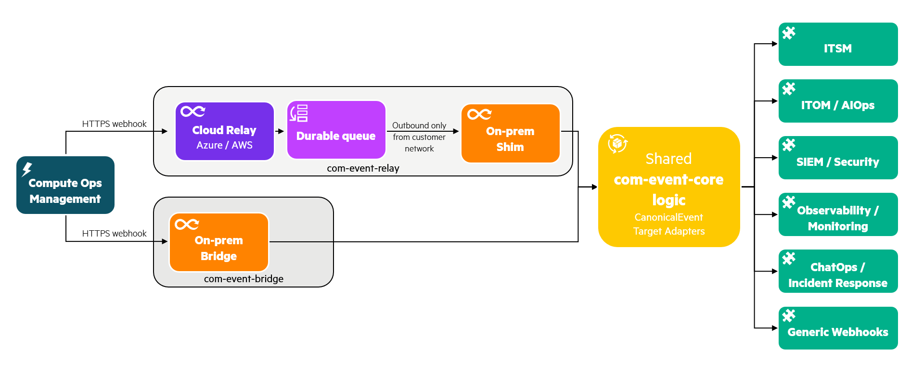
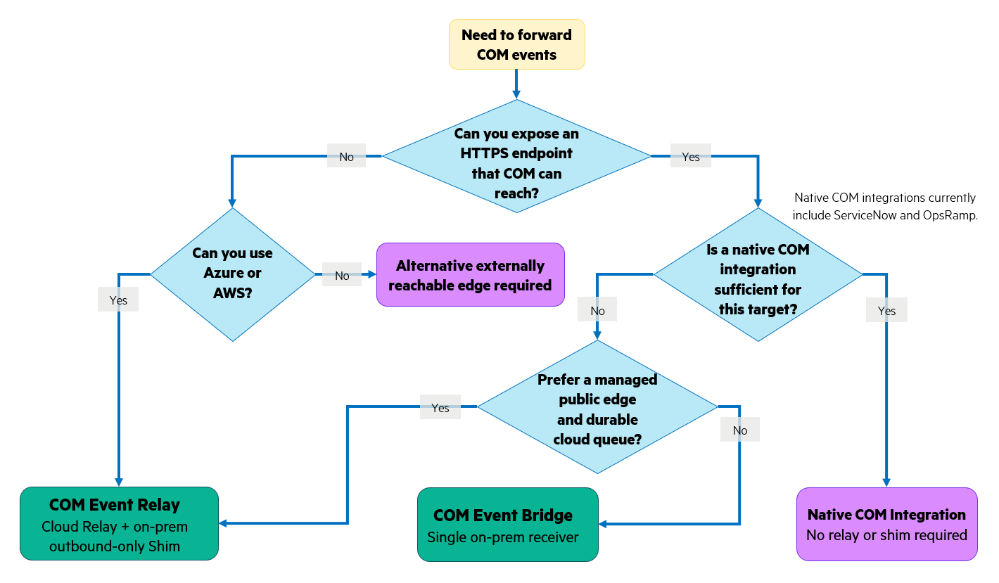
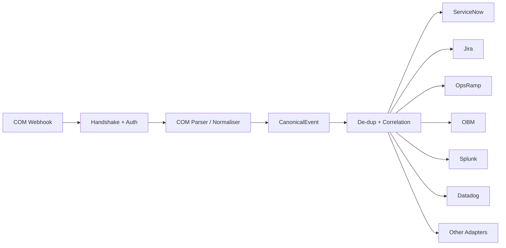

# HPE COM Event Integrations

Securely integrate **HPE Compute Ops Management (COM)** webhook events with **ITSM, ITOM, SIEM, SOAR, ChatOps, incident-response, and observability platforms** — with webhook validation, authentication, payload normalisation, de-duplication, reliable delivery, raise/clear correlation, and an architecture option that requires **no inbound network port into the customer environment**.

The framework uses a shared `CanonicalEvent` model and pluggable target adapters, so COM-specific processing is implemented once and the same delivery logic can be reused across many operational platforms.

It ships as **ready-to-run, multi-architecture container images** (published to GHCR) that are configured entirely through environment variables and secrets — deploy quickly by passing your own parameters, with no code changes and nothing to build first.

> **Reference implementation**
>
> This repository provides open-source reference/sample implementations for HPE Compute Ops Management event integrations. It is **not an officially supported HPE product**. It is intended to demonstrate, accelerate, and simplify COM integration patterns and can be forked or adapted for specific environments.


---

## At a glance



Two deployment models are available:

- **Relay + Shim** — use a managed public cloud edge and keep the customer network outbound-only.
- **Bridge** — run a single all-in-one receiver when you can expose an HTTPS endpoint that COM can reach.

Both models share the same normalisation, de-duplication, correlation, and target-adapter logic from `com-event-core`.

---

## Contents

- [Why this project?](#why-this-project)
- [What it provides](#what-it-provides)
- [Typical use cases](#typical-use-cases)
- [Quick start](#quick-start)
- [Deployment models](#deployment-models)
- [Which deployment should I choose?](#which-deployment-should-i-choose)
- [Supported integrations](#supported-integrations)
- [When should I use a native COM integration?](#when-should-i-use-a-native-com-integration)
- [How it works](#how-it-works)
- [Delivering to multiple targets](#delivering-to-multiple-targets)
- [COM event lifecycle](#com-event-lifecycle)
- [Projects in this repository](#projects-in-this-repository)
- [Container images](#container-images)
- [Documentation](#documentation)
- [Adapter validation status](#adapter-validation-status)
- [Roadmap](#roadmap)
- [License](#license)

---

# Why this project?

COM can send server-health transitions and alerts to HTTPS endpoints through webhooks.

In theory, a target that supports webhooks could receive those events directly. In practice, enterprise integrations usually require more than simply forwarding an HTTP payload.

| Challenge | Why direct webhook delivery is often insufficient |
|---|---|
| **Compatibility** | A target may support webhooks without supporting COM's verification handshake, shared-secret authentication, or payload structure. |
| **Payload transformation** | ITSM, ITOM, SIEM, monitoring, and incident-response products usually expect their own API or event schema. |
| **Reliability** | Production delivery commonly requires retry, buffering, retention, de-duplication, and safe handling of target outages. |
| **Event lifecycle** | A fault and its later recovery need to be correlated so the item opened by the raise can be resolved or closed. |
| **Security** | Hosting a public receiver can require inbound firewall access, certificate management, credential protection, and clear operational ownership. |
| **Fan-out** | The same COM event may need to create an incident, feed a SIEM, and notify an operations channel at the same time. |

This repository provides that integration layer once, with shared logic that can be reused across all supported targets.

---

# What it provides

## COM webhook compatibility

The receiver handles the COM webhook contract, including:

- verification handshake
- shared-secret authentication
- request validation and input hardening
- COM payload parsing

## Normalised event model

COM events are transformed into a neutral `CanonicalEvent` before target-specific delivery.

That separates:

```text
COM-specific processing
        |
        v
  CanonicalEvent
        |
        v
Target-specific adapter
```

from the API details of ServiceNow, Jira, OpsRamp, Splunk, Datadog, and other platforms.

## Reliable delivery

Depending on the deployment model:

- **Relay + Shim** uses Azure Service Bus or AWS SQS as the durable queue.
- **Bridge** can use an on-disk spool.

This allows receive and delivery to be decoupled and provides retry when a target is temporarily unavailable.

## De-duplication

Repeated or redelivered COM events are suppressed so retries do not create duplicate tickets or alerts.

## Raise / clear correlation

A stable `correlation_key` ties a problem event to its recovery event.

Targets that support stateful objects can therefore close or resolve the object opened by the original raise.

## Multi-target fan-out

A single COM event can be delivered independently to several different target adapters.

## Pluggable adapters

Adding an integration is primarily a mapping from:

```text
CanonicalEvent -> target API
```

The COM receiver does not need to be redesigned for every new target.

## Ready-to-deploy containerized solution

The Relay, Shim, and Bridge are packaged as ready-to-run container images, so deployment is quick and consistent across environments. All settings are supplied through configuration — the same images run everywhere without code changes.

- **Fast deployment** — prebuilt images start with a single run command; nothing to compile or package first.
- **Consistent runtime** — the same image behaves identically across development, test, and production.
- **Minimal host dependencies** — no language runtime or libraries to install on the host; only a container engine is required.
- **Simple upgrades** — move to a new version by pulling an updated image tag.
- **Easy rollback** — return to a previous version by redeploying an earlier image tag.
- **Portable deployment** — the same images run on-premises or on supported cloud platforms; only the supplied configuration changes.
- **Automation-friendly** — configuration through environment variables and secrets fits naturally into CI/CD and infrastructure-as-code workflows.

All deployment-specific behavior is supplied through configuration, including:

- COM shared secret
- deployment mode
- Azure / AWS queue settings
- target selection
- target credentials
- server conditions to monitor
- de-duplication settings
- delivery and timeout settings


## Secure outbound-only option

With **Relay + Shim**, the public endpoint lives in Azure or AWS and the on-premises shim consumes from the queue using outbound connectivity.

**No inbound network path is required into the customer environment.**

---

# Typical use cases

- Create or update an ITSM incident when a COM-managed server becomes unhealthy.
- Automatically resolve an incident when COM reports that the condition has recovered.
- Forward COM hardware and server events to a SIEM platform for search, correlation, or audit.
- Send events to an ITOM/AIOps platform for operational correlation.
- Feed observability and monitoring platforms such as Datadog, Dynatrace, or Grafana.
- Trigger PagerDuty incidents from COM events.
- Post operational notifications to Microsoft Teams or Slack.
- Create GitHub or Jira issues from COM events.
- Integrate COM with a platform that does not natively understand the COM webhook contract.
- Deliver COM events to an internal application **without opening inbound firewall ports**.
- Fan one COM event stream out to several operational systems at once.
- Insert custom transformation, filtering, authentication, or enrichment between COM and the target.

---

# Quick start

**Need the simplest deployment?**

→ [`com-event-bridge`](com-event-bridge/)

**Need an outbound-only customer architecture with no inbound port into the customer network?**

→ [`com-event-relay`](com-event-relay/)

**Want to understand event normalisation or add a target adapter?**

→ [`com-event-core`](com-event-core/)

---

# Deployment models

## 1. Relay + Shim

Recommended when the target resides in a restricted or private customer network.

```text
COM
 |
 | HTTPS webhook
 v
Public Cloud Relay
 |
 v
Azure Service Bus / AWS SQS
 |
 | outbound connection from customer environment
 v
On-prem Shim
 |
 v
Target application
```

### Benefits

- No inbound port into the customer network
- Cloud-managed public HTTPS edge
- Durable cloud queue
- Receive and delivery are decoupled
- Target outages do not require COM to retry directly
- Public receive and target delivery are decoupled and can be operated independently
- Suitable for private/internal targets

### Trade-offs

- Requires Azure or AWS
- Requires a cloud queue
- Two components are deployed: relay and shim
- Cloud resources introduce some operational cost

See [`com-event-relay`](com-event-relay/) for deployment details and [`end-to-end Azure deployment runbook`](com-event-relay/docs/Deploy-End-to-End-to-Azure.md) and [`end-to-end AWS deployment runbook`](com-event-relay/docs/Deploy-End-to-End-to-AWS.md) for step-by-step instructions to deploy the solution from scratch.

---

## 2. Bridge

Recommended when you can expose a public HTTPS endpoint that COM can reach and want the smallest deployment footprint.

```text
COM
 |
 | HTTPS webhook
 v
On-prem Bridge
 |
 v
Target application
```

The bridge performs the complete pipeline in one process:

```text
receive
  -> authenticate
  -> normalise
  -> de-duplicate
  -> correlate
  -> transform
  -> forward
```

### Benefits

- Single container
- No managed-cloud dependency
- Simple deployment model
- Optional on-disk spool for durable retry
- Full delivery path remains under your control

### Trade-offs

- You operate the public edge
- Requires public DNS
- Requires a CA-signed TLS certificate
- Requires inbound HTTPS connectivity to the bridge
- You own host and certificate lifecycle
- A single bridge does not provide the same queue-level resilience or horizontal receive/deliver scaling as Relay + Shim

The repository includes nginx + certbot support to help operate the public TLS edge.

See [`com-event-bridge`](com-event-bridge/) for deployment details and [`end-to-end deployment runbook`](com-event-bridge/docs/Deploy-End-to-End-On-Prem.md) for step-by-step instructions to deploy the Bridge solution from scratch.


---

# Which deployment should I choose?



| Option | Use it when |
|---|---|
| **Relay + Shim** | You want the public edge in Azure/AWS, a durable queue, or no inbound network path into the customer environment. |
| **Bridge** | You can host the public HTTPS endpoint yourself and prefer a single all-in-one deployment. |
| **Native COM integration** | COM already provides a native integration for the target and that integration meets the requirement. |

---

## Why host the relay in Azure or AWS?

COM is a SaaS service and must send its webhook to a publicly reachable HTTPS endpoint.

That endpoint normally requires:

| Requirement | Managed-cloud relay |
|---|---|
| Public HTTPS URL | Provided by the managed application service |
| Valid TLS certificate | Managed by the platform |
| HTTPS ingress | Managed by the platform |
| Public host | Managed service rather than a customer-operated Internet-facing server |
| Scaling | Platform-managed |
| Durable buffering | Azure Service Bus or AWS SQS |

With the **Relay + Shim** architecture, only the cloud relay is publicly exposed. The on-premises shim connects outward to consume queued events and deliver them to the internal target.

This means there is **no inbound connection from COM into the customer network**.

---

# Supported integrations

All target adapters are implemented in `com-event-core` and can be used by both deployment models:

- `com-event-relay` 
- `com-event-bridge`

Select one or more adapters with:

```bash
TARGETS=<name>
```

or:

```bash
TARGETS=<name>,<name>,<name>
```

For example:

```bash
TARGETS=jira
TARGETS=servicenow,splunk
TARGETS=opsramp,teams,pagerduty
```

## Integration categories

### ITSM — IT Service Management

Platforms used for incidents, tickets, service requests, and service-management workflows.

Supported adapters include:

- ServiceNow
- HaloITSM
- Jira Service Management / Jira Software
- BMC Helix ITSM

### ITOM / AIOps — IT Operations Management

Platforms used to monitor, correlate, and operate infrastructure and service health.

Supported adapters include:

- OpsRamp
- OpenText Operations Bridge Manager (OBM)

### SIEM — Security Information and Event Management

Platforms used for event ingestion, search, security analysis, correlation, and audit.

Supported adapters include:

- Splunk
- Elastic
- Microsoft Sentinel / Log Analytics

### Observability / Monitoring

Platforms used for monitoring, telemetry, logs, operational events, and observability.

Supported adapters include:

- Datadog
- Dynatrace
- Grafana Cloud Logs / Loki

### Incident response / ChatOps / Collaboration

Supported adapters include:

- PagerDuty
- Microsoft Teams
- Slack
- GitHub Issues

### Generic integration

- Generic webhook adapter

---

## Integration matrix

| `TARGET` | Category | Primary role | Authentication | Native COM path | Clear handling |
|---|---|---|---|---|---|
| `servicenow` | ITSM | Event Management or incident creation | Basic | ✅ | ✅ Clear / resolve |
| `halo` | ITSM | Ticket / incident creation | OAuth2 | — | ✅ Close matching ticket |
| `jira` | ITSM | JSM / Jira issue creation | Email + API token | — | ✅ Close transition |
| `bmc_helix` | ITSM | Helix / Remedy incident creation | JWT | — | ✅ Resolve |
| `opsramp` | ITOM / AIOps | Alert / event ingestion | OAuth2 | ✅ | ✅ State → OK |
| `obm` | ITOM | OBM event ingestion | Basic | — | ✅ Normal / closed |
| `splunk` | SIEM / log | HEC ingestion | HEC token | — | ➖ Clear as event |
| `elastic` | SIEM / log | Elasticsearch document ingestion | API key / Basic | — | ➖ Clear as document |
| `sentinel` | SIEM | Log Analytics / Sentinel ingestion | Workspace credentials | — | ➖ Clear as record |
| `pagerduty` | Incident response | Events API v2 | Routing key | — | ✅ Resolve using `dedup_key` |
| `slack` | ChatOps | Incoming webhook message | Webhook URL | — | ➖ Resolved message |
| `teams` | ChatOps | Adaptive Card via Workflow webhook | Webhook URL | — | ➖ Resolved card |
| `github` | Issue tracking | GitHub issue creation | PAT | — | ✅ Close matching issue |
| `datadog` | Monitoring | Events API | API key | — | ➖ Recovery event |
| `dynatrace` | Monitoring | Events API v2 | API token | — | ➖ Recovery event |
| `grafana` | Observability / log | Grafana Cloud Logs / Loki | Basic | — | ➖ Clear log line |
| `webhook` | Generic | Canonical JSON POST | Optional custom header | — | ➖ Clear as event |

Detailed credentials and adapter-specific environment variables are documented in [`com-event-core`](com-event-core/) and the project-specific README files.

---

# When should I use a native COM integration?

If COM already provides a native integration for the target **and it meets your requirements**, that path is normally the simplest option.

Today, this is particularly relevant for **ServiceNow** and **OpsRamp**.

Use the native integration when:

- the native integration's connectivity and workflow requirements meet your needs
- the native payload and behavior meet your requirements
- you do not need an additional buffering or transformation layer

Use this framework when you need capabilities such as:

- **no inbound firewall port into the customer environment**
- durable buffering and retry
- custom payload transformation or enrichment
- de-duplication
- raise/clear lifecycle correlation
- fan-out to several targets
- a target without native COM support
- a single shared integration architecture across multiple target products

Even for ServiceNow or OpsRamp, Relay + Shim can be useful when the internal endpoint must remain private.

---

# How it works

The core architecture intentionally separates COM-specific logic from target-specific logic.



A new integration generally does **not** require changing the COM webhook receiver.

Instead, a target adapter maps:

```text
CanonicalEvent
      |
      v
Target-specific API request
```

This keeps the COM contract, de-duplication, correlation, and delivery behavior consistent across adapters.

---

## Which component does what?

| Feature | Bridge | Cloud Relay | On-prem Shim |
|---|---:|---:|---:|
| COM verification handshake | ✅ | ✅ | — |
| Shared-secret validation | ✅ | ✅ | — |
| Request/input hardening | ✅ | ✅ | — |
| Enqueue to durable cloud queue | — | ✅ | — |
| Consume from cloud queue | — | — | ✅ |
| Normalise to `CanonicalEvent` | ✅ | — | ✅ |
| De-duplication | ✅ | — | ✅ |
| Raise / clear correlation | ✅ | Event identity only | ✅ |
| Target adapter execution | ✅ | — | ✅ |
| Retry | ✅ via spool | Queue-driven | ✅ via redelivery |
| Durable buffer | Local spool | Cloud queue | Consumes cloud queue |
| Public HTTPS endpoint | ✅ | ✅ managed edge | — |
| Inbound customer-network path | Required | — | **Not required** |

---

# Delivering to multiple targets

One COM event can be delivered to several different adapters without running a separate COM receiver for every target.

Examples:

```bash
TARGETS=halo
TARGETS=halo,opsramp
TARGETS=servicenow,splunk
TARGETS=github,slack
TARGETS=sentinel,pagerduty,teams
```

### Independent delivery

De-duplication and raise/clear state are tracked per adapter.

A successful target is not resent simply because another target failed.

### Safe partial failure

If one target is unavailable:

1. successful targets remain successful
2. the failed adapter is retried
3. successful target deliveries are not duplicated

### Use durable delivery for important fan-out

Multi-target delivery should use:

- the Relay + Shim queue, or
- Bridge spool mode

Bridge `sync` mode is best-effort and does not provide durable retry.

### Current limitation

Multiple instances of the **same adapter type** are not yet supported because adapters currently use global environment-variable names.

For example, this is not currently a supported configuration:

```text
two different generic webhook adapters
```

Support for per-instance adapter configuration is listed in the [Roadmap](#roadmap).

---

# COM event lifecycle

The framework currently normalises server events, alert events, and a generic fallback.

| Resource | Delivered COM `type` | Behavior |
|---|---|---|
| Server | `compute-ops-mgmt/server` | Evaluates configured conditions such as health, power, connection, and subscription |
| Alert | `compute-ops-mgmt/alert` | Raises on alert creation and clears when the alert is resolved/deleted |
| Generic | Other resource types | Delivered as a generic raise event |

## Server conditions

Server snapshots can evaluate one or more conditions through:

```bash
SERVER_MONITORS=health,power,connection,subscription
```

`health` is the default.

Each condition receives its own correlation identity so, for example, recovery of a power condition cannot accidentally close a health incident for the same server.

## Raise and clear

For lifecycle-aware integrations, configure COM to send both:

1. the **problem transition**
2. the **recovery transition**

to the same relay or bridge endpoint.

The framework then assigns a stable correlation key, conceptually:

```text
server:<serial>:<condition>
```

or:

```text
alert:<id>
```

A later clear can therefore resolve the exact object created by the raise.

De-duplication also includes the event action, so a raise and its clear are never mistaken for the same delivery.

For the exact COM webhook filters and lifecycle examples, see the project documentation and [`com-event-core`](com-event-core/).

---

# Projects in this repository

## [`com-event-relay`](com-event-relay/)

Cloud relay plus outbound consumer:

```text
COM -> Relay -> Azure Service Bus / AWS SQS -> Shim -> Target
```

Includes:

- Azure Container Apps support
- AWS App Runner support
- Azure Service Bus
- AWS SQS
- outbound-only shim
- deployment scripts and end-to-end runbooks

Start here when the internal target should **not** be directly reachable from COM.

---

## [`com-event-bridge`](com-event-bridge/)

Single-box all-in-one deployment:

```text
COM -> Bridge -> Target
```

Includes:

- webhook handshake and authentication
- normalisation
- de-duplication
- correlation
- target adapters
- optional on-disk spool
- nginx + certbot public TLS edge

Start here when you can host the public endpoint yourself and want the smallest footprint.

---

## [`com-event-core`](com-event-core/)

Shared integration package used by both Bridge and the Relay Shim.

It contains:

- `CanonicalEvent`
- COM event normalisation
- de-duplication
- raise/clear correlation
- target-adapter framework
- all built-in adapters

A fix to an adapter or mapping is made once in `com-event-core` and inherited by both deployment models.

---

# Container images

CI builds multi-architecture images for `amd64` and `arm64` and publishes them to GHCR.

```text
ghcr.io/jullienl/com-event-relay
ghcr.io/jullienl/com-event-shim
ghcr.io/jullienl/com-event-bridge
```

The images are self-contained. Building from the repository root includes the local `com-event-core` package, so a separate package publication step is not required.

---

# Documentation

## End-to-end deployment runbooks

Use the deployment runbooks for the fastest path from an empty environment to a working COM-to-target pipeline:

- [`Azure end-to-end deployment`](com-event-relay/docs/Deploy-End-to-End-to-Azure.md) — Azure relay + on-prem shim
- [`AWS end-to-end deployment`](com-event-relay/docs/Deploy-End-to-End-to-AWS.md) — AWS relay + on-prem shim
- [`Bridge end-to-end deployment`](com-event-bridge/docs/Deploy-End-to-End-On-Prem.md) — single-box on-prem deployment

Each flow covers the public receiver, COM webhooks, raise/clear behavior, and target delivery.

## Reference documentation

- [`ARCHITECTURE.md`](ARCHITECTURE.md) — implementation-level architecture and process mapping
- [`com-event-core/README.md`](com-event-core/README.md) — adapter framework and adding new targets
- [`com-event-relay/README.md`](com-event-relay/README.md) — relay/shim architecture and configuration
- [`com-event-bridge/README.md`](com-event-bridge/README.md) — bridge configuration and deployment
- [`com-event-bridge/HARDENING.md`](com-event-bridge/HARDENING.md) — on-prem hardening guidance

---

# Adapter validation status

> ⚠️ **Important**
>
> The adapters are reference implementations and must be validated against the target environment before production use.

At the time of writing, the **GitHub adapter** has been exercised end-to-end against a live target.

The other built-in adapters are implemented against the relevant product APIs but may require:

- connectivity validation
- tenant-specific field mapping
- workflow/status tuning
- authentication adjustments
- confirmation of raise/clear behavior

Some platforms are particularly tenant-specific. Examples include:

- Jira close-transition names
- BMC Helix status, impact, and urgency values
- Microsoft Sentinel / Log Analytics custom-table conventions

🙋 **Volunteers welcome.** If you can validate an adapter against a live environment, contributions, issues, and pull requests are welcome.
 
---

# Roadmap

Planned or candidate improvements include:

- **Multiple instances of the same adapter type**  
  Add per-instance configuration namespaces so two webhooks, two Slack targets, or two instances of another adapter can coexist.

- **Additional live-tenant validation**  
  Exercise more built-in adapters end-to-end against real target environments.

- **More target adapters**  
  New integrations remain small `CanonicalEvent -> target API` mappings in `com-event-core`.

- **Additional shim deployment helpers**  
  Simplify running the outbound shim as a managed container or system service.

- **Infrastructure-as-code templates**  
  Add Bicep / CloudFormation and simplified deployment entry points.

Contributions and real-world adapter feedback are welcome.

---

# License

MIT — see [`LICENSE`](LICENSE).
