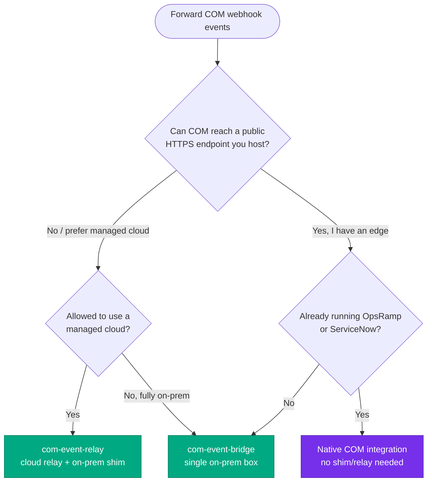

# HPE COM Event Integrations

Reference implementations that forward **HPE Compute Ops Management (COM)**
webhook events to your operational tooling — OBM, ServiceNow, Splunk, or any
generic webhook. Pick the deployment shape that fits your constraints; the event
normalisation, de-duplication, and target adapters are **shared** across all of
them.

> These are **reference/sample** implementations meant to be forked and adapted,
> not a supported HPE product.

## Why this project exists

COM can **push events** (server health transitions, alerts) to any HTTPS endpoint
via webhooks. In theory you just point COM at your monitoring or ITSM tool and
you're done. In practice, "just send COM a webhook" runs into four recurring
objections — and connecting COM to real operational tooling is rarely a simple
one-liner:

**1. Compatibility & integration complexity.** A target may "support webhooks",
but not COM's *specific* contract: the **GET verification handshake**, the
**static-header shared-secret** auth, and COM's **payload shape**. The event body
also isn't in the target's expected format. So most integrations need custom glue
anyway.

**2. Additional components.** That glue usually means standing up **middleware** —
one more thing to design, deploy, secure, and operate.

**3. Reliability & data handling.** A raw webhook is fire-and-forget. Production
needs **retry, queuing/buffering, retention, de-duplication, filtering, and
correlation** — and if the endpoint just forwards, *the receiving system* has to
provide all of it.

**4. Security & supportability.** A **public endpoint**, **credential
management**, **troubleshooting**, and unclear **ownership across several moving
parts** are all legitimate concerns — especially for on-prem or closed networks.

### What this project does about it

These reference implementations are exactly that glue, built once and done right,
so you don't rebuild it per target or per site:

| Objection | How this project addresses it |
|-----------|-------------------------------|
| **Compatibility** | Implements COM's contract for you — the **GET handshake**, **static-header auth**, and body parsing — then **normalises** the payload into a neutral `CanonicalEvent`. A tiny per-target **adapter** maps that to the target's API (OBM, ServiceNow, OpsRamp, HaloITSM, Splunk, or any webhook). |
| **Extra components** | **One container** does receive → transform → forward (`com-event-bridge`), or a thin relay + outbound shim when you want cloud/on-prem separation (`com-event-relay`). No bespoke middleware to invent. |
| **Reliability** | Built-in **de-duplication** (retry never opens a second ticket), **retry**, durable **queue** (relay) or on-disk **spool** (bridge), and **raise/clear correlation** so a recovery auto-closes the item the fault opened. |
| **No inbound firewall port** | The **cloud relay takes the public endpoint**; on-prem runs an **outbound-only shim** that *pulls* from the queue. **Nothing inbound** is ever opened into your network — even when the target is ServiceNow or OpsRamp, which their native COM integrations can't do. (The on-prem `com-event-bridge` is the option for teams that *do* host their own edge.) |
| **Security & support** | **Shared-secret auth**, body-size limits, **least-privilege** queue credentials (send-only relay, listen-only shim), and one small, inspectable codebase you own — clear to troubleshoot, easy to fork. |

> **When you *don't* need this:** if you run **OpsRamp** or **ServiceNow** *and*
> you're willing to expose an endpoint COM can reach, both have a **native COM
> integration** — point COM straight at it. Use these projects for everything else
> (OBM, HaloITSM, Splunk, custom webhooks), to fan one COM stream out to several
> targets at once, or when you **cannot open an inbound firewall port** — even for
> ServiceNow or OpsRamp. The **outbound-only** relay + shim (and the on-prem
> bridge) let you deliver to those targets without any inbound path into your
> network, which the native integrations can't do.

## Key capabilities

- **No inbound ports on your network** — the on-prem shim is **outbound-only**; it
  *pulls* from the queue, so COM never connects into your datacenter (works even
  for ServiceNow / OpsRamp).
- **Speaks COM's contract** — answers the **GET verification handshake** and
  validates the **static-header shared secret**, so targets that can't (OBM,
  Splunk, HaloITSM, …) still work.
- **Durable queue decouples receive from deliver** — Azure Service Bus / AWS SQS
  absorbs bursts and target outages; the on-prem bridge uses an on-disk **spool**
  for the same effect.
- **Normalise, de-duplicate, correlate** — one canonical event model; retries
  never double-ticket; a recovery auto-closes the item the fault opened.
- **Pluggable adapters for any target** — OBM, ServiceNow, OpsRamp, HaloITSM,
  Splunk, or any webhook; add a new target in ~one small file.
- **Cloud-native, container-first, scalable** — multi-arch images (amd64 + arm64)
  to GHCR; scale the relay horizontally on ACA / App Runner.
- **Operable by design** — health/readiness probes, structured logs, and it
  **fails safely**: retries transient errors, quarantines bad events (no data
  loss) via the queue's dead-letter queue (DLQ).

## Which project do I use?



| Option | Project | When to use |
|--------|---------|-------------|
| **Cloud relay + on-prem shim** | [com-event-relay](com-event-relay) | You want a managed public receiver (Azure Container Apps / AWS App Runner) that enqueues events, drained by an outbound-only shim running next to your target. No inbound ports on-prem. |
| **Single on-prem box** | [com-event-bridge](com-event-bridge) | No cloud allowed, or you just want the smallest footprint. One container receives, transforms, and forwards in a single process, with an optional local disk spool for durability. |
| **Native integration** | — (product) | If you already run **OpsRamp** or **ServiceNow** *and* can expose an endpoint COM reaches, both have a **built-in COM integration** — no shim/relay needed. But if you **can't open an inbound firewall port**, use the outbound-only relay + shim above instead. See the relay README's "native integrations" note. |

### Why host the relay in Azure / AWS?

COM is a SaaS service that **pushes** events to a public HTTPS endpoint you
provide, so **whatever COM talks to must be publicly reachable**: a **public DNS
name**, a **valid CA-signed TLS certificate**, and **inbound 443** open to COM's
egress. That's a real edge to build, secure, patch, and keep certificates valid on.

Running the relay on **Azure Container Apps** or **AWS App Runner** gives you all
of that **for free from the platform** — so you operate none of it:

| You need… | Managed cloud gives you |
|-----------|-------------------------|
| Public DNS name | A public URL out of the box |
| Valid CA TLS certificate | **Automatic TLS** — issuance *and* renewal |
| Inbound 443 exposed | Public HTTPS ingress, no firewall/reverse proxy to run |
| A patched, available host | **OS patching + autoscaling**, nothing to maintain |

Your internal network stays closed: the public edge is the cloud relay, and the
**outbound-only shim** delivers to your target with **no inbound path** into your
datacenter. Prefer no cloud at all? The **com-event-bridge** single box gives you
the same pipeline, but then *you* own the public edge (DNS, cert lifecycle,
inbound 443) — it ships with an nginx + certbot stack to help. Full trade-offs are
in the [relay README](com-event-relay/README.md#choosing-a-deployment-model).

## Projects in this repo

- **[com-event-relay](com-event-relay)** — cloud relay (`relay/`, COM → queue) plus
  the outbound consumer (`shim/`, queue → target). Multi-cloud (Azure Service Bus
  or AWS SQS), container-first, with deploy scripts for ACA and App Runner.
- **[com-event-bridge](com-event-bridge)** — single-box on-prem all-in-one: one
  container that folds handshake + auth + transform + forward into a single
  process, with an optional on-disk spool. Ships with an nginx + certbot compose
  stack for the public TLS edge.
- **[com-event-core](com-event-core)** — the shared package used by the shim and
  the bridge: the COM event **normaliser** (`CanonicalEvent`), the **de-dup**
  store, and all **target adapters** (`obm`, `servicenow`, `opsramp`, `halo`,
  `splunk`, `webhook`). A mapping or adapter fix is made once here and both
  consumers get it.

## Targets supported

All adapters live in `com-event-core`, so **every target works in both projects**
(com-event-relay's shim *and* com-event-bridge) — pick one per deployment with
`TARGET=<name>`. The pipeline handles the COM handshake, auth, normalisation,
**de-duplication**, retry, and (relay) queue / (bridge) spool; an adapter only
maps the `CanonicalEvent` to the target's API.

| `TARGET` | Layer | Role | Auth | In both projects | Native COM path? | Close on clear | Key config |
|----------|-------|------|------|:----------------:|:----------------:|:--------------:|------------|
| `obm` | ITOM (event) | OpenText Operations Bridge Manager event | Basic | ✅ | — | ✅ severity→normal + closed (correlation key) | `OBM_EVENT_API_URL`, `OBM_USER`, `OBM_PASSWORD` |
| `servicenow` | ITSM | Event Management (`em_event`) or incident creation | Basic | ✅ | ✅ native* | ✅ em_event Clear / incident resolve (lookup by correlation) | `SNOW_INSTANCE`, `SNOW_USER`, `SNOW_PASSWORD`, `SNOW_TABLE` |
| `opsramp` | ITOM / AIOps | Alert / event ingestion | OAuth2 | ✅ | ✅ native* | ✅ state→Ok (alertKey correlation) | `OPSRAMP_API_URL`, `OPSRAMP_TENANT_ID`, `OPSRAMP_KEY`, `OPSRAMP_SECRET` |
| `halo` | ITSM | HaloITSM ticket / incident creation | OAuth2 | ✅ | — | ✅ look up open ticket by `thirdpartyref` and set closed status | `HALO_API_URL`, `HALO_CLIENT_ID`, `HALO_CLIENT_SECRET` |
| `splunk` | SIEM / log | HTTP Event Collector (HEC) ingestion | HEC token | ✅ | — | ➖ clear logged as its own event (`action=clear`) | `SPLUNK_HEC_URL`, `SPLUNK_HEC_TOKEN` |
| `webhook` | Generic | POST the canonical event JSON to any URL | Optional header | ✅ | — | ➖ clear delivered as its own event (`action=clear`) | `WEBHOOK_URL` (+ optional `WEBHOOK_AUTH_HEADER`/`_VALUE`) |

Adding a new target is a small adapter in `com-event-core` (map `CanonicalEvent`
→ the target's API); see [com-event-core/README.md](com-event-core/README.md#adding-a-new-target).

> \* **ServiceNow and OpsRamp have native COM integrations** (purpose-built COM
> paths — ServiceNow for incident creation, OpsRamp for event/alert ingestion).
> If COM can reach them directly, point COM straight at the native integration and
> **skip this project**. Use the bundled `servicenow` / `opsramp` adapters only for
> the **decoupled** path this project provides: **no inbound firewall port** (the
> outbound-only shim pulls from the queue, so COM never reaches into your network),
> keeping the internal network unexposed, feeding enriched/normalised events, or
> fanning the same COM stream out to several targets at once. Details in the
> [com-event-relay README](com-event-relay/README.md#when-you-dont-need-this-native-com-integrations-opsramp-servicenow).
>
> **Why a `halo` adapter?** HaloITSM has no native COM path, and the pipeline's
> built-in **de-duplication** means a repeated COM event won't open a second
> ticket for the same fault — one ticket per real problem, not one per webhook
> retry.

## COM resource types & the raise / clear lifecycle

The normaliser dispatches on the payload `type` and handles two COM resource
types plus a generic fallback:

| Resource type | COM `type` (payload) | What it is | How raise vs clear is detected |
|---------------|----------------------|------------|--------------------------------|
| **Server health** | `compute-ops-mgmt/server` | A server whose `hardware.health.summary` transitioned | **raise** when health ≠ OK; **clear** when it returns to OK |
| **Alert** | `compute-ops-mgmt/alert` | An individual COM alert (create / delete) | **raise** on create; **clear** when `cleared`/`clearedAt` is set or the alert is deleted |
| Generic | anything else | Any other COM resource | Passed through as a raise; adapters still deliver it |

> **Namespace quirk:** COM's `eventFilter` grammar uses the short namespace
> (`compute-ops/server`) while the **delivered payload** `type` is the long one
> (`compute-ops-mgmt/server`). The normaliser matches on the type **suffix**
> (`…/server`, `…/alert`), so both spellings work.

**Getting clears requires a second COM webhook.** A COM webhook only fires for
the transition its `eventFilter` selects, so recovery ("clear") needs a *second*
webhook pointing at the **same** relay/bridge URL with the opposite transition.
Configure both:

Server health — raise then clear:

```text
# raise: health left OK
type eq 'compute-ops/server' and old/hardware/health/summary eq 'OK' and changed/hardware/health/summary eq True
# clear: health returned to OK
type eq 'compute-ops/server' and new/hardware/health/summary eq 'OK' and changed/hardware/health/summary eq True
```

Alerts — raise then clear:

```text
# raise: alert created
type eq 'compute-ops/alert' and operation eq 'Created'
# clear: alert deleted / resolved
type eq 'compute-ops/alert' and operation eq 'Deleted'
```

Each event carries a stable **`correlation_key`** (`server:<serial>` or
`alert:<id>`) so a later clear closes exactly the object the raise opened —
that's what the "Close on clear" column above builds on. De-duplication is keyed
on `correlation_key + action + severity`, so a raise and its clear are never
collapsed, but repeats of either are still suppressed. See the
[com-event-relay README](com-event-relay/README.md) for the full webhook setup.

## Images

CI builds and publishes multi-arch (amd64 + arm64) images to GHCR:

```
ghcr.io/<owner>/com-event-relay
ghcr.io/<owner>/com-event-shim
ghcr.io/<owner>/com-event-bridge
```

The images are **self-contained** — `git clone` + `docker build` (from the repo
root) works with nothing to publish first, because the shared `com-event-core`
package is installed into the shim/bridge images from local source.

## Documentation

- Each project has its own README with quick start, configuration, and deployment.
- On-prem hardening for the single box: [com-event-bridge/HARDENING.md](com-event-bridge/HARDENING.md).

## License

MIT — see [LICENSE](LICENSE).
