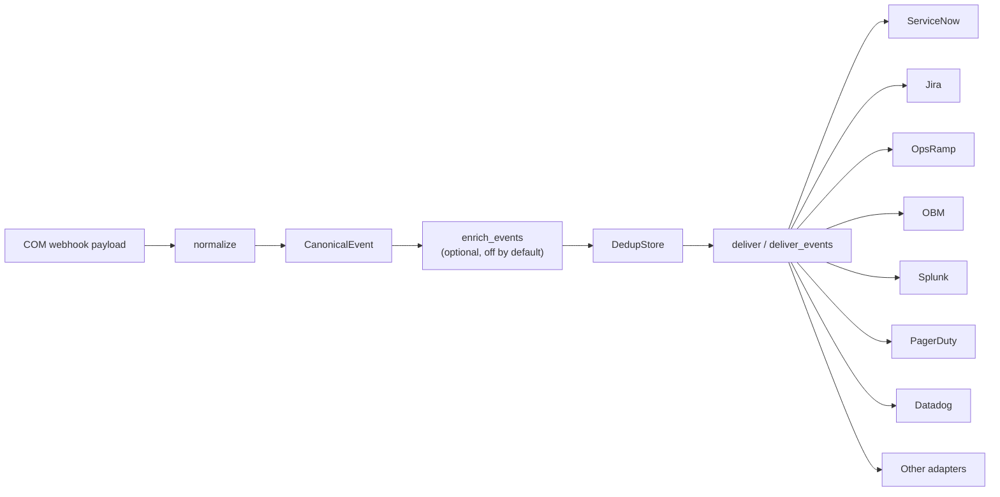

# com-event-core

Shared event-processing and target-adapter package for **HPE Compute Ops Management (COM)** integrations.

`com-event-core` is the single source of truth used by both deployment models in this repository:

- [`com-event-relay`](../com-event-relay/) — cloud relay + durable queue + outbound-only on-prem shim
- [`com-event-bridge`](../com-event-bridge/) — single-box receiver with optional on-disk spool

It contains the COM event normalisation, `CanonicalEvent` model, de-duplication, raise/clear correlation, multi-target delivery logic, secrets helper, and all built-in target adapters.

> **Reference implementation**
>
> This is an open-source reference/sample implementation. Review, validate, and harden it for your own environment before production use.

---

## Contents

- [Why this package exists](#why-this-package-exists)
- [Architecture](#architecture)
- [What's in it](#whats-in-it)
- [COM resource types](#com-resource-types)
- [COM webhook filters and raise / clear lifecycle](#com-webhook-filters-and-raise--clear-lifecycle)
  - [Namespace note](#namespace-note)
  - [Server health](#server-health)
  - [Server power](#server-power)
  - [Server connection](#server-connection)
  - [Server subscription](#server-subscription)
  - [COM alerts](#com-alerts)
- [Server conditions](#server-conditions)
- [CanonicalEvent](#canonicalevent)
- [Correlation and de-duplication](#correlation-and-de-duplication)
- [Durable state: queues, spools, and dedup stores](#durable-state-queues-spools-and-dedup-stores)
- [Delivering to multiple targets](#delivering-to-multiple-targets)
- [Supported adapters](#supported-adapters)
  - [Adapter reference table](#adapter-reference-table)
  - [Finding an adapter's environment variables](#finding-an-adapters-environment-variables)
- [Known per-target tuning](#known-per-target-tuning)
- [AI analysis enrichment](#ai-analysis-enrichment)
- [TLS interception (corporate proxy)](#tls-interception-corporate-proxy)
- [Usage](#usage)
- [Example: COM event to CanonicalEvent](#example-com-event-to-canonicalevent)
- [What each adapter sends](#what-each-adapter-sends)
- [Inspecting adapter payloads](#inspecting-adapter-payloads)
- [Install](#install)
- [Adding a new target](#adding-a-new-target)
- [Secrets](#secrets)
- [Current limitations](#current-limitations)
- [Versioning](#versioning)

---

# Why this package exists

Both the Relay Shim and the Bridge need to perform the same processing:

```text
COM payload
   |
   v
Normalise
   |
   v
CanonicalEvent
   |
   +--> De-duplicate
   |
   +--> Correlate raise / clear
   |
   +--> Deliver to one or more target adapters
```

Without a shared package, the event model, mappings, de-duplication, and target adapters would need to be implemented twice.

`com-event-core` keeps that logic in one place.

A mapping or adapter fix made here is inherited by both:

```text
com-event-relay/shim
com-event-bridge/bridge
```

---

# Architecture



The public COM webhook handshake and shared-secret validation belong to the **Relay** or **Bridge** receiver.

The shared package starts once the COM payload is ready to be interpreted and delivered.

---

# What's in it

| Module | Purpose |
|---|---|
| `com_event_core.normalize` | `CanonicalEvent` + COM payload normalisation |
| `com_event_core.dedup` | SQLite TTL de-duplication store |
| `com_event_core.adapters` | Adapter discovery and all built-in target adapters |
| `com_event_core.deliver` | Single- and multi-target delivery with per-adapter de-duplication and partial-failure handling |
| `com_event_core.enrich` | Optional analysis stage that runs *between* normalise and deliver (see [AI analysis enrichment](#ai-analysis-enrichment)); off by default |
| `com_event_core.secrets` | Resolve secrets from environment variables or `<NAME>_FILE` projected files |

Target selection is controlled with:

```bash
TARGETS=<name>
```

or a comma-separated list:

```bash
TARGETS=servicenow,splunk
```

Do **not** put a space after the comma — separate the names with a bare comma
(`TARGETS=servicenow,splunk`). A space makes the shell split the value into two
arguments, so only the first target is applied. If you want the space for
readability, quote the whole assignment: `-e "TARGETS=servicenow, splunk"`.

If `TARGETS` is not set, the generic `webhook` adapter is used by default.

---

# COM resource types

The normaliser currently handles two COM resource families plus a generic fallback.

| Resource | Delivered payload `type` | Interpretation |
|---|---|---|
| **Server** | `compute-ops-mgmt/server` | Full-state server snapshot. One or more conditions are evaluated according to `SERVER_MONITORS`. |
| **Alert** | `compute-ops-mgmt/alert` | Individual COM alert lifecycle event. |
| **Generic** | Any other type | Passed through as a generic raise event. |

For a server event, `power`, `connection`, and `subscription` are **not separate resource types**.

<a id="com-webhook-filters-and-raise--clear-lifecycle"></a>
# COM webhook filters and raise / clear lifecycle

For stateful targets, a complete lifecycle requires both:

```text
problem transition  -> raise
recovery transition -> clear
```

COM webhook filtering occurs before the event reaches the Relay or Bridge.
For each monitored server transition, configure two COM webhooks: one for the
problem transition and one for the recovery transition. Both should point to
the same Relay or Bridge endpoint.

## Namespace note

COM `eventFilter` expressions use the shorter namespace:

```text
compute-ops/server
compute-ops/alert
```

Delivered webhook payloads use:

```text
compute-ops-mgmt/server
compute-ops-mgmt/alert
```

The normaliser recognizes both forms by resource-type suffix.

## Server health

Enable health monitoring with:

```bash
SERVER_MONITORS=health
```

`health` is the default when `SERVER_MONITORS` is not configured.

### Raise - health leaves OK

```text
type eq 'compute-ops/server' and old/hardware/health/summary eq 'OK' and changed/hardware/health/summary eq True
```

### Clear - health returns to OK

```text
type eq 'compute-ops/server' and new/hardware/health/summary eq 'OK' and changed/hardware/health/summary eq True
```

Correlation key:

```text
server:<serial>:health
```

## Server power

Enable power monitoring with:

```bash
SERVER_MONITORS=power
```

or:

```bash
SERVER_MONITORS=health,power
```

### Raise - server powers off

```text
type eq 'compute-ops/server' and old/hardware/powerState eq 'ON' and changed/hardware/powerState eq True
```

### Clear - server powers back on

```text
type eq 'compute-ops/server' and new/hardware/powerState eq 'ON' and changed/hardware/powerState eq True
```

Correlation key:

```text
server:<serial>:power
```

---

## Server connection

Enable connection monitoring with:

```bash
SERVER_MONITORS=connection
```

### Raise — server disconnects from COM

```text
type eq 'compute-ops/server' and old/state/connected eq True and changed/state/connected eq True
```

### Clear — server reconnects

```text
type eq 'compute-ops/server' and old/state/connected eq False and changed/state/connected eq True
```

> The reconnect filter can also match a newly added server's first transition to connected. Validate the desired behavior in your COM environment.

Correlation key:

```text
server:<serial>:connection
```

---

## Server subscription

Enable subscription monitoring with:

```bash
SERVER_MONITORS=subscription
```

### Raise — subscription leaves SUBSCRIBED

```text
type eq 'compute-ops/server' and old/state/subscriptionState eq 'SUBSCRIBED' and changed/state/subscriptionState eq True
```

### Clear — subscription returns to SUBSCRIBED

```text
type eq 'compute-ops/server' and new/state/subscriptionState eq 'SUBSCRIBED' and changed/state/subscriptionState eq True
```

Correlation key:

```text
server:<serial>:subscription
```

The normaliser can also treat an expired `subscriptionExpiresAt` value as a subscription problem.

---

## COM alerts

### Raise — alert created

```text
type eq 'compute-ops/alert' and operation eq 'Created'
```

### Clear — alert deleted / resolved

```text
type eq 'compute-ops/alert' and operation eq 'Deleted'
```

The normaliser treats an alert as cleared when the payload indicates the alert has been cleared, including `cleared`, `clearedAt`, or a deleted operation.

Correlation key:

```text
alert:<id>
```

---

## Why two COM webhooks are needed

A webhook only receives events that match its configured `eventFilter`.

For example:

```text
OK -> non-OK
```

and:

```text
non-OK -> OK
```

are separate transitions.

Therefore the raise and clear filters must both be configured and should point to the same receiver.

---

# Server conditions

A COM server webhook is a **full-state snapshot**, not a field-change delta.

`normalize()` evaluates every condition enabled in `SERVER_MONITORS`.

| `SERVER_MONITORS` | Raise when | Clear when | Canonical severity |
|---|---|---|---|
| `health` *(default)* | `hardware.health.summary != OK` | health returns to `OK` | mapped from COM health |
| `power` | `hardware.powerState = OFF` | returns to `ON` | `warning` |
| `connection` | `state.connected = false` | returns to `true` | `major` |
| `subscription` | subscription not `SUBSCRIBED` or expired | subscribed and not expired | `minor` |

Example:

```bash
SERVER_MONITORS=health,power,connection
```

One server snapshot can then result in several independent events:

```text
server:CZ2311004G:health
server:CZ2311004G:power
server:CZ2311004G:connection
```

A recovery for one condition cannot close an incident opened for another condition.

A condition not listed in `SERVER_MONITORS` is ignored.

Because server webhooks are snapshots, a healthy condition can generate repeated clear candidates. The de-duplication layer suppresses repeated equivalent clears.

> **Post-only chat adapters (`slack`, `teams`) show a `Resolved` message for every
> enabled-but-healthy condition.** Stateful adapters (`github`, ITSM, ...) *search*
> for the item a clear would close and silently no-op when none is open, so a
> healthy condition is invisible there. A post-only incoming webhook has no such
> lookup — it simply posts, so each condition in `SERVER_MONITORS` that is healthy
> on a given snapshot produces a `✅ Resolved` post **on every delivery**. Example:
> with `SERVER_MONITORS=health,power` a snapshot whose health is `CRITICAL` but
> whose power is `ON` posts a critical **health** message *and* a `Resolved`
> **power** message. This is by design (power really is healthy), just noisier on
> chat. **Scope `SERVER_MONITORS` to only the conditions you want alerts on** —
> e.g. `SERVER_MONITORS=health` if you only care about hardware health.

## Splitting monitors across multiple deployments

Nothing in `normalize()`, `deliver()`, or de-duplication requires all enabled
`SERVER_MONITORS` conditions to live in the same process: each condition's
correlation key (`server:<serial>:<condition>`) and dedup key are already
fully independent. Running one shim/bridge deployment per condition is a
supported pattern, not a workaround.

**Why you would:**

- **Per-condition target routing.** Adapters read fixed global environment
  variables (`SLACK_WEBHOOK_URL`, `GITHUB_REPO`, ...), so one process cannot
  run two instances of the same adapter type with different destinations
  (see [Current limitations](#current-limitations)). Splitting
  `SERVER_MONITORS` across deployments, each with its own `TARGETS` and
  adapter configuration, is the way to send `health` events to one
  destination and `power` events to another today, without waiting on
  namespaced adapter configuration.
- **No cross-condition noise on a shared post-only target.** Enabling only
  the condition(s) a given deployment should alert on means a `Resolved`
  message never appears for a healthy condition nobody asked that deployment
  about (see the callout above).
- **Isolating AI-enrichment latency.** `enrich_events()` runs serially on a
  single worker thread per deployment (the bridge's `SpoolWorker`, or the
  shim's consume loop). A slow analyzer call triggered by a `power` raise
  delays delivery for every other condition queued behind it in that same
  process. Splitting conditions into separate deployments confines a stuck
  analysis to its own deployment. See [Latency, throughput, and
  concurrency](#latency-throughput-and-concurrency) for the full mechanics.
- **Independent failure domains.** A full spool, an exhausted AI budget, or a
  down target for one condition's deployment doesn't affect another
  condition's deployment.

**What it costs:** each deployment needs its own pair of COM webhook
subscriptions (raise + clear) for the transition it monitors, its own
container/process, its own dedup store, and its own secrets, adding more
moving parts than a single deployment with several conditions enabled. For
**Relay + Shim**, each split deployment also needs its **own queue**: a
queue is drained by competing consumers, so two differently configured
shims sharing one queue would each only see some of the messages, silently
dropping whichever condition that particular shim isn't monitoring. See
[Multiple Shim consumers](../com-event-relay/README.md#multiple-shim-consumers)
for the underlying constraint.

**When not to split:** if every monitored condition should go to the same
target(s) and AI-enrichment latency isolation isn't a concern, one deployment
with `SERVER_MONITORS=health,power,...` is simpler and delivers identically.
Splitting does not reduce total event volume, only where it lands and how it
is isolated.

---

# CanonicalEvent

Every adapter consumes the same neutral event model.

Conceptually:

```python
CanonicalEvent(
    event_id=...,
    operation=...,
    title=...,
    severity=...,
    resource_serial=...,
    resource_model=...,
    mgmt_url=...,
    time_created=...,
    tags=...,
    dedup_key=...,
    source_type=...,
    action=...,
    correlation_key=...,
    resource_name=...,
    part_number=...,
    description=...,
    resolution=...,
    category=...,
    raw=...,
)
```

| Field | Purpose |
|---|---|
| `event_id` | Source COM event/resource identifier |
| `source_type` | `server`, `alert`, or generic type |
| `action` | `raise` or `clear` |
| `severity` | Canonical severity |
| `correlation_key` | Stable identity connecting raise and clear |
| `dedup_key` | Delivery identity used to suppress duplicates |
| `resource_serial` | Server serial number when available |
| `resource_name` | Resource/display name |
| `resource_model` | Server model |
| `description` | Normalised description |
| `resolution` | Recovery text where available (alerts only) |
| `raw` | Original COM payload |

---

# Correlation and de-duplication

These solve different problems.

## Correlation

The `correlation_key` identifies the underlying condition.

Examples:

```text
server:CZ2311004G:health
server:CZ2311004G:power
alert:123456
```

The same key is used for both raise and clear.

## De-duplication

The `dedup_key` identifies a particular delivery state.

Conceptually:

```text
correlation_key + action + severity
```

This means a raise and its clear are never collapsed together, while repeated copies of the same event can still be suppressed.

---

# Durable state: queues, spools, and dedup stores

Each deployment model uses a different combination of durable stores. None of
them are shared across processes; every queue, spool, and dedup store below
belongs to exactly one consumer.

| Component | Queue | Spool | Dedup store |
|---|---|---|---|
| **Relay** | 1 durable queue (`QUEUE_NAME` on Service Bus, or 1 SQS queue URL), shared by every event regardless of `TARGETS` or `SERVER_MONITORS` | none | none (never parses the payload) |
| **Shim** | consumes that same 1 queue | none | 1 SQLite dedup store |
| **Bridge**, `DELIVERY_MODE=spool` | none | 1 on-disk SQLite spool | 1 SQLite dedup store |
| **Bridge**, `DELIVERY_MODE=sync` | none | none (never created) | 1 SQLite dedup store |

A few consequences worth calling out:

- **Enrichment (`ENRICHERS`) adds none of these.** `ilo_ai`'s cache and budget
  counter are plain in-memory objects in the enrichment process, lost on
  restart, so enabling AI analysis never changes the counts above.
- **The Relay+Shim queue is a plain queue, not a topic.** It is drained by
  competing consumers, so two shims consuming the same queue split the
  traffic between them rather than each seeing every message. See [Multiple
  Shim consumers](../com-event-relay/README.md#multiple-shim-consumers) for
  what that means for horizontal scaling, and [Splitting monitors across
  multiple deployments](#splitting-monitors-across-multiple-deployments) for
  why that also means a split-by-condition deployment needs its own queue.
- **A single bridge process owns one spool file and one drain thread**, so it
  has no built-in way to add worker concurrency; see [Latency, throughput,
  and concurrency](#latency-throughput-and-concurrency).

---

# Delivering to multiple targets

One event can be delivered to several adapters.

Examples:

```bash
TARGETS=halo
TARGETS=halo,opsramp
TARGETS=servicenow,splunk
TARGETS=github,slack
TARGETS=sentinel,pagerduty,teams
```

Separate the names with a bare comma and **no space** (`TARGETS=github,slack`). An
unquoted space makes the shell split the value, so only the first target is
applied — quote the whole assignment if you want the space: `-e "TARGETS=github, slack"`.

De-duplication is tracked per adapter.

If some targets succeed and one fails, the successful targets remain marked as complete and only the failed target is re-attempted on retry.

Durability is supplied by the consumer:

- **Relay + Shim** — queue redelivery
- **Bridge spool mode** — local spool retry
- **Bridge sync mode** — best-effort only

For important fan-out, use queue or spool mode.

Multiple instances of the **same adapter type** are not currently supported because adapter configuration uses fixed global environment-variable names.

---

# Supported adapters

Current adapter names:

```text
bmc_helix
datadog
dynatrace
elastic
github
grafana
halo
jira
obm
opsramp
pagerduty
sentinel
servicenow
slack
splunk
teams
webhook
```

## Adapter reference table

This is the single source of truth for adapter support. Each row lists the target category, the adapter's role, the authentication it uses, whether COM also offers a native integration for that target, how a clear (recovery) is delivered, and whether the adapter has been validated end-to-end against a live target.

The **Category** column groups adapters by the kind of platform they target:

- **ITSM** — incidents, tickets, service requests, and service-management workflows
- **ITOM / AIOps** — monitoring, correlation, and operation of infrastructure and service health
- **SIEM / log** — event ingestion, search, security analysis, correlation, and audit
- **Monitoring / Observability** — telemetry, logs, and operational events
- **Incident response / ChatOps** — paging and operational notifications
- **Issue tracking** — issue/ticket creation and closure
- **Generic** — canonical JSON POST to any HTTP endpoint

| `TARGET` | Category | Role | Auth | Native COM | Clear behavior | Live validation |
|---|---|---|---|:---:|---|:---:|
| `servicenow` | ITSM | Event Management or incident creation | Basic | ✅ | Sends a clear event / resolves the correlated incident | ⚠️ Validate |
| `halo` | ITSM | HaloITSM ticket / incident | OAuth2 | — | Closes the matching ticket (by `thirdpartyref`) | ⚠️ Validate |
| `jira` | ITSM | Jira Service Management / Jira issue | Email + API token | — | Runs the configured close transition | ✅ |
| `bmc_helix` | ITSM | BMC Helix / Remedy incident | JWT | — | Marks the correlated incident resolved | ⚠️ Validate |
| `opsramp` | ITOM / AIOps | Alert / event ingestion | OAuth2 | ✅ | Sends state `Ok` using the same alert key | ⚠️ Validate |
| `obm` | ITOM | OpenText OBM event | Basic | — | Sends normal/closed using the same correlation key | ⚠️ Validate |
| `splunk` | SIEM / log | Splunk HEC | HEC token | — | Stored as an event with `action=clear` | ⚠️ Validate |
| `elastic` | SIEM / log | Elasticsearch document | API key / Basic | — | Indexed as another document | ⚠️ Validate |
| `sentinel` | SIEM | Microsoft Sentinel / Log Analytics | Workspace credentials | — | Ingested as another record | ⚠️ Validate |
| `pagerduty` | Incident response | PagerDuty Events API v2 | Routing key | — | Sends `resolve` using the same `dedup_key` | ⚠️ Validate |
| `slack` | ChatOps | Slack incoming webhook | Webhook URL | — | Posts a resolved notification | ✅ |
| `teams` | ChatOps | Microsoft Teams Workflow webhook | Webhook URL | — | Posts a resolved card | ✅ |
| `github` | Issue tracking | GitHub Issues | PAT | — | Closes the matching issue | ✅ |
| `datadog` | Monitoring | Datadog Events API | API key | — | Posts a recovery/success event | ⚠️ Validate |
| `dynatrace` | Monitoring | Dynatrace Events API v2 | API token | — | Posts a recovery event | ⚠️ Validate |
| `grafana` | Observability / log | Grafana Cloud Logs / Loki | Basic | — | Writes a clear log entry | ⚠️ Validate |
| `webhook` | Generic | Canonical JSON POST | Optional custom header | — | Sends the canonical clear event | ⚠️ Validate |


> ⚠️ **Reference implementations.** Every adapter is fully implemented against its target's API — connectivity, field mapping, authentication, and raise/clear handling are all in place. What is still pending for most is **validation against a live product**: the **GitHub**, **Slack**, **Teams**, and **Jira** adapters have been exercised end-to-end against a real target so far (raise *and* clear); the others have not yet been tested against a live instance (standing up every one of these platforms in a lab isn't feasible, and several also require paid licenses). Validate each adapter against your own environment before production use. Useful validation feedback includes authentication, payload acceptance, object creation, de-duplication, raise/clear behavior, and tenant-specific settings. Tenant-specific tuning is covered in [Known per-target tuning](#known-per-target-tuning).
>
> 🙋 Contributions and live-tenant validation feedback are welcome. If you face any issue with an adapter integration, please [open an issue](https://github.com/jullienl/HPE-COM-Event-Integrations/issues) in the project.

## Finding an adapter's environment variables

Once you've picked a target from the table above, here's how to learn exactly
which variables it needs when you start the container.

**The catalog: the `.env.example` for whatever you run.** Every adapter has its
own clearly-marked block, headed with its selector name in parentheses (the exact
value you put in `TARGETS`), and comments flag which vars are **required**,
**optional** (with defaults), and **secrets**:

- Relay + Shim (cloud): [`shim/.env.example`](../com-event-relay/shim/.env.example)
- Bridge (on-prem single box): [`bridge/.env.example`](../com-event-bridge/bridge/.env.example)

```text
# --- Target: GitHub Issues (github) ---------------------------------------
# GITHUB_REPO=owner/repo         # slug only, NOT a URL (required)
# GITHUB_TOKEN=change-me         # issues:write (secret; prefer GITHUB_TOKEN_FILE)
# GITHUB_API_URL=...             # optional (GitHub Enterprise Server)
# GITHUB_LABELS=ops,com          # optional extra labels on new issues
```

**The four steps:**

1. **Pick the adapter name** — the value for `TARGETS` (e.g. `TARGETS=halo`, or
   fan-out `TARGETS=halo,slack`). Valid names are the ones in the list above.
2. **Open the matching `.env.example`** and find the
   `# --- Target: <Name> (<name>) ---` block.
3. **Set every var marked required**, plus any optional overrides. Pass them to
   the container as `-e VAR=value` (or an env file).
4. **For secrets, prefer the `<NAME>_FILE` form**
   (e.g. `GITHUB_TOKEN_FILE=/run/secrets/github-token`) so they don't leak via
   `docker inspect` — see [Secrets](#secrets).

**The source of truth: the adapter file itself.** Each adapter reads its own
vars at construction in [`com_event_core/adapters/`](com_event_core/adapters/) —
one file per adapter (e.g. `github.py`, `halo.py`). The pattern is consistent, so
one file shows its full contract in a few lines:

- `os.environ["VAR"]` → **required** (fails fast if missing)
- `os.environ.get("VAR", "default")` → **optional** with a default
- `get_secret("VAR")` → **secret** (accepts `VAR` or `VAR_FILE`)

> **Two gotchas.** Only `github`, `slack`, `teams`, and `jira` are validated
> end-to-end, so other adapters' instance-specific vars (Halo status ids,
> ServiceNow table, …) may need tuning for your system — see [Known per-target
> tuning](#known-per-target-tuning). And
> because config uses fixed global var names (`GITHUB_REPO`), you can't run two
> instances of the **same** adapter type with different settings yet.

---

# Known per-target tuning

## Jira

`JIRA_URL` is the **Atlassian site** the project lives on, not the project URL.
Read it from your browser's address bar — `https://acme.atlassian.net/jira/software/projects/OPS`
means `JIRA_URL=https://acme.atlassian.net` and `JIRA_PROJECT_KEY=OPS`. One
account often has access to several sites (e.g. a production tenant *and* a
sandbox), and pointing at the wrong one fails in a **misleading** way: issue
create returns `400 {"errors":{"project":"valid project is required"}}` rather
than a 404, because to that site the key genuinely doesn't exist. Auth is fine
(a bad token gives `401`), so the error looks like a payload bug.

`JIRA_ISSUE_TYPE` must exist **in that project**. The default `Incident` is a
Jira Service Management type — Jira Software/Business projects ship `Task`,
`Bug`, `Story`, `Epic` instead, and an invalid name is another `400`.

`JIRA_PROJECT_KEY` is **case-sensitive**: Jira stores keys upper-case, so
`COMEvent` fails with the same `400 {"errors":{"project":"valid project is
required"}}` as a wrong site while looking perfectly plausible in a
`docker run -e …` line. Copy it verbatim from the address bar.

The end-to-end validation for this adapter ran against a Jira **Software**
Cloud project with `JIRA_ISSUE_TYPE=Task` and `JIRA_CLOSE_TRANSITION=Done`.

Confirm all three against the live site before deploying:

```bash
PAIR=$(printf '%s:%s' "$JIRA_EMAIL" "$JIRA_API_TOKEN" | base64 -w0)

# Project reachable? 200 = key + site + permissions all correct.
curl -s -o /dev/null -w '%{http_code}\n' -H "Authorization: Basic $PAIR" \
  "$JIRA_URL/rest/api/3/project/$JIRA_PROJECT_KEY"

# Valid issue type names for JIRA_ISSUE_TYPE
curl -s -H "Authorization: Basic $PAIR" \
  "$JIRA_URL/rest/api/3/issue/createmeta?projectKeys=$JIRA_PROJECT_KEY&expand=projects.issuetypes"
```

Closing an issue depends on the workflow transition configured in the Jira project.

Review:

```text
JIRA_CLOSE_TRANSITION
```

The adapter resolves this **by name** against the issue's available transitions
and fails loudly listing what it found, so a wrong name is self-diagnosing.

> **Clears can legitimately find nothing.** The close path searches for the open
> issue via `POST /rest/api/3/search/jql`, which has **no read-after-write
> consistency** — a clear fired seconds after its raise may log
> `no open Jira issue for <label>; nothing to close`. Space raise/clear apart
> when testing.

## BMC Helix

Status, impact, urgency, and other field values can differ across Helix configurations.

Review settings such as:

```text
BMC_HELIX_STATUS_RESOLVED
```

and validate selected impact/urgency values.

## Microsoft Sentinel / Log Analytics

Validate:

- workspace credentials
- log type
- custom-table naming
- expected `<LOG_TYPE>_CL` behavior

## ServiceNow incident mode

Validate:

- assignment behavior
- `cmdb_ci` mapping
- state/resolution values
- permissions to search and update the correlated incident

---

# AI analysis enrichment

**AI-assisted incident investigation and remediation.** An optional stage that
turns intelligent, event-driven operations from *"here's an alert"* into *"here's
an alert, here's what's likely wrong, here's how confident we are, and here's
what to check or do next"* — attached **before** the event is delivered, so the
analysis lands inside the ticket or chat message at creation rather than
arriving separately. It is **off by default**.

When enabled, an AI agent analyzes the collected Redfish evidence alongside the
COM event and produces a structured incident report that keeps **observed
facts** (`evidence` — the specific signals in the data) separate from
**hypothesis** (`likely_root_cause` — the agent's best explanation for them). It
proposes a likely cause, assesses its own confidence in that cause, and
recommends concrete next steps — further diagnostic checks as well as
remediation actions — without presenting an unverified guess as a definitive
root cause: the underlying prompt is instructed to base every conclusion on the
supplied data and say so plainly when data is missing. See
[The analyzer contract](#the-analyzer-contract) for the exact fields, and
[agents.py](https://github.com/jullienl/ai-gateway/blob/main/agents.py) for the prompt that produces them.

The primary supported analyzer for this project is the standalone
[AI Gateway](https://github.com/jullienl/ai-gateway). Deploy its published image
and follow the [AI Gateway Operator Guide](https://github.com/jullienl/ai-gateway/blob/main/GUIDE.md)
for provider credentials, model selection, TLS, and deployment. The gateway
owns the agent prompts, including `com-rca`; this project owns the payload and
response contract described below. A different analyzer can be used when it
implements the same contract.

## Enable it with `ENRICHERS`, not `TARGETS`

The CA-aware flow resolves firmware-bundle advisory evidence through COM and
passes it to the analyzer alongside Redfish evidence:


Enrichment and delivery are selected separately:

```bash
ENRICHERS=ilo_ai          # analyse the event
TARGETS=jira              # then deliver it
```

`TARGETS` chooses where an event is **sent**; `ENRICHERS` chooses what happens to
it **on the way**. Putting `ilo_ai` in `TARGETS` is not valid and will fail at
startup with an unknown-target error.

```text
normalize()  →  [CanonicalEvent]
                     ↓
                enrich_events()          ← fetch iLO evidence, call the analyzer
                     │                     adds 4 fields to the event:
                     │                       analysis_summary
                     │                       analysis_root_cause
                     │                       analysis_confidence
                     │                       analysis_actions
                     ↓
                deliver_events()  →  github / jira / slack / …
```

Enrichment runs once per event, before any adapter, so every target in `TARGETS`
receives the same analysed event. It works identically in the shim and the
bridge.

## Where it runs

| Component | Hosts it? | Why |
|---|:---:|---|
| Shim (on-prem) | ✅ | On your network; can reach the BMC subnet |
| Bridge (on-prem) | ✅ | Same |
| Relay (cloud) | ❌ | No iLO reachability |

The shim/bridge opens an **additional outbound** connection to the management
network. No inbound port into your network is opened, so the project's
outbound-only property is unchanged.

## The `ilo_ai` enricher

For a server *problem* event it reads a small set of Redfish data from the
server's own iLO, sends it with the event to an analyzer service, and writes the
result onto four `CanonicalEvent` fields: `analysis_summary`,
`analysis_root_cause`, `analysis_confidence`, `analysis_actions`. Adapters that
support it render these in the ticket or message they create.

The iLO address comes from the event itself (`mgmt_url`), so no CMDB or inventory
lookup is required.

The analyzer is a **separate service**, not part of this package, so you can use
a hosted model or run one on-premises without changing the shim or the bridge.
Any service that implements the contract below works; see
[Set up the analyzer](#set-up-the-analyzer) for how to point the shim or bridge
at one.

### The analyzer contract

The shim or bridge takes `AI_ANALYZER_URL` as a **base** URL and appends
`/agent/<agent>`
(`AI_AGENT`, default `com-rca`). It sends:

```json
{
  "input": {
    "event": {
      "event_id": "…", "title": "…", "severity": "critical",
      "description": "…", "category": "…",
      "resource_serial": "…", "resource_model": "…", "resource_name": "…",
      "time_created": "…"
    },
    "redfish": { "source": "…", "resources": {}, "components": {}, "log": [] }
  },
  "session_id": "<correlation key, so repeat analyses of one problem thread together>"
}
```

When `ENRICHERS` also runs `hpe_advisories` (run order versus `ilo_ai` is
guaranteed by each enricher's `priority`, not by how `ENRICHERS` is written),
the body also carries `input.advisories`: `{"bundle": {...}, "open": [...],
"resolved": [...], "compliance": {...} | null}`, the same shape
`hpe_advisories` attaches to `advisory_evidence`. Absent otherwise, so this is a
strict addition — nothing about the existing `event`/`redfish` payload changes.

and expects HTTP `200` with:

```json
{
  "result": {
    "summary": "…",
    "likely_root_cause": "…",
    "confidence": 0.94,
    "recommended_actions": ["…", "…"]
  }
}
```

`confidence` may be a number `0–1`, a percentage such as `"80%"`, or a word
(`high` / `medium` / `low`); `recommended_actions` may be a list of strings, a
list of objects with an `action` or `step` field, or one newline-separated
string. Any other field in `result` is ignored, and a missing field is simply
omitted from the ticket. If `AI_ANALYZER_TOKEN` is set, it is sent as
`Authorization: Bearer <token>`.

### What is sent to the analyzer

Only a bounded slice of the Redfish tree, so the payload stays small enough to
send and to fit a model's context:

| Source | Kept |
| --- | --- |
| `Systems/1` | Whole resource — health rollup, power state, identity |
| `Chassis/1/Thermal`, `Chassis/1/Power` | Sensors that are unhealthy or past one of their own thresholds, plus a kept-of-total count |
| `Systems/1/Memory` | Unhealthy DIMMs, plus a count |
| Drive collections | Unhealthy drives, plus a count |
| `LogServices/IML/Entries` | Non-`OK` entries, newest first, capped at `ILO_MAX_LOG_ENTRIES` |

Drive collections are discovered at run time from both the HPE `SmartStorage`
tree and the standard `Systems/1/Storage` tree, so no controller ids need
configuring. A resource that a given iLO does not expose is skipped and noted in
the bundle rather than treated as an error.

On a DL360 this produces a bundle of roughly 13 KB while retaining the faulty
component — the full `Thermal` resource alone carries 48 temperature sensors,
nearly all of them healthy.

The bounds are adjustable, and you can add Redfish paths if your servers report a
fault somewhere not listed above — see [step 3](#3-configure-the-shim-or-bridge).

## Set up the analyzer

### 1. Run an analyzer service

Stand up a service that implements [the contract above](#the-analyzer-contract)
and that the shim or bridge can reach over HTTP. It needs no inbound access from
the internet and no access to COM — only the shim or bridge calls it.

One available service is the standalone [AI Gateway](https://github.com/jullienl/ai-gateway),
which exposes the `com-rca` agent used by default. It supports GitHub Copilot,
OpenAI, Anthropic, and customer-hosted OpenAI-compatible models. Any other
service that implements the contract works too; nothing here is gateway-specific.

#### Choose analyzer credentials

Copilot is one provider option. OpenAI, Anthropic, and an on-premises
OpenAI-compatible model are also supported. Follow the [AI Gateway Operator
Guide](https://github.com/jullienl/ai-gateway/blob/main/GUIDE.md) for the
provider-specific credentials and deployment configuration.

For the Copilot option, create a **fine-grained personal access token** on an
account that has Copilot enabled, and keep it somewhere the AI Gateway can mount
it as a file. If your organization routes personal and enterprise Copilot
accounts differently, use the enterprise/business account.

#### Run the AI gateway

The shim or bridge must be able to reach the analyzer over HTTP or HTTPS. For
deployment, use the published image and the operator instructions in
the [AI Gateway Guide](https://github.com/jullienl/ai-gateway/blob/main/GUIDE.md).

**Run the published image next to the shim or bridge:**

Vault the PAT on the host first — never bake it into the image or pass it as a
plain `-e COPILOT_GITHUB_TOKEN=...` where you can avoid it (that's the
dev-fallback path, visible to `docker inspect`):

```bash
sudo mkdir -p /run/secrets
sudo sh -c 'umask 077; read -rs PAT && printf "%s" "$PAT" > /run/secrets/copilot_pat'
sudo chown root:root /run/secrets/copilot_pat   # paste the PAT, press Enter
```

`umask 077` plus the trailing `chown` keep the file at `600 root:root`; the
container reads it read-only via the bind mount below and it never touches the
image, `docker inspect`, or shell history. `/run/secrets` is `tmpfs` on most
distros, so the plaintext doesn't survive a reboot either — recreate it from
your vault/password manager when the host restarts.

```bash
docker pull ghcr.io/jullienl/ai-gateway:1.0.2
```

Then join it to the same network the shim/bridge already runs on, so it's
reachable by name (`http://ai-gateway:8000`) — with Docker Compose, add it as a
service next to the shim/bridge:

```yaml
# docker-compose.yml
services:
  ai-gateway:
    image: ghcr.io/jullienl/ai-gateway:1.0.2
    container_name: ai-gateway
    ports:
      - "8000:8000"
    environment:
      COPILOT_GITHUB_TOKEN_FILE: /run/secrets/copilot_pat
    secrets:
      - copilot_pat
    networks:
      - com-events
networks:
  com-events:
    external: true   # the network the shim/bridge already runs on
secrets:
  copilot_pat:
    file: ./copilot-pat.txt   # 600, gitignored
```

```bash
docker compose up -d
```

Or with plain `docker run`:

```bash
docker run -d --name ai-gateway --network com-events -p 8000:8000 \
  -v /run/secrets/copilot_pat:/run/secrets/copilot_pat:ro \
  -e COPILOT_GITHUB_TOKEN_FILE=/run/secrets/copilot_pat \
  ghcr.io/jullienl/ai-gateway:1.0.2
```

Either way, the token is read **file-first** so it does not appear in
`docker inspect` or `/proc/<pid>/environ`.

On a network that inspects TLS, the AI gateway also needs your corporate CA
bundle — it makes its own outbound HTTPS call to the model API and will
otherwise fail with a certificate error. The bundle must contain the internal
CA **plus** the public roots, `SSL_CERT_FILE` *replaces* the trust store
rather than adding to it, so a file holding only the corporate CA breaks every
other outbound call. Build and verify it first:
[TLS interception (corporate proxy)](#tls-interception-corporate-proxy) below
has the recipe, then mount the result and set `SSL_CERT_FILE` /
`NODE_EXTRA_CA_CERTS` on the container.

**Option C — Azure Container Apps:**

See the AI gateway's
[GUIDE.md §10](https://github.com/jullienl/ai-gateway/blob/main/GUIDE.md#10-deploying-to-azure-container-apps-primary-path).
Use **internal** ingress; the shim or bridge then reaches it by app name
(`http://ai-gateway`) if it runs in the same environment.

**Confirm it is up:**

```bash
curl http://<gateway-host>:8000/health
curl http://<gateway-host>:8000/agents    # com-rca must be listed
```

No GitHub Copilot license? the AI gateway's
[Bring your own model](https://github.com/jullienl/ai-gateway#no-github-copilot-license-bring-your-own-model)
section is a minimal analyzer built on OpenAI/Anthropic/any other provider
instead — point `AI_ANALYZER_URL` at it the same way.

Because the analysis prompt lives in the analyzer, not in the shim or bridge, you
can swap models or reword the prompt without touching this project. The one thing
to keep is the **field names** — `summary`, `likely_root_cause`, `confidence` and
`recommended_actions` are read by name, and renaming any of them makes the
analysis disappear from tickets without an error.

### 2. Create a read-only iLO account

The shim or bridge reads evidence over Redfish with a single account, used across
the fleet. It only issues `GET`s, so give it the **lowest read-only role** your
iLO offers, and keep the management network reachable only from that host.

### 3. Configure the shim or bridge

```bash
ENRICHERS=ilo_ai
AI_ANALYZER_URL=http://analyzer:8000   # base URL; /agent/<agent> is appended

ILO_USERNAME=com-readonly
ILO_PASSWORD_FILE=/run/secrets/ilo_password
ILO_CA_BUNDLE=/etc/ssl/certs/ilo-ca.pem
```

Optional settings:

| Variable | Default | Effect |
| --- | --- | --- |
| `AI_AGENT` | `com-rca` | Path segment appended to `AI_ANALYZER_URL` |
| `AI_TIMEOUT` | `90` | Seconds to wait for an analysis |
| `AI_TENANT` | — | Sent as `tenant` in the request body |
| `AI_ANALYZER_TOKEN` | — | Sent as `Authorization: Bearer` |
| `AI_MIN_SEVERITY` | `warning` | Severity floor for analysing an event |
| `AI_MAX_ANALYSES_PER_HOUR` | `60` | Hourly cap |
| `AI_MAX_ANALYSES_PER_DAY` | `500` | Daily cap |
| `AI_CACHE_TTL_SECONDS` | `3600` | How long a repeat analysis is reused |
| `ILO_MAX_LOG_ENTRIES` | `25` | IML entries kept |
| `ILO_MAX_MEMBERS` | `64` | Unhealthy members kept per collection |
| `ILO_EXTRA_PATHS` | — | Extra Redfish paths to collect, comma-separated |
| `ILO_INSECURE` | — | `1` skips iLO TLS verification; logs a warning on every use |

See the [shim](../com-event-relay/shim/.env.example) or
[bridge](../com-event-bridge/bridge/.env.example) `.env.example` for the full
variable list.

### 4. Verify

Send a test event through the shim or bridge and watch its log. A successful
analysis logs:

```text
event <id> analysed in 12.4s (confidence=0.94)
```

The ticket or message the adapter creates then carries an **AI analysis** section.

If analysis is missing, the log says why, it never fails the delivery:

| Log line | Cause |
| --- | --- |
| `enrichment by ilo_ai failed: …` | The iLO or the AI gateway could not be reached, or the analysis errored |
| `no mgmt_url on event <id> …` | An alert-sourced event, which carries no iLO address |
| `AI analysis budget exhausted …` | An hourly or daily cap was reached — see [What gets analysed, and what it costs](#what-gets-analysed-and-what-it-costs) |

When the failure came from the AI gateway, its status code narrows it down:

| Status | Meaning |
| --- | --- |
| `502` | The Copilot SDK or the model rejected the request. `The requested model is not supported` means the account behind the PAT is not entitled to the model that agent uses — change `model` for `com-rca` in [agents.py](https://github.com/jullienl/ai-gateway/blob/main/agents.py), or use an entitled account |
| `503` | The Copilot runtime is not ready yet; retry once it has started |
| `404` | Unknown agent name: check `AI_AGENT` against `GET /agents` |
| `400` / `404` on `tenant` | `AI_TENANT` is malformed or has no PAT configured |

## What gets analysed, and what it costs

**Only real problems.** An event is analysed when all three hold:

| Condition | Default | Change with |
|---|---|---|
| The event is a `raise` | — | — |
| Severity is at or above the threshold | `warning` | `AI_MIN_SEVERITY` |
| The event carries a BMC address (`mgmt_url`) | — | — |

Clears are never analysed. Because server webhooks are snapshots, a healthy
condition produces a clear on *every* delivery, so analysing them would cost
money for no benefit.

**Repeat analyses are cached.** A repeated event within the default 1-hour
window reuses the existing analysis instead of requesting and paying for a new
one. Technically: cached per `correlation_key` for `AI_CACHE_TTL_SECONDS`
(default 3600s). This matters because a delivery can be retried — for example
when the same event goes out to several targets and one of them fails — and
without the cache, that retry would trigger (and pay for) a brand new analysis
of a problem already analysed moments earlier.

**Spending is capped** by `AI_MAX_ANALYSES_PER_HOUR` and
`AI_MAX_ANALYSES_PER_DAY`. When a limit is reached, events are delivered without
analysis until the window rolls over. Both hitting the cap and recovering from it
are logged at `WARNING`:

```text
AI analysis budget exhausted (60/hour, 500/day); skipping analysis until the
window resets — events are still delivered, just unenriched
AI analysis budget window reset; analysis re-enabled
```

So if tickets stop carrying analysis, the log says why.

**Failures never block delivery.** If the iLO is unreachable, or the analyzer
errors or times out, the event is delivered **without** the analysis and the
reason is logged:

```text
event <id> enrichment by ilo_ai failed: <reason>; delivering unenriched
```

Analysis is an enhancement, so no analyzer problem can delay or lose an event.

> **Not available in bridge `sync` mode.** An analysis round-trip takes seconds
> to tens of seconds, which is too long to spend while COM waits for its
> acknowledgement — COM never re-sends a failed event, so a timeout would lose
> it. The bridge **refuses to start** with `ENRICHERS` set and
> `DELIVERY_MODE=sync`. Use `spool` (the bridge default) or the relay + queue.

## Analyzer failures and partial evidence

AI enrichment is fail-open and is not required for event delivery:

- If the iLO is unreachable or its credentials are invalid, the event is
  delivered without an AI report.
- If an individual Redfish resource is missing or fails, the remaining evidence
  can still be sent to the analyzer.
- If the analyzer is unavailable, times out, or returns invalid output, the
  event is delivered without AI enrichment.
- If the analyzer returns only some fields, adapters render only those fields.
  Missing report fields are omitted rather than emitted as empty sections.

This prevents an iLO outage, credential problem, or analyzer outage from
blocking the underlying COM event or creating a delivery retry loop. The
enrichment logs the reason for every skipped or failed analysis.

## Latency, throughput, and concurrency

`enrich_events()` is called **synchronously, inline, one event at a time**, by
the same single worker that already drains delivery for that consumer:

- **Bridge** (`spool` mode): the background `SpoolWorker` thread claims one
  spool row, enriches it, delivers it, then claims the next. There is exactly
  one such thread per bridge process.
- **Shim**: `worker.py`'s `for msg in consumer.receive():` loop does the same,
  one queue message at a time.

Neither consumer runs a worker pool or parallel enrichment. This is
deliberate: `enrich_events()` mutates a small, per-event list of
`CanonicalEvent` objects with no shared state across events, so correctness
never depended on concurrency, but it does mean **one slow analyzer call
delays every event behind it** in that process.

### Why this doesn't block the COM webhook response

Enrichment runs strictly *after* the event is already durably captured:

- **Bridge**: `DELIVERY_MODE=spool` persists the raw event to the on-disk
  spool and returns `202` to COM before the `SpoolWorker` ever picks it up.
  This is exactly why enrichment is refused outright with
  `DELIVERY_MODE=sync`: that mode forwards inline while COM is still waiting,
  and COM does not retry a timed-out request.
- **Shim**: the event was already durably enqueued by the relay; the shim
  consuming it slowly only affects its own consumer lag, never COM's original
  request.

### What bounds a slow or unresponsive analyzer

| Mechanism | Effect |
|---|---|
| `wants()` gating | Skips the analyzer call entirely for clears, sub-threshold severity, and events with no `mgmt_url`, so most events never reach the network call |
| `_Cache` (per `correlation_key`, `AI_CACHE_TTL_SECONDS`) | A repeat raise of the same problem reuses the cached result instead of making a new call |
| `_Budget` circuit breaker (`AI_MAX_ANALYSES_PER_HOUR` / `AI_MAX_ANALYSES_PER_DAY`) | Once tripped, `enrich()` returns immediately without calling the analyzer, at near-zero cost, until the window rolls over |
| `AI_TIMEOUT` (default `90`) | Bounds the outbound HTTP call itself: a hung analyzer fails after this many seconds rather than blocking the worker forever |
| `enrich_events()`'s try/except (never raises) | Any exception, including a timeout, is caught and logged; the event proceeds to delivery unenriched |

None of these add concurrency: they only bound how often, and for how long,
the single worker can be stuck waiting on the analyzer. None of them add a
new queue, spool, or dedup store either: `_Cache` and `_Budget` are plain
in-memory objects local to the enrichment process, lost on restart, so
enabling `ENRICHERS` never changes the queue/spool/dedup counts for the
consumer it runs in.

### What happens to the backlog while that worker is stuck

If the analyzer is slow rather than fully down, the worker still spends up to
`AI_TIMEOUT` seconds per raise event, so the backlog can grow faster than it
drains:

- **Bridge**: the spool uses a single SQLite file and writer. The normal
  enriched backlog is bounded by `SPOOL_MAX_BYTES` (default 50 MB). If it
  fills, `SpoolStore.put_overflow()` accepts the event in a separate bounded
  lane, returns `202`, and the worker delivers it without enrichment. Only when
  both lanes are full does the handler return `503`; COM does not retry that
  rejected event. A single bridge process has no built-in way to add worker
  concurrency: there is one spool file and one drain thread.
- **Shim**: messages simply accumulate in the durable cloud queue (Azure
  Service Bus or AWS SQS) instead, safely, with no size cap of this kind, but
  with growing consumer lag. Both queue backends support multiple concurrent
  consumers, so running additional shim replicas against the same queue *does*
  add real concurrency here, unlike the bridge.

### Isolating the blast radius

Because enrichment shares its process and worker thread with delivery for
*every* condition that deployment monitors, a slow analyzer call triggered by
one `SERVER_MONITORS` condition (say, `power`) delays delivery for every other
condition (`health`, `connection`, `subscription`) queued behind it in the same
process. Running one shim/bridge deployment per monitored condition, each
with its own worker, its own spool or queue, and its own `TARGETS`, isolates
this: a stuck analysis for one condition only stalls that deployment, not the
others. See [Splitting monitors across multiple
deployments](#splitting-monitors-across-multiple-deployments) for the routing
side of that same trade-off.

## Alert events

An alert payload never carries a BMC address directly (verified against a
real `GET /v1/alerts` response, 2026-09) — only `device.resourceUri` (a
relative path like `/compute-ops-mgmt/v1/servers/<id>`) or `device.id`. For a
raise alert, `ilo_ai` resolves `mgmt_url` by fetching that server resource's
`hardware.bmc.ip` through the COM API, the same client already used by
`hpe_advisories`, then proceeds exactly like a server event. The resolved
address is cached per device id (`ILO_ALERT_MGMT_URL_CACHE_TTL_SECONDS`,
default 24h), since a BMC address effectively never changes.

This needs `COM_BASE_URL` plus COM client credentials or `COM_PAT`, the same
prerequisites as `hpe_advisories`, even when `hpe_advisories` itself isn't
enabled. Without them, or when the lookup fails, this is a skip, not an
error: the event is delivered normally, with one line in the log:

```text
no mgmt_url on event <id> (source_type=alert); skipping AI analysis
```

Clears are never resolved or analysed (see [What gets analysed, and what it
costs](#what-gets-analysed-and-what-it-costs)), so a cleared alert costs
nothing extra.

## The `hpe_advisories` enricher

A second, independent enrichment stage attaches **HPE Customer Advisory (CA)**
context from the server's currently-installed firmware bundle — known issues
not yet fixed (**Open CAs**) and issues this bundle already fixes
(**Resolved CAs**) — so a ticket or an AI analysis can say "this looks like a
known firmware issue" instead of starting from nothing.

The supported API boundary is COM itself: a server's `firmwareBundleUri` (on
the webhook payload, or resolved via a narrow `GET /servers/{id}` call), then
`GET /compute-ops-mgmt/v1/firmware-bundles/{id}`, whose `advisories` field is a
URL into an HPE SPP/support document. That document is content referenced by
the API, not a stable JSON API in its own right — see
[Parsing limitations](#parsing-limitations) below.

```bash
ENRICHERS=hpe_advisories,ilo_ai
```

`ilo_ai` reads `hpe_advisories`' evidence into its analyzer payload when both
are enabled. That dependency is enforced by the framework, not by how you write
this line: each enricher declares a `priority`, and `get_enrichers()` sorts by
it (not by ENRICHERS' string order) — so `ENRICHERS=ilo_ai,hpe_advisories` runs
in the identical, correct order. Listing them in dependency order here is
purely for readability.

Like `ilo_ai`, it only ever adds an optional section — enrichment failures are
logged and the event is delivered unenriched.

### Configuration

```bash
ENRICHERS=hpe_advisories,ilo_ai

COM_BASE_URL=https://<COM-API-base-URL>   # e.g. https://eu-central.api.greenlake.hpe.com

# Preferred for a long-running shim/bridge: client credentials, auto-refreshed.
COM_CLIENT_ID=...
COM_CLIENT_SECRET_FILE=/run/secrets/com_client_secret   # or COM_CLIENT_SECRET for local dev

# Alternative: a static Personal Access Token (simpler for a one-off manual
# test, but expires in ~2h with nothing to refresh it — expect 401s after that).
# COM_PAT_FILE=/run/secrets/com_pat                     # or COM_PAT for local dev
```

Optional settings:

| Variable | Default | Effect |
| --- | --- | --- |
| `COM_SSO_TOKEN_URL` | `https://sso.common.cloud.hpe.com/as/token.oauth2` | GreenLake SSO token endpoint for the client_credentials exchange |
| `COM_TENANT_ACID` | — | MSP tenant selector, sent as a header (adjust the header name in [com_client.py](com_event_core/com_client.py) if your GreenLake gateway expects a different one) |
| `COM_TIMEOUT` | `15` | Seconds to wait for a COM API call |
| `HPE_ADVISORIES_MIN_SEVERITY` | `warning` | Severity floor for looking up advisories |
| `HPE_ADVISORIES_CACHE_TTL_SECONDS` | `86400` (24h) | How long a bundle's advisories (and a device's group-compliance record) are reused before re-fetching |
| `HPE_ADVISORIES_TIMEOUT` | `20` | Seconds to wait for the advisory document fetch |
| `HPE_ADVISORIES_CHECK_COMPLIANCE` | `true` | Also resolve the device's COM group firmware-compliance record (see below); set `false` to skip the extra COM calls |

Two auth options, tried in this order: **client credentials**
(`COM_CLIENT_ID` + `COM_CLIENT_SECRET`/`COM_CLIENT_SECRET_FILE`) — a GreenLake
service client's id/secret exchanged for a ~2h access token at
`COM_SSO_TOKEN_URL`, cached in-process and transparently refreshed shortly
before it expires — or a **static PAT** (`COM_PAT`/`COM_PAT_FILE`), which also
expires in ~2h but has no refresh mechanism of its own, so it is only suitable
for a manual/short-lived test. A `401`/`403` from the COM API means the
credential is missing, expired, or not scoped for the tenant the event belongs
to; the error message names this explicitly rather than just the status code.

### What gets resolved, and how

1. **Bundle reference**, in order: the webhook payload's own
   `firmwareBundleUri`, then `lastFirmwareUpdate.attemptedBaselineUri`, then —
   only if `COM_BASE_URL`/`COM_PAT` are configured — a narrow
   `GET /servers/{id}?select=firmwareBundleUri,lastFirmwareUpdate,`
   `firmwareInventory,hardware,serverGeneration` lookup. A deployment with
   neither the payload fields nor COM API access simply skips this enricher
   for every event — a normal, logged skip, not an error.
2. **Bundle metadata + advisories link**, via
   `GET /compute-ops-mgmt/v1/firmware-bundles/{id}` — `displayName`,
   `releaseVersion`, `releaseDate`, `bundleGeneration`, `supportUrl`, and the
   `advisories` URL.
3. **Open/Resolved CA lists**, by fetching *only* that `advisories` URL (never
   a broad HPE Support Center search) and parsing its two sections.
4. **Caching by bundle reference**, not by event id — many servers in a fleet
   share one firmware bundle, so the advisory document is fetched at most once
   per `HPE_ADVISORIES_CACHE_TTL_SECONDS` (default 24h) regardless of how many
   servers/events reference it.
5. **Two outputs** land on the event:
   - `advisory_evidence` — the *full* Open/Resolved lists plus bundle
     metadata, included in the `ilo_ai` analyzer payload's `advisories` field
     whenever both enrichers are enabled (run order is guaranteed by
     `priority`, not by how `ENRICHERS` is written — see above).
   - `advisory_references` — a small, conservatively keyword-matched subset
     judged relevant to *this* event, rendered as an **"HPE Customer
     Advisories"** section by the webhook, Slack, Teams, Jira, GitHub, and
     Elastic adapters. Matching only ever narrows: a CA is included only when
     its title/component text shares a real word with the event's own
     title/description/category, never by default.

### A bundle reference is not proof it was applied

A device's own `firmwareBundleUri`/`lastFirmwareUpdate` only reflect a direct,
one-off "update firmware" action — they say nothing about a **COM group**
firmware baseline assigned to the device separately, which can be a different
(often newer) bundle the device has not actually been updated to yet. So
"resolved" CAs from the bundle in `advisory_evidence` are not necessarily fixed
on *this* device.

When `HPE_ADVISORIES_CHECK_COMPLIANCE` is enabled (the default), the enricher
also resolves the device's COM group (by paging `GET /groups` and matching its
`devices` list — there is no reverse "which group is this device in" lookup)
and fetches that group's `GET /groups/{id}/compliance` record for it, adding a
`compliance` field to `advisory_evidence`:

```json
{
  "group_id": "…", "group_name": "…",
  "group_firmware_status": "Not Compliant",
  "assigned_bundle_id": "…",
  "compliance_state": "Not Compliant",
  "score": 56,
  "deviations": [
    {"category": "BIOS", "component": "System ROM",
     "expected_version": "v2.60", "installed_version": "v2.50"}
  ]
}
```

`compliance` is `null` when the device isn't in a group, the group has no
compliance record for it, or `HPE_ADVISORIES_CHECK_COMPLIANCE=false` — all
normal, fail-open outcomes. The `com-rca` prompt is instructed to only treat a
"resolved" CA as confirmed-fixed when `compliance` shows this device compliant
with the *same* bundle id used for the advisory lookup; otherwise it is framed
as "would fix it, not confirmed applied".

> **Verified against a live GreenLake account (2026-09):** a real device's own
> `firmwareBundleUri` pointed at one bundle while `GET /groups/{id}/compliance`
> reported that same device `"Not Compliant"` (score 56) against a
> **different** `assigned_bundle_id` — i.e. the group had a newer baseline
> assigned than what the device's own fields showed, exactly the scenario this
> section exists to catch. The four `deviations` returned were genuine
> component-level version mismatches (BIOS, a storage controller, a NIC, SPS
> firmware), not synthetic test data.

### Parsing limitations

The advisories page itself is an Angular SPA — a plain HTTP GET on it returns
only an empty app shell (`<div id="root">`), with no Open/Resolved CA content
in the static response. `hpe_advisories` doesn't need to render that page,
though: verified live (2026-09, via browser devtools), the SPA itself fetches
a same-origin **static JSON asset** to populate its Open/Resolved CA tables —
sibling to the page URL, e.g.:

```text
.../spp/index.aspx?version=gen10.2025.11.00.00
.../spp/assets/gen10.2025.11.00.00.json
```

`fetch_advisories_json()` derives that asset URL from the advisories URL's own
`version` query parameter and reads it directly — no JS engine, no headless
browser, no page render needed. It is used first; the static HTML heading
parse (`parse_advisories_html()`) is kept only as a fallback safety net for
the (currently unseen) case where the asset can't be derived or doesn't have
the expected shape.

> **This is an undocumented, unversioned static asset path — not a published
> API.** It could move or change shape without notice, so it is used as a
> best-effort optimisation, never assumed stable: any failure (network error,
> missing `Advisories` key, unexpected structure) falls straight through to the
> HTML parse, which itself fails open to "no advisories" rather than raising.
> Both paths together were verified live end-to-end (2026-09) against a real
> bundle (`gen10.2025.11.00.00`): **8 Open CAs and 6 Resolved CAs** extracted
> correctly, matching what the rendered page itself showed in a browser.

If HPE changes the page structure enough to break **both** paths, this is the
log line to watch for:

```text
advisory page has neither an 'Open Customer Advisories' nor a 'Resolved
Customer Advisories' heading; page structure may have changed. Treating as no
advisories.
```

### Running the tests

```bash
pip install -e ".[dev]"
pytest com-event-core/tests
```

[tests/test_hpe_advisories.py](tests/test_hpe_advisories.py) covers bundle-ref
extraction (payload fields vs. COM fallback vs. neither), the firmware-bundle
client against mocked COM responses, HTML parsing against a fixture page,
fail-open behaviour on COM `401`/lookup failure/page-fetch failure, the
keyword-matching heuristic, analyzer-payload formation, and adapter rendering.

## The shared iLO credential

A single read-only account replicated across the fleet is operationally simplest,
but it is a fleet-wide single point of compromise — one leaked secret is BMC
access to every server. In value order:

- **Least privilege** — a dedicated **read-only** Redfish account. The collector
  only issues `GET`s. Highest-value mitigation by far.
- **File-first secret** — `ILO_PASSWORD_FILE` via `get_secret()`, so it doesn't
  leak through `docker inspect` or `/proc/<pid>/environ`.
- **TLS verification** — iLOs ship self-signed certificates, so the tempting move
  is to disable verification, which makes the shared credential interceptable on
  the management LAN. Set `ILO_CA_BUNDLE`; `ILO_INSECURE=1` exists but logs a
  warning every time. One caveat that costs a debugging round otherwise:
  `ILO_CA_BUNDLE` must name the CA that **issued** the certificate. Pointing it
  at the iLO's own self-signed certificate works only if that certificate carries
  `basicConstraints: CA:TRUE` — OpenSSL refuses a plain leaf certificate as a
  trust anchor and fails with `invalid CA certificate`. Where the iLO presents a
  plain leaf, the real choices are to install a CA-issued certificate on the iLO,
  or to accept `ILO_INSECURE=1` on a segmented management LAN.
- **Network segmentation** — the BMC network reachable only from the shim or
  bridge host.
- **Rotation** — have a story for rolling the fleet credential before you need it.

**Privacy.** iLO telemetry (serials, hostnames, IPs, IML text) leaving your
network to a hosted model is a real enterprise review item. The
self-hosted analyzer backend is the answer where that matters.

## The COM credential (client secret / PAT)

`hpe_advisories` reads from the COM API with account-wide reach — servers,
firmware bundles, and groups/compliance across the whole GreenLake tenant, not
one server's BMC — so a leaked credential here has a *larger* blast radius
than the per-fleet iLO account above, even though `ComClient` itself only ever
issues `GET`s. In value order:

- **Least privilege** — if your GreenLake workspace supports scoping a service
  client's role, grant it the narrowest one that can read
  servers/firmware-bundles/groups and nothing else (no write, no billing, no
  user/identity administration). `ComClient` never calls a write endpoint, but
  a stolen credential's real-world reach is whatever role GreenLake granted it,
  not what this code happens to use.
- **Prefer client credentials over a PAT for anything long-running** — beyond
  the operational reason (a PAT expires in ~2h with no refresh; see
  [Configuration](#configuration) above), a service client's secret can be
  rotated and revoked independently of any one person's account, and doesn't
  ride along with a human user's own access if that account is later
  deprovisioned.
- **File-first secret** — `COM_CLIENT_SECRET_FILE` / `COM_PAT_FILE` via
  `get_secret()`, same reasoning as every other credential in this project:
  it doesn't leak through `docker inspect` or `/proc/<pid>/environ`.
- **Rotation** — have a story for rolling the service client's secret (or
  reissuing the PAT) before you need to under incident pressure. A `401`
  reading `"Signature has expired"` from a previously-working PAT means
  exactly that — normal expiry, not a scope/config bug.

---

# TLS interception (corporate proxy)

Every adapter talks to its target with `httpx`, which verifies TLS against the
**`certifi`** bundle of public roots — *not* the host OS trust store. On a
network that inspects TLS (most corporate proxies), the proxy re-signs the
connection with an internal CA that `certifi` doesn't know, and delivery fails:

```text
forward to jira FAILED: [SSL: CERTIFICATE_VERIFY_FAILED] certificate verify
failed: unable to get local issuer certificate (_ssl.c:1010)
```

The tell is that a **browser on the same machine reaches the target fine** — the
OS trusts the internal CA, the container doesn't. Interception is usually
**selective by destination**, so unrelated traffic (e.g. the shim's Service Bus /
SQS connection) keeps working while one adapter fails; expect the same error to
appear on each *new* target you add, so treat this as deployment configuration,
not a per-adapter workaround.

**Fix: mount a CA bundle and point `SSL_CERT_FILE` at it.** No code change is
needed — `httpx` honours `SSL_CERT_FILE` / `SSL_CERT_DIR` because the clients are
built with the default `trust_env=True`.

The bundle must contain the internal CA **plus** the public roots. `SSL_CERT_FILE`
*replaces* the trust store rather than adding to it, so a file holding only the
corporate CA breaks every other target.

Build one on Windows (exports the machine's trust store, appends `certifi`):

```powershell
$Bundle = Join-Path $env:USERPROFILE ".com-event\corp-ca-bundle.pem"
New-Item -ItemType Directory -Force -Path (Split-Path $Bundle) | Out-Null
$seen = @{}; $sb = [Text.StringBuilder]::new()
foreach ($s in @("Cert:\LocalMachine\Root","Cert:\CurrentUser\Root",
                 "Cert:\LocalMachine\CA","Cert:\CurrentUser\CA")) {
  foreach ($c in (Get-ChildItem $s -ErrorAction SilentlyContinue)) {
    if ($seen.ContainsKey($c.Thumbprint)) { continue }
    $seen[$c.Thumbprint] = $true
    [void]$sb.AppendLine("-----BEGIN CERTIFICATE-----")
    [void]$sb.AppendLine([Convert]::ToBase64String($c.RawData,'InsertLineBreaks').Trim())
    [void]$sb.AppendLine("-----END CERTIFICATE-----")
  }
}
$certifi = (python -c "import certifi;print(certifi.where())").Trim()
[IO.File]::WriteAllText($Bundle, (($sb.ToString() + (Get-Content $certifi -Raw)) -replace "`r`n","`n"))
```

On Linux the distro bundle already includes a CA installed via
`update-ca-certificates`, so use `/etc/ssl/certs/ca-certificates.pem` (Debian/
Ubuntu) or `/etc/pki/tls/certs/ca-bundle.crt` (RHEL) directly.

Verify the bundle **against the real target** before deploying — this proves both
that the file parses and that it satisfies the proxy's chain:

```powershell
$env:SSL_CERT_FILE = $Bundle
python -c "import httpx; print(httpx.get('https://acme.atlassian.net/rest/api/3/serverInfo').status_code)"
```

Then mount it into the container (shim or bridge):

```powershell
docker run -d --name com-event-shim --restart unless-stopped `
  -v "$env:USERPROFILE\.com-event\corp-ca-bundle.pem:/etc/ssl/certs/corp-ca.pem:ro" `
  -e SSL_CERT_FILE=/etc/ssl/certs/corp-ca.pem `
  ghcr.io/jullienl/com-event-shim:1.0.0
```

Compose (bridge):

```yaml
services:
  bridge:
    environment:
      SSL_CERT_FILE: /etc/ssl/certs/corp-ca.pem
    volumes:
      - ./corp-ca-bundle.pem:/etc/ssl/certs/corp-ca.pem:ro
```

On Kubernetes put the bundle in a `ConfigMap`, mount it, and set `SSL_CERT_FILE`
to the mounted path.

> **Don't disable verification.** There is deliberately no "skip TLS verify"
> switch: events carry infrastructure detail and adapter requests carry
> credentials, so an unverified connection is a real exposure. Add the CA
> instead.

---

# Usage

```python
from com_event_core import normalize, DedupStore, deliver_events, get_adapters

adapters = get_adapters()
dedup = DedupStore()

events = normalize(com_payload)
deliver_events(events, adapters, dedup)
```

Use the shared delivery layer rather than calling `adapter.forward()` directly when you need de-duplication, fan-out, and partial-failure handling.

---

# Example: COM event to CanonicalEvent

Example server-health payload:

```json
{
  "type": "compute-ops-mgmt/server",
  "id": "P28948-B21+CZ2311004G",
  "name": "ESX-node-01",
  "operation": "Updated",
  "updatedAt": "2025-01-01T10:00:00Z",
  "hardware": {
    "serialNumber": "CZ2311004G",
    "productId": "P28948-B21",
    "model": "ProLiant DL360 Gen11",
    "bmc": { "ip": "10.0.0.5" },
    "health": {
      "summary": "CRITICAL",
      "fans": "OK",
      "powerSupplies": "CRITICAL",
      "memory": "OK"
    }
  }
}
```

Normalisation produces an event conceptually equivalent to:

```python
CanonicalEvent(
    event_id="P28948-B21+CZ2311004G",
    operation="Updated",
    title="Server ESX-node-01 health CRITICAL",
    severity="critical",
    resource_serial="CZ2311004G",
    resource_model="ProLiant DL360 Gen11",
    mgmt_url="https://10.0.0.5",
    time_created="2025-01-01T10:00:00Z",
    tags={},
    dedup_key="82b8f550…",          # sha1(correlation_key | action | severity)
    source_type="server",
    action="raise",
    correlation_key="server:CZ2311004G:health",
    resource_name="ESX-node-01",
    part_number="P28948-B21",
    description="Server: ESX-node-01\nHealth summary: CRITICAL\nComponents not OK: powerSupplies=CRITICAL",
    resolution=None,                # populated for alerts only
    category="hardware-health",
)
```

A later healthy snapshot produces:

```text
action = clear
correlation_key = server:CZ2311004G:health
```

---

# What each adapter sends

For the same server-health raise above, this is the object each adapter builds
and delivers. These are hand-checked snapshots for quick reading; refer to 
[`examples/dump_payloads.py`](#inspecting-adapter-payloads) to see the mapping for
the current code and for the clear/alert variants.

`obm` → `POST` to the OBM Event REST API:

```json
{
  "title": "Server ESX-node-01 health CRITICAL",
  "severity": "critical",
  "lifecycle_state": "open",
  "related_ci": "CZ2311004G",
  "node": "ProLiant DL360 Gen11",
  "mgmt_url": "https://10.0.0.5",
  "time_created": "2025-01-01T10:00:00Z",
  "description": "Server: ESX-node-01\nHealth summary: CRITICAL\nComponents not OK: powerSupplies=CRITICAL",
  "custom_attrs": "",
  "dedup_key": "server:CZ2311004G:health"
}
```

`servicenow` (default `em_event` table) → `POST /api/now/table/em_event`:

```json
{
  "source": "HPE COM",
  "event_class": "compute-ops-management",
  "resource": "ProLiant DL360 Gen11",
  "node": "CZ2311004G",
  "severity": "1",
  "description": "Server: ESX-node-01\nHealth summary: CRITICAL\nComponents not OK: powerSupplies=CRITICAL",
  "message_key": "server:CZ2311004G:health",
  "additional_info": ""
}
```

`servicenow` (`SNOW_TABLE=incident`) → `POST /api/now/table/incident`:

```json
{
  "short_description": "Server ESX-node-01 health CRITICAL",
  "description": "Server: ESX-node-01\nHealth summary: CRITICAL\nComponents not OK: powerSupplies=CRITICAL",
  "cmdb_ci": "CZ2311004G",
  "correlation_id": "server:CZ2311004G:health"
}
```

`opsramp` → `POST /api/v2/tenants/<id>/alerts`:

```json
{
  "serviceName": "HPE COM",
  "device": { "hostName": "CZ2311004G", "resourceName": "CZ2311004G" },
  "currentState": "Critical",
  "alertKey": "server:CZ2311004G:health",
  "component": "ProLiant DL360 Gen11",
  "subject": "Server ESX-node-01 health CRITICAL",
  "description": "Server: ESX-node-01\nHealth summary: CRITICAL\nComponents not OK: powerSupplies=CRITICAL",
  "app": "HPE COM",
  "alertTime": "2025-01-01T10:00:00Z"
}
```

`halo` → `POST /api/Tickets` (an array of one ticket):

```json
[
  {
    "summary": "Server ESX-node-01 health CRITICAL",
    "details": "COM operation Updated on CZ2311004G (ProLiant DL360 Gen11).\nEvent id: P28948-B21+CZ2311004G\nSeverity: critical\nManagement URL: https://10.0.0.5\nTime: 2025-01-01T10:00:00Z\n\nServer: ESX-node-01\nHealth summary: CRITICAL\nComponents not OK: powerSupplies=CRITICAL",
    "tickettype_id": 1,
    "impact": 1,
    "urgency": 1,
    "thirdpartyref": "server:CZ2311004G:health"
  }
]
```

`splunk` → `POST` to the HTTP Event Collector:

```json
{
  "source": "hpe-com",
  "sourcetype": "com:event",
  "event": {
    "event_id": "P28948-B21+CZ2311004G",
    "operation": "Updated",
    "action": "raise",
    "title": "Server ESX-node-01 health CRITICAL",
    "severity": "critical",
    "serial": "CZ2311004G",
    "model": "ProLiant DL360 Gen11",
    "mgmt_url": "https://10.0.0.5",
    "time_created": "2025-01-01T10:00:00Z",
    "tags": {},
    "dedup_key": "82b8f550…",
    "correlation_key": "server:CZ2311004G:health",
    "description": "Server: ESX-node-01\nHealth summary: CRITICAL\nComponents not OK: powerSupplies=CRITICAL",
    "resolution": null
  }
}
```

`webhook` → `POST` the **full** `CanonicalEvent` as JSON (`dataclasses.asdict`,
i.e. every field shown in the example above plus the original COM payload under
`raw`).

The remaining adapters (`jira`, `bmc_helix`, `github`, `pagerduty`, `sentinel`,
`elastic`, `slack`, `teams`, `datadog`, `dynatrace`, `grafana`) map the same
canonical fields to their own API shapes; see
[`examples/dump_payloads.py`](#inspecting-adapter-payloads) for their live output.

---

# Inspecting adapter payloads

Use the companion helper script to inspect mappings without sending anything:

```bash
python examples/dump_payloads.py
python examples/dump_payloads.py server clear
python examples/dump_payloads.py alert raise
python examples/dump_payloads.py alert clear
```

This is preferable to relying only on static README payload examples because it reflects the current adapter code.

---

# Install

From a consumer directory:

```bash
pip install -e ../../com-event-core
```

From the repository root:

```bash
pip install -e ./com-event-core
```

The Relay Shim and Bridge container images install `com-event-core` from local source, so no PyPI publication is required.

---

# Adding a new target

A target adapter is the target-specific part of the pipeline. Normalisation, correlation, de-duplication, fan-out, retry integration, and secrets handling are shared.

## 1. Create the adapter

Create:

```text
com_event_core/adapters/<name>.py
```

Example:

```python
from __future__ import annotations

import logging
import os

import httpx

from com_event_core.normalize import CanonicalEvent, ACTION_CLEAR
from .base import TargetAdapter

log = logging.getLogger("com_event_core.adapter.mytool")


class MyToolAdapter(TargetAdapter):
    name = "mytool"

    def __init__(self) -> None:
        self._url = os.environ["MYTOOL_URL"]
        self._token = os.environ["MYTOOL_TOKEN"]
        self._timeout = int(os.environ.get("TARGET_TIMEOUT", "15"))

    def forward(self, event: CanonicalEvent) -> None:
        payload = {
            "summary": event.title,
            "severity": event.severity,
            "node": event.resource_serial,
            "dedupKey": event.correlation_key,
            "state": "resolved" if event.action == ACTION_CLEAR else "active",
            "detail": event.description,
        }

        with httpx.Client(timeout=self._timeout) as client:
            response = client.post(
                self._url,
                json=payload,
                headers={"Authorization": f"Bearer {self._token}"},
            )
            response.raise_for_status()

        log.info("event %s forwarded to mytool", event.event_id)
```

## 2. Register it

Add it to `_ADAPTERS` in:

```text
com_event_core/adapters/__init__.py
```

Example:

```python
_ADAPTERS = {
    # ...
    "mytool": ("com_event_core.adapters.mytool", "MyToolAdapter"),
}
```

Then select it with:

```bash
TARGETS=mytool
```

## 3. Handle raise and clear

Every event contains:

```text
event.action
event.correlation_key
```

If the target supports lifecycle state, use the correlation key to resolve or close the object on clear.

If the target is an event/log sink, send the clear as another event.

## 4. Respect the adapter contract

An adapter should:

- set a unique `name`
- validate required configuration at startup
- raise on delivery failure
- never silently swallow target errors
- be safe for redelivery
- use `correlation_key` where the target supports lifecycle correlation
- optionally implement a health/readiness check

## 5. Test locally

The Bridge in `sync` mode is convenient for development:

```bash
cd com-event-bridge/bridge
pip install -e ../../com-event-core

TARGETS=mytool \
MYTOOL_URL=... \
MYTOOL_TOKEN=... \
DELIVERY_MODE=sync \
COM_SHARED_SECRET=dev \
uvicorn app:app --port 8080
```

Use durable queue/spool delivery in production where event loss is unacceptable.

## 6. Validate lifecycle behavior

Minimum useful test:

```text
raise
  -> target object created

same raise again
  -> no duplicate

clear
  -> object resolved / clear recorded
```

Also test a temporary target outage to verify retry.

## 7. Document it

When adding an adapter:

1. add a row to the [supported-adapters table](#supported-adapters) above (category, role, auth, native-COM path, clear behavior, validation status)
2. add required variables to Bridge and Relay Shim `.env.example`
3. document tenant-specific settings under [Known per-target tuning](#known-per-target-tuning)
4. extend `examples/dump_payloads.py` if appropriate
5. update the adapter's validation status in the same table after live testing

The generic `webhook.py` adapter is the simplest implementation to copy.

---

# Secrets

Sensitive values can be loaded from either the plain environment variable:

```text
NAME
```

or a file:

```text
NAME_FILE
```

through the shared secret helper. When both are set, `NAME_FILE` takes
precedence — a file-projected secret always wins over the plain environment
variable.

Example:

```text
JIRA_API_TOKEN_FILE=/run/secrets/jira_api_token
```

This supports Docker secrets, CSI projections, systemd credentials, and external vault integrations without requiring secrets to be stored directly in `.env`.

---

# Current limitations

## Multiple instances of the same adapter

Adapters currently use fixed global variable names, such as:

```text
WEBHOOK_URL
SLACK_WEBHOOK_URL
```

So one deployment cannot yet cleanly configure two instances of the same adapter type with different destinations.

A future namespaced model could look like:

```text
TARGETS=webhook:itsm,webhook:archive
```

with:

```text
WEBHOOK__ITSM_URL=...
WEBHOOK__ARCHIVE_URL=...
```

## Live-target validation

The `github`, `slack`, `teams`, and `jira` adapters have been validated
end-to-end against live targets — both the raise and the clear path. The
remaining adapters still need broader live-tenant testing.

The Jira validation ran against a Jira **Software** Cloud project
(`JIRA_ISSUE_TYPE=Task`, `JIRA_CLOSE_TRANSITION=Done`); see [Jira](#jira) for
the per-tenant values you are most likely to have to change.

## Tenant-specific workflows

Workflow names, custom fields, states, and table conventions can vary between target environments and may require local configuration.

---

# Versioning

Semantic versioning is recommended.

Typical guidance:

- bug fix → patch
- backward-compatible adapter/mapping enhancement → minor
- breaking `CanonicalEvent` change → major
- breaking adapter environment-variable contract → major

Example compatible range:

```text
com-event-core>=0.1,<0.2
```
