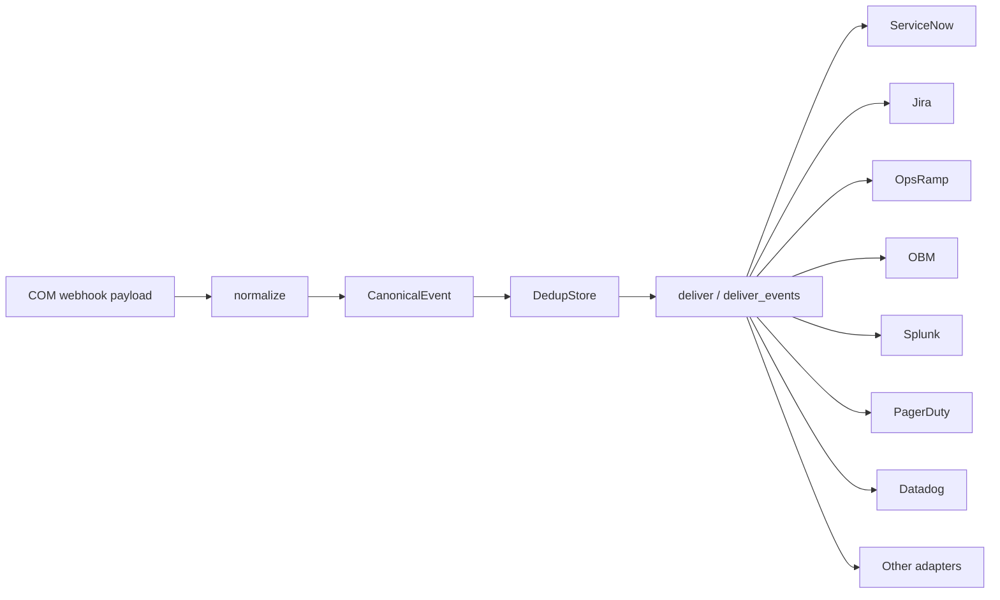

# com-event-core

Shared event-processing and target-adapter package for **HPE Compute Ops Management (COM)** integrations.

`com-event-core` is the single source of truth used by both deployment models in this repository:

- [`com-event-relay`](../com-event-relay/) — cloud relay + durable queue + outbound-only on-prem shim
- [`com-event-bridge`](../com-event-bridge/) — single-box receiver with optional on-disk spool

It contains the COM event normalisation, `CanonicalEvent` model, de-duplication, raise/clear correlation, multi-target delivery logic, secrets helper, and all built-in target adapters.

> **Reference implementation**
>
> This is an open-source reference/sample implementation. Review, validate, and harden it for your own environment before production use.

---

## Contents

- [Why this package exists](#why-this-package-exists)
- [Architecture](#architecture)
- [What's in it](#whats-in-it)
- [COM resource types](#com-resource-types)
- [COM webhook filters and raise / clear lifecycle](#com-webhook-filters-and-raise--clear-lifecycle)
  - [Namespace note](#namespace-note)
  - [Server health](#server-health)
  - [Server power](#server-power)
  - [Server connection](#server-connection)
  - [Server subscription](#server-subscription)
  - [COM alerts](#com-alerts)
- [Server conditions](#server-conditions)
- [CanonicalEvent](#canonicalevent)
- [Correlation and de-duplication](#correlation-and-de-duplication)
- [Delivering to multiple targets](#delivering-to-multiple-targets)
- [Supported adapters](#supported-adapters)
- [Raise / clear behavior by adapter](#raise--clear-behavior-by-adapter)
- [Adapter validation status](#adapter-validation-status)
- [Known per-target tuning](#known-per-target-tuning)
- [Usage](#usage)
- [Example: COM event to CanonicalEvent](#example-com-event-to-canonicalevent)
- [What each adapter sends](#what-each-adapter-sends)
- [Inspecting adapter payloads](#inspecting-adapter-payloads)
- [Install](#install)
- [Adding a new target](#adding-a-new-target)
- [Secrets](#secrets)
- [Current limitations](#current-limitations)
- [Versioning](#versioning)

---

# Why this package exists

Both the Relay Shim and the Bridge need to perform the same processing:

```text
COM payload
   |
   v
Normalise
   |
   v
CanonicalEvent
   |
   +--> De-duplicate
   |
   +--> Correlate raise / clear
   |
   +--> Deliver to one or more target adapters
```

Without a shared package, the event model, mappings, de-duplication, and target adapters would need to be implemented twice.

`com-event-core` keeps that logic in one place.

A mapping or adapter fix made here is inherited by both:

```text
com-event-relay/shim
com-event-bridge/bridge
```

---

# Architecture



The public COM webhook handshake and shared-secret validation belong to the **Relay** or **Bridge** receiver.

The shared package starts once the COM payload is ready to be interpreted and delivered.

---

# What's in it

| Module | Purpose |
|---|---|
| `com_event_core.normalize` | `CanonicalEvent` + COM payload normalisation |
| `com_event_core.dedup` | SQLite TTL de-duplication store |
| `com_event_core.adapters` | Adapter discovery and all built-in target adapters |
| `com_event_core.deliver` | Single- and multi-target delivery with per-adapter de-duplication and partial-failure handling |
| `com_event_core.secrets` | Resolve secrets from environment variables or `<NAME>_FILE` projected files |

Target selection is controlled with:

```bash
TARGETS=<name>
```

or a comma-separated list:

```bash
TARGETS=servicenow,splunk
```

If `TARGETS` is not set, the generic `webhook` adapter is used by default.

---

# COM resource types

The normaliser currently handles two COM resource families plus a generic fallback.

| Resource | Delivered payload `type` | Interpretation |
|---|---|---|
| **Server** | `compute-ops-mgmt/server` | Full-state server snapshot. One or more conditions are evaluated according to `SERVER_MONITORS`. |
| **Alert** | `compute-ops-mgmt/alert` | Individual COM alert lifecycle event. |
| **Generic** | Any other type | Passed through as a generic raise event. |

For a server event, `power`, `connection`, and `subscription` are **not separate resource types**.

They are conditions contained inside the same server snapshot:

```text
compute-ops-mgmt/server
        |
        +--> health
        +--> power
        +--> connection
        +--> subscription
```

The normaliser can emit one `CanonicalEvent` per enabled condition.

---

# COM webhook filters and raise / clear lifecycle

For stateful targets, a complete lifecycle requires both:

```text
problem transition  -> raise
recovery transition -> clear
```

COM webhook filtering occurs before the event reaches the Relay or Bridge.

This means that, for each monitored server transition, you normally configure **two COM webhooks**:

1. one webhook for the problem transition
2. one webhook for the recovery transition

Both webhooks point to the **same Relay or Bridge endpoint**.

The receiver and `com-event-core` then convert those COM snapshots into correlated raise and clear events.

---

## Namespace note

There is an important namespace difference between COM webhook filters and delivered payloads.

COM `eventFilter` expressions use the shorter namespace:

```text
compute-ops/server
compute-ops/alert
```

The delivered webhook payload uses:

```text
compute-ops-mgmt/server
compute-ops-mgmt/alert
```

For example:

```text
eventFilter:
type eq 'compute-ops/server'
```

but the received JSON contains:

```json
{
  "type": "compute-ops-mgmt/server"
}
```

The normaliser matches the resource type by suffix (`.../server`, `.../alert`), so either namespace spelling is safely recognised during normalisation.

---

## Server health

Enable health monitoring with:

```bash
SERVER_MONITORS=health
```

`health` is the default if `SERVER_MONITORS` is not configured.

### Raise — health leaves OK

```text
type eq 'compute-ops/server' and old/hardware/health/summary eq 'OK' and changed/hardware/health/summary eq True
```

### Clear — health returns to OK

```text
type eq 'compute-ops/server' and new/hardware/health/summary eq 'OK' and changed/hardware/health/summary eq True
```

The normalised lifecycle is:

```text
health != OK
     |
     v
action = raise
correlation_key = server:<serial>:health

health returns to OK
     |
     v
action = clear
correlation_key = server:<serial>:health
```

---

## Server power

Enable power monitoring with:

```bash
SERVER_MONITORS=power
```

or:

```bash
SERVER_MONITORS=health,power
```

### Raise — server powers off

```text
type eq 'compute-ops/server' and old/hardware/powerState eq 'ON' and changed/hardware/powerState eq True
```

### Clear — server powers back on

```text
type eq 'compute-ops/server' and new/hardware/powerState eq 'ON' and changed/hardware/powerState eq True
```

Correlation key:

```text
server:<serial>:power
```

---

## Server connection

Enable connection monitoring with:

```bash
SERVER_MONITORS=connection
```

### Raise — server disconnects from COM

```text
type eq 'compute-ops/server' and old/state/connected eq True and changed/state/connected eq True
```

### Clear — server reconnects

```text
type eq 'compute-ops/server' and old/state/connected eq False and changed/state/connected eq True
```

> The reconnect filter can also match a newly added server's first transition to connected. Validate the desired behavior in your COM environment.

Correlation key:

```text
server:<serial>:connection
```

---

## Server subscription

Enable subscription monitoring with:

```bash
SERVER_MONITORS=subscription
```

### Raise — subscription leaves SUBSCRIBED

```text
type eq 'compute-ops/server' and old/state/subscriptionState eq 'SUBSCRIBED' and changed/state/subscriptionState eq True
```

### Clear — subscription returns to SUBSCRIBED

```text
type eq 'compute-ops/server' and new/state/subscriptionState eq 'SUBSCRIBED' and changed/state/subscriptionState eq True
```

Correlation key:

```text
server:<serial>:subscription
```

The normaliser can also treat an expired `subscriptionExpiresAt` value as a subscription problem.

---

## COM alerts

### Raise — alert created

```text
type eq 'compute-ops/alert' and operation eq 'Created'
```

### Clear — alert deleted / resolved

```text
type eq 'compute-ops/alert' and operation eq 'Deleted'
```

The normaliser treats an alert as cleared when the payload indicates the alert has been cleared, including `cleared`, `clearedAt`, or a deleted operation.

Correlation key:

```text
alert:<id>
```

---

## Why two COM webhooks are needed

A webhook only receives events that match its configured `eventFilter`.

For example:

```text
OK -> non-OK
```

and:

```text
non-OK -> OK
```

are separate transitions.

Therefore the raise and clear filters must both be configured and should point to the same receiver.

---

# Server conditions

A COM server webhook is a **full-state snapshot**, not a field-change delta.

`normalize()` evaluates every condition enabled in `SERVER_MONITORS`.

| `SERVER_MONITORS` | Raise when | Clear when | Canonical severity |
|---|---|---|---|
| `health` *(default)* | `hardware.health.summary != OK` | health returns to `OK` | mapped from COM health |
| `power` | `hardware.powerState = OFF` | returns to `ON` | `warning` |
| `connection` | `state.connected = false` | returns to `true` | `major` |
| `subscription` | subscription not `SUBSCRIBED` or expired | subscribed and not expired | `minor` |

Example:

```bash
SERVER_MONITORS=health,power,connection
```

One server snapshot can then result in several independent events:

```text
server:CZ2311004G:health
server:CZ2311004G:power
server:CZ2311004G:connection
```

A recovery for one condition cannot close an incident opened for another condition.

A condition not listed in `SERVER_MONITORS` is ignored.

Because server webhooks are snapshots, a healthy condition can generate repeated clear candidates. The de-duplication layer suppresses repeated equivalent clears.

---

# CanonicalEvent

Every adapter consumes the same neutral event model.

Conceptually:

```python
CanonicalEvent(
    event_id=...,
    operation=...,
    title=...,
    severity=...,
    resource_serial=...,
    resource_model=...,
    mgmt_url=...,
    time_created=...,
    tags=...,
    dedup_key=...,
    source_type=...,
    action=...,
    correlation_key=...,
    resource_name=...,
    part_number=...,
    description=...,
    resolution=...,
    category=...,
    raw=...,
)
```

| Field | Purpose |
|---|---|
| `event_id` | Source COM event/resource identifier |
| `source_type` | `server`, `alert`, or generic type |
| `action` | `raise` or `clear` |
| `severity` | Canonical severity |
| `correlation_key` | Stable identity connecting raise and clear |
| `dedup_key` | Delivery identity used to suppress duplicates |
| `resource_serial` | Server serial number when available |
| `resource_name` | Resource/display name |
| `resource_model` | Server model |
| `description` | Normalised description |
| `resolution` | Recovery text where available (alerts only) |
| `raw` | Original COM payload |

---

# Correlation and de-duplication

These solve different problems.

## Correlation

The `correlation_key` identifies the underlying condition.

Examples:

```text
server:CZ2311004G:health
server:CZ2311004G:power
alert:123456
```

The same key is used for both raise and clear.

## De-duplication

The `dedup_key` identifies a particular delivery state.

Conceptually:

```text
correlation_key + action + severity
```

This means a raise and its clear are never collapsed together, while repeated copies of the same event can still be suppressed.

---

# Delivering to multiple targets

One event can be delivered to several adapters.

Examples:

```bash
TARGETS=halo
TARGETS=halo,opsramp
TARGETS=servicenow,splunk
TARGETS=github,slack
TARGETS=sentinel,pagerduty,teams
```

De-duplication is tracked per adapter.

If some targets succeed and one fails, the successful targets remain marked as complete and only the failed target is re-attempted on retry.

Durability is supplied by the consumer:

- **Relay + Shim** — queue redelivery
- **Bridge spool mode** — local spool retry
- **Bridge sync mode** — best-effort only

For important fan-out, use queue or spool mode.

Multiple instances of the **same adapter type** are not currently supported because adapter configuration uses fixed global environment-variable names.

---

# Supported adapters

Current adapter names:

```text
obm
servicenow
opsramp
halo
splunk
github
slack
teams
jira
pagerduty
sentinel
datadog
elastic
bmc_helix
dynatrace
grafana
webhook
```

| `TARGET` | Category | Target role |
|---|---|---|
| `servicenow` | ITSM | Event Management or incident creation |
| `halo` | ITSM | HaloITSM ticket / incident |
| `jira` | ITSM | Jira Service Management / Jira issue |
| `bmc_helix` | ITSM | BMC Helix / Remedy incident |
| `opsramp` | ITOM / AIOps | Alert / event ingestion |
| `obm` | ITOM | OpenText OBM event |
| `splunk` | SIEM / log | Splunk HEC |
| `elastic` | SIEM / log | Elasticsearch document |
| `sentinel` | SIEM | Microsoft Sentinel / Log Analytics |
| `pagerduty` | Incident response | PagerDuty Events API v2 |
| `slack` | ChatOps | Slack incoming webhook |
| `teams` | ChatOps | Microsoft Teams Workflow webhook |
| `github` | Issue tracking | GitHub Issues |
| `datadog` | Monitoring | Datadog Events API |
| `dynatrace` | Monitoring | Dynatrace Events API v2 |
| `grafana` | Observability / log | Grafana Cloud Logs / Loki |
| `webhook` | Generic | Canonical JSON POST |

---

# Raise / clear behavior by adapter

## Stateful targets

| Adapter | Clear behavior |
|---|---|
| `servicenow` Event Management | Sends a clear event |
| `servicenow` incident | Finds and resolves the correlated incident |
| `halo` | Finds the matching ticket by `thirdpartyref` and closes it |
| `jira` | Finds the correlated issue and runs the configured close transition |
| `bmc_helix` | Finds the correlated incident and marks it resolved |
| `opsramp` | Sends state `Ok` using the same alert key |
| `obm` | Sends normal/closed state using the same correlation key |
| `github` | Finds and closes the matching issue |
| `pagerduty` | Sends `resolve` using the same `dedup_key` |

## Event / log / notification targets

| Adapter | Clear behavior |
|---|---|
| `splunk` | Clear is stored as an event with `action=clear` |
| `elastic` | Clear is indexed as another document |
| `sentinel` | Clear is ingested as another record |
| `slack` | Posts a resolved notification |
| `teams` | Posts a resolved card |
| `datadog` | Posts a recovery/success event |
| `dynatrace` | Posts a recovery event |
| `grafana` | Writes a clear log entry |
| `webhook` | Sends the canonical clear event |

---

# Adapter validation status

> ⚠️ **Important**
>
> These adapters are reference implementations. Validate connectivity, authentication, payload mapping, and raise/clear behavior against your own target environment before production use.

At the time of writing, the `github` adapter has been exercised end-to-end against a live target.

| Adapter | Implemented | Live end-to-end validation |
|---|:---:|:---:|
| `github` | ✅ | ✅ |
| `servicenow` | ✅ | ⚠️ Validate |
| `opsramp` | ✅ | ⚠️ Validate |
| `halo` | ✅ | ⚠️ Validate |
| `splunk` | ✅ | ⚠️ Validate |
| `obm` | ✅ | ⚠️ Validate |
| `slack` | ✅ | ⚠️ Validate |
| `teams` | ✅ | ⚠️ Validate |
| `jira` | ✅ | ⚠️ Validate |
| `pagerduty` | ✅ | ⚠️ Validate |
| `sentinel` | ✅ | ⚠️ Validate |
| `datadog` | ✅ | ⚠️ Validate |
| `elastic` | ✅ | ⚠️ Validate |
| `bmc_helix` | ✅ | ⚠️ Validate |
| `dynatrace` | ✅ | ⚠️ Validate |
| `grafana` | ✅ | ⚠️ Validate |
| `webhook` | ✅ | ⚠️ Validate against destination |

Useful validation feedback includes authentication, payload acceptance, object creation, de-duplication, raise/clear behavior, and tenant-specific settings.

---

# Known per-target tuning

## Jira

Closing an issue depends on the workflow transition configured in the Jira project.

Review:

```text
JIRA_CLOSE_TRANSITION
```

## BMC Helix

Status, impact, urgency, and other field values can differ across Helix configurations.

Review settings such as:

```text
BMC_HELIX_STATUS_RESOLVED
```

and validate selected impact/urgency values.

## Microsoft Sentinel / Log Analytics

Validate:

- workspace credentials
- log type
- custom-table naming
- expected `<LOG_TYPE>_CL` behavior

## ServiceNow incident mode

Validate:

- assignment behavior
- `cmdb_ci` mapping
- state/resolution values
- permissions to search and update the correlated incident

---

# Usage

```python
from com_event_core import normalize, DedupStore, deliver_events, get_adapters

adapters = get_adapters()
dedup = DedupStore()

events = normalize(com_payload)
deliver_events(events, adapters, dedup)
```

Use the shared delivery layer rather than calling `adapter.forward()` directly when you need de-duplication, fan-out, and partial-failure handling.

---

# Example: COM event to CanonicalEvent

Example server-health payload:

```json
{
  "type": "compute-ops-mgmt/server",
  "id": "P28948-B21+CZ2311004G",
  "name": "ESX-node-01",
  "operation": "Updated",
  "updatedAt": "2025-01-01T10:00:00Z",
  "hardware": {
    "serialNumber": "CZ2311004G",
    "productId": "P28948-B21",
    "model": "ProLiant DL360 Gen11",
    "bmc": { "ip": "10.0.0.5" },
    "health": {
      "summary": "CRITICAL",
      "fans": "OK",
      "powerSupplies": "CRITICAL",
      "memory": "OK"
    }
  }
}
```

Normalisation produces an event conceptually equivalent to:

```python
CanonicalEvent(
    event_id="P28948-B21+CZ2311004G",
    operation="Updated",
    title="Server ESX-node-01 health CRITICAL",
    severity="critical",
    resource_serial="CZ2311004G",
    resource_model="ProLiant DL360 Gen11",
    mgmt_url="https://10.0.0.5",
    time_created="2025-01-01T10:00:00Z",
    tags={},
    dedup_key="82b8f550…",          # sha1(correlation_key | action | severity)
    source_type="server",
    action="raise",
    correlation_key="server:CZ2311004G:health",
    resource_name="ESX-node-01",
    part_number="P28948-B21",
    description="Server: ESX-node-01\nHealth summary: CRITICAL\nComponents not OK: powerSupplies=CRITICAL",
    resolution=None,                # populated for alerts only
    category="hardware-health",
)
```

A later healthy snapshot produces:

```text
action = clear
correlation_key = server:CZ2311004G:health
```

---

# What each adapter sends

For the same server-health raise above, this is the object each adapter builds
and delivers. These are hand-checked snapshots for quick reading; run
[`examples/dump_payloads.py`](#inspecting-adapter-payloads) to see the mapping for
the current code and for the clear/alert variants.

`obm` → `POST` to the OBM Event REST API:

```json
{
  "title": "Server ESX-node-01 health CRITICAL",
  "severity": "critical",
  "lifecycle_state": "open",
  "related_ci": "CZ2311004G",
  "node": "ProLiant DL360 Gen11",
  "mgmt_url": "https://10.0.0.5",
  "time_created": "2025-01-01T10:00:00Z",
  "description": "Server: ESX-node-01\nHealth summary: CRITICAL\nComponents not OK: powerSupplies=CRITICAL",
  "custom_attrs": "",
  "dedup_key": "server:CZ2311004G:health"
}
```

`servicenow` (default `em_event` table) → `POST /api/now/table/em_event`:

```json
{
  "source": "HPE COM",
  "event_class": "compute-ops-management",
  "resource": "ProLiant DL360 Gen11",
  "node": "CZ2311004G",
  "severity": "1",
  "description": "Server: ESX-node-01\nHealth summary: CRITICAL\nComponents not OK: powerSupplies=CRITICAL",
  "message_key": "server:CZ2311004G:health",
  "additional_info": ""
}
```

`servicenow` (`SNOW_TABLE=incident`) → `POST /api/now/table/incident`:

```json
{
  "short_description": "Server ESX-node-01 health CRITICAL",
  "description": "Server: ESX-node-01\nHealth summary: CRITICAL\nComponents not OK: powerSupplies=CRITICAL",
  "cmdb_ci": "CZ2311004G",
  "correlation_id": "server:CZ2311004G:health"
}
```

`opsramp` → `POST /api/v2/tenants/<id>/alerts`:

```json
{
  "serviceName": "HPE COM",
  "device": { "hostName": "CZ2311004G", "resourceName": "CZ2311004G" },
  "currentState": "Critical",
  "alertKey": "server:CZ2311004G:health",
  "component": "ProLiant DL360 Gen11",
  "subject": "Server ESX-node-01 health CRITICAL",
  "description": "Server: ESX-node-01\nHealth summary: CRITICAL\nComponents not OK: powerSupplies=CRITICAL",
  "app": "HPE COM",
  "alertTime": "2025-01-01T10:00:00Z"
}
```

`halo` → `POST /api/Tickets` (an array of one ticket):

```json
[
  {
    "summary": "Server ESX-node-01 health CRITICAL",
    "details": "COM operation Updated on CZ2311004G (ProLiant DL360 Gen11).\nEvent id: P28948-B21+CZ2311004G\nSeverity: critical\nManagement URL: https://10.0.0.5\nTime: 2025-01-01T10:00:00Z\n\nServer: ESX-node-01\nHealth summary: CRITICAL\nComponents not OK: powerSupplies=CRITICAL",
    "tickettype_id": 1,
    "impact": 1,
    "urgency": 1,
    "thirdpartyref": "server:CZ2311004G:health"
  }
]
```

`splunk` → `POST` to the HTTP Event Collector:

```json
{
  "source": "hpe-com",
  "sourcetype": "com:event",
  "event": {
    "event_id": "P28948-B21+CZ2311004G",
    "operation": "Updated",
    "action": "raise",
    "title": "Server ESX-node-01 health CRITICAL",
    "severity": "critical",
    "serial": "CZ2311004G",
    "model": "ProLiant DL360 Gen11",
    "mgmt_url": "https://10.0.0.5",
    "time_created": "2025-01-01T10:00:00Z",
    "tags": {},
    "dedup_key": "82b8f550…",
    "correlation_key": "server:CZ2311004G:health",
    "description": "Server: ESX-node-01\nHealth summary: CRITICAL\nComponents not OK: powerSupplies=CRITICAL",
    "resolution": null
  }
}
```

`webhook` → `POST` the **full** `CanonicalEvent` as JSON (`dataclasses.asdict`,
i.e. every field shown in the example above plus the original COM payload under
`raw`).

The remaining adapters (`jira`, `bmc_helix`, `github`, `pagerduty`, `sentinel`,
`elastic`, `slack`, `teams`, `datadog`, `dynatrace`, `grafana`) map the same
canonical fields to their own API shapes; see
[`examples/dump_payloads.py`](#inspecting-adapter-payloads) for their live output.

---

# Inspecting adapter payloads

Use the companion helper script to inspect mappings without sending anything:

```bash
python examples/dump_payloads.py
python examples/dump_payloads.py server clear
python examples/dump_payloads.py alert raise
python examples/dump_payloads.py alert clear
```

This is preferable to relying only on static README payload examples because it reflects the current adapter code.

---

# Install

From a consumer directory:

```bash
pip install -e ../../com-event-core
```

From the repository root:

```bash
pip install -e ./com-event-core
```

The Relay Shim and Bridge container images install `com-event-core` from local source, so no PyPI publication is required.

---

# Adding a new target

A target adapter is the target-specific part of the pipeline. Normalisation, correlation, de-duplication, fan-out, retry integration, and secrets handling are shared.

## 1. Create the adapter

Create:

```text
com_event_core/adapters/<name>.py
```

Example:

```python
from __future__ import annotations

import logging
import os

import httpx

from com_event_core.normalize import CanonicalEvent, ACTION_CLEAR
from .base import TargetAdapter

log = logging.getLogger("com_event_core.adapter.mytool")


class MyToolAdapter(TargetAdapter):
    name = "mytool"

    def __init__(self) -> None:
        self._url = os.environ["MYTOOL_URL"]
        self._token = os.environ["MYTOOL_TOKEN"]
        self._timeout = int(os.environ.get("TARGET_TIMEOUT", "15"))

    def forward(self, event: CanonicalEvent) -> None:
        payload = {
            "summary": event.title,
            "severity": event.severity,
            "node": event.resource_serial,
            "dedupKey": event.correlation_key,
            "state": "resolved" if event.action == ACTION_CLEAR else "active",
            "detail": event.description,
        }

        with httpx.Client(timeout=self._timeout) as client:
            response = client.post(
                self._url,
                json=payload,
                headers={"Authorization": f"Bearer {self._token}"},
            )
            response.raise_for_status()

        log.info("event %s forwarded to mytool", event.event_id)
```

## 2. Register it

Add it to `_ADAPTERS` in:

```text
com_event_core/adapters/__init__.py
```

Example:

```python
_ADAPTERS = {
    # ...
    "mytool": ("com_event_core.adapters.mytool", "MyToolAdapter"),
}
```

Then select it with:

```bash
TARGETS=mytool
```

## 3. Handle raise and clear

Every event contains:

```text
event.action
event.correlation_key
```

If the target supports lifecycle state, use the correlation key to resolve or close the object on clear.

If the target is an event/log sink, send the clear as another event.

## 4. Respect the adapter contract

An adapter should:

- set a unique `name`
- validate required configuration at startup
- raise on delivery failure
- never silently swallow target errors
- be safe for redelivery
- use `correlation_key` where the target supports lifecycle correlation
- optionally implement a health/readiness check

## 5. Test locally

The Bridge in `sync` mode is convenient for development:

```bash
cd com-event-bridge/bridge
pip install -e ../../com-event-core

TARGETS=mytool \
MYTOOL_URL=... \
MYTOOL_TOKEN=... \
DELIVERY_MODE=sync \
COM_SHARED_SECRET=dev \
uvicorn app:app --port 8080
```

Use durable queue/spool delivery in production where event loss is unacceptable.

## 6. Validate lifecycle behavior

Minimum useful test:

```text
raise
  -> target object created

same raise again
  -> no duplicate

clear
  -> object resolved / clear recorded
```

Also test a temporary target outage to verify retry.

## 7. Document it

When adding an adapter:

1. add it to the root supported-integration matrix
2. add required variables to Bridge and Relay Shim `.env.example`
3. document tenant-specific settings
4. extend `examples/dump_payloads.py` if appropriate
5. update adapter validation status after live testing

The generic `webhook.py` adapter is the simplest implementation to copy.

---

# Secrets

Sensitive values can be loaded from either the plain environment variable:

```text
NAME
```

or a file:

```text
NAME_FILE
```

through the shared secret helper. When both are set, `NAME_FILE` takes
precedence — a file-projected secret always wins over the plain environment
variable.

Example:

```text
JIRA_API_TOKEN_FILE=/run/secrets/jira_api_token
```

This supports Docker secrets, CSI projections, systemd credentials, and external vault integrations without requiring secrets to be stored directly in `.env`.

---

# Current limitations

## Multiple instances of the same adapter

Adapters currently use fixed global variable names, such as:

```text
WEBHOOK_URL
SLACK_WEBHOOK_URL
```

So one deployment cannot yet cleanly configure two instances of the same adapter type with different destinations.

A future namespaced model could look like:

```text
TARGETS=webhook:itsm,webhook:archive
```

with:

```text
WEBHOOK__ITSM_URL=...
WEBHOOK__ARCHIVE_URL=...
```

## Live-target validation

Most adapters need broader live-tenant testing.

## Tenant-specific workflows

Workflow names, custom fields, states, and table conventions can vary between target environments and may require local configuration.

---

# Versioning

Semantic versioning is recommended.

Typical guidance:

- bug fix → patch
- backward-compatible adapter/mapping enhancement → minor
- breaking `CanonicalEvent` change → major
- breaking adapter environment-variable contract → major

Example compatible range:

```text
com-event-core>=0.1,<0.2
```
