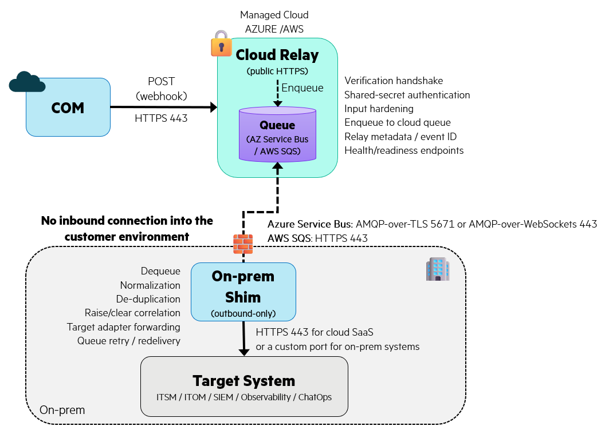

# COM Event Relay

A cloud-hosted webhook relay for **HPE Compute Ops Management (COM)** that securely receives COM events, stores them in a durable Azure or AWS queue, and lets an **outbound-only on-premises shim** deliver them to internal ITSM, ITOM, SIEM, ChatOps, incident-response, and observability platforms — **without opening inbound network ports into the customer environment**.

Use this deployment model when you want the public webhook edge hosted in Azure or AWS while keeping the internal target private.

> **Reference implementation**
>
> This is an open-source reference/sample implementation. Review, validate, and harden it for your own environment before production use.

---

## At a glance



Cloud mappings:

```text
Azure:
COM -> Azure Container Apps -> Azure Service Bus -> Shim -> Target

AWS:
COM -> AWS App Runner -> Amazon SQS -> Shim -> Target
```

The customer-side network remains outbound-only:

```text
Customer network
    |
    +--> outbound to Azure Service Bus / AWS SQS
    |
    +--> outbound to target platform
```

No inbound connection from COM into the customer environment is required.

---

## Contents

- [Why use Relay + Shim?](#why-use-relay--shim)
- [When to use the Relay](#when-to-use-the-relay)
- [When a native COM integration is enough](#when-a-native-com-integration-is-enough)
- [Architecture](#architecture)
- [Relay vs Shim responsibilities](#relay-vs-shim-responsibilities)
- [Delivery guarantees](#delivery-guarantees)
- [Queue message outcomes](#queue-message-outcomes)
- [Queue retention and dead-lettering](#queue-retention-and-dead-lettering)
- [Network requirements](#network-requirements)
- [Azure vs AWS](#azure-vs-aws)
- [Shim persistence and scaling](#shim-persistence-and-scaling)
- [Endpoints](#endpoints)
- [Quick start](#quick-start)
- [Configuration](#configuration)
- [Target adapters](#target-adapters)
- [Secrets management](#secrets-management)
- [Observability](#observability)
- [Register the webhook in COM](#register-the-webhook-in-com)
- [Production checklist](#production-checklist)
- [Project layout](#project-layout)
- [Relationship to com-event-core](#relationship-to-com-event-core)
- [Relationship to com-event-bridge](#relationship-to-com-event-bridge)

---

# Why use Relay + Shim?

COM is a SaaS service and therefore sends webhook events to a publicly reachable HTTPS endpoint.

In many enterprise environments, the actual destination system is private:

```text
ServiceNow MID-connected environment
OpsRamp private endpoint
OpenText OBM
Splunk
internal SIEM
internal webhook target
```

Directly exposing an internal receiver introduces:

- inbound firewall requirements
- public DNS
- public TLS/certificate management
- public-host hardening
- direct dependence between COM and the target
- no durable buffering between receive and deliver

Relay + Shim inserts a managed public edge and durable queue:

```text
COM
 |
 v
Cloud Relay
 |
 v
Durable Queue
 |
 v
Outbound-only Shim
 |
 v
Internal target
```

This separates **webhook reception** from **target delivery**.

---

# When to use the Relay

Use `com-event-relay` when:

- no inbound HTTPS path into the customer network is allowed
- you want the public edge hosted as a managed Azure or AWS service
- queue-backed durability is preferred
- receive and delivery should be decoupled
- the target may be temporarily unavailable
- you want one shared architecture across several target types
- you need transformation, de-duplication, raise/clear correlation, or fan-out
- the target has no native COM integration

---

# When a native COM integration is enough

If COM already provides a native integration for a target and that native path meets the requirement, it is usually the simplest option.

Use the native integration when:

- the built-in workflow is sufficient
- no extra buffering or transformation layer is needed
- no multi-target fan-out is required
- no shared custom correlation logic is required

Use Relay + Shim when you additionally need:

- outbound-only customer connectivity
- durable queue buffering
- custom payload transformation or enrichment
- shared de-duplication
- raise/clear lifecycle correlation
- fan-out to multiple targets
- a common integration layer across native and non-native targets

---

# Architecture

## Relay path

The Relay is intentionally simple.

```text
COM request
   |
   +--> verification handshake
   |
   +--> shared-secret authentication
   |
   +--> request-size / JSON validation
   |
   +--> add relay metadata
   |
   +--> publish raw COM payload
            |
            v
         Queue
```

The Relay does **not**:

- normalize COM events
- interpret server conditions
- perform target-specific transformation
- correlate raise and clear
- call the final target

Those responsibilities belong to the Shim and `com-event-core`.

---

## Shim path

```text
Queue message
   |
   +--> receive
   |
   +--> normalize COM payload
   |
   +--> CanonicalEvent
   |
   +--> de-duplicate
   |
   +--> correlate raise / clear
   |
   +--> deliver to target adapter(s)
            |
            v
          Target
```

This boundary keeps the public Relay stateless and target-agnostic.

---

# Relay vs Shim responsibilities

| Capability | Relay | Shim |
|---|:---:|:---:|
| Public HTTPS endpoint | ✅ | — |
| COM verification handshake | ✅ | — |
| COM shared-secret validation | ✅ | — |
| Body-size / malformed JSON checks | ✅ | — |
| Add relay metadata | ✅ | — |
| Publish to queue | ✅ | — |
| Consume from queue | — | ✅ |
| Normalize to `CanonicalEvent` | — | ✅ |
| Evaluate `SERVER_MONITORS` | — | ✅ |
| De-duplication | — | ✅ |
| Raise / clear correlation | — | ✅ |
| Target adapter execution | — | ✅ |
| Partial-failure tracking | — | ✅ |
| Retry via queue redelivery | Queue-managed | ✅ |

---

# Delivery guarantees

The Relay architecture has two distinct reliability boundaries.

## Before queue enqueue

```text
COM -> Relay -> Queue
```

If the Relay successfully publishes the event to the queue:

```text
Relay -> 202
```

the event is durably handed off to the queue.

If enqueue fails:

```text
Relay -> 503
```

> **Important**
>
> COM does not retry failed webhook deliveries.
>
> A `503` protects the Relay from falsely acknowledging an event that was not queued, but the COM event itself is lost.

Repeated webhook failures may also cause COM to disable the webhook, so Relay readiness and queue health should be monitored.

---

## After queue enqueue

Once the event is successfully queued:

```text
Queue -> Shim -> Target
```

delivery is **at least once**.

That means the queue may redeliver a message after:

- Shim restart
- transient target failure
- connection interruption
- message-lock expiration
- consumer failure

The Shim uses per-adapter de-duplication from `com-event-core` to avoid repeating target actions unnecessarily.

Conceptually:

```text
queue redelivery
      |
      v
per-adapter dedup
      |
      +--> already delivered -> skip
      |
      +--> not delivered -> forward
```

---

## Queue consumption and delivery latency

A common question is *"how often does the Shim poll the queue?"*

The Shim does **not** poll on a fixed interval (ask → sleep → ask again). It uses **long polling**: it opens a receive call and the queue holds that call open until either a message arrives or a maximum wait window elapses.

```text
fixed-interval polling (NOT used):
  ask -> "nothing" (instant) -> sleep -> ask -> ...
  a message can wait up to one full interval before pickup

long polling (used):
  ask -> queue holds the call open ... -> message arrives -> returned immediately
  if the window elapses empty -> return -> ask again at once
```

Consequences:

- **Delivery is effectively immediate.** A queued event is returned to the Shim the moment it is enqueued — it does not wait for a timer.
- **Fewer idle requests.** While the queue is empty, one long-poll call covers the whole wait window instead of many short "nothing" round-trips (relevant to SQS request cost).

`RECEIVE_MAX_WAIT` sets only the **maximum time the queue holds an *empty* receive call before the Shim loops and re-issues it** — it is a ceiling on *idle waiting*, not a delay applied to real messages. Defaults: **20s** for SQS (the AWS long-poll maximum) and **30s** for Azure Service Bus. Lowering it does **not** speed up delivery (delivery is already immediate); it just makes the idle loop re-issue empty receives more often.

---

# Queue message outcomes

The Shim maps processing results to queue actions.

| Processing result | Queue action |
|---|---|
| All selected adapters succeed | Complete / delete message |
| One or more transient target failures | Abandon / make available for retry |
| Some adapters already succeeded | Skip them through per-adapter de-duplication |
| Invalid or malformed message | Dead-letter where supported/configured |

This supports safe partial failure.

Example:

```text
ServiceNow -> success
Splunk     -> success
PagerDuty  -> failure
```

On redelivery:

```text
ServiceNow -> skipped
Splunk     -> skipped
PagerDuty  -> retried
```

---

# Queue retention and dead-lettering

Durable queueing is not unlimited storage.

Queue configuration determines:

- how long messages can remain pending
- how many delivery attempts are allowed
- when a poison message is dead-lettered
- how long dead-lettered messages are retained

## Azure Service Bus

Review settings such as:

- message TTL
- lock duration
- max delivery count
- dead-letter queue monitoring

A message that exceeds the configured delivery-attempt limit is moved to the Service Bus dead-letter subqueue.

## Amazon SQS

Review settings such as:

- message retention period
- visibility timeout
- max receive count
- redrive policy
- Dead Letter Queue configuration

> SQS dead-letter behavior requires a configured redrive policy and DLQ.

These values determine how long a target can remain unavailable before messages expire or move to dead-letter storage.

---

# Network requirements

## Public side

| Source | Destination | Direction | Port |
|---|---|---|---|
| COM | Cloud Relay | HTTPS | 443 |

## Customer side

| Source | Destination | Direction | Port |
|---|---|---|---|
| Shim | Azure Service Bus | Outbound | 5671 AMQP/TLS or 443 AMQP-over-WebSockets |
| Shim | Amazon SQS | Outbound | 443 |
| Shim | Target platform | Outbound | Usually 443 |

No inbound connection into the customer environment is required.

If the customer network only permits HTTPS/443 egress, configure Azure Service Bus clients to use AMQP-over-WebSockets where appropriate.

---

# Azure vs AWS

| Concern | Azure | AWS |
|---|---|---|
| Public Relay | Azure Container Apps | AWS App Runner |
| Durable Queue | Azure Service Bus | Amazon SQS |
| Secret store | Azure Key Vault | AWS Secrets Manager / SSM Parameter Store |
| Workload identity | Managed Identity | IAM role |
| Customer-side queue access | Service Bus consumer | SQS consumer |
| Public TLS | Managed by platform | Managed by platform |

The architecture is cloud-agnostic:

```text
HTTP receiver
    |
QueuePublisher abstraction
    |
    +--> Azure Service Bus
    |
    +--> Amazon SQS
```

The platform manages the public TLS endpoint, underlying host/OS, and application scaling, significantly reducing public-edge operational overhead.

You still own and operate:

- application configuration
- cloud resource configuration
- identity and permissions
- secrets
- queue settings
- monitoring
- application/container updates
- target integration configuration

---

# Shim persistence and scaling

The Relay itself is stateless and can scale horizontally behind the managed cloud platform.

The Shim requires more care because de-duplication state is local by default.

Typical persistence:

```text
/data
 └── dedup.db
```

If duplicate suppression must survive Shim restarts, mount `DEDUP_DB_PATH` on persistent storage.

Example:

```text
DEDUP_DB_PATH=/data/dedup.db
```

---

## Multiple Shim consumers

Cloud queues support competing consumers:

```text
             +--> Shim A
Queue -------+
             +--> Shim B
```

However, `com-event-core` de-duplication currently uses local SQLite state.

Running several Shim instances without a shared deduplication design can reduce duplicate-suppression consistency across consumers.

Therefore:

> Treat a single persistent Shim instance as the simplest supported operational model unless you deliberately design and validate multi-consumer state behavior.

If horizontal Shim scaling is required, consider moving de-duplication state to a shared backend as a future enhancement.

---

# Endpoints

The Relay exposes:

| Endpoint | Purpose |
|---|---|
| `GET /com/webhook` | COM verification handshake |
| `POST /com/webhook` | COM event receiver |
| `GET /healthz` | Process liveness |
| `GET /readyz` | Readiness including queue publisher availability |

Typical responses:

| Condition | Response |
|---|---|
| Valid verification challenge | `200` |
| Valid event successfully queued | `202` |
| Invalid shared secret | `401` |
| Request body too large | `413` |
| Malformed JSON | `400` |
| Queue enqueue failure | `503` |

A successful `202` means:

> the Relay accepted the event and durably handed it to the configured queue.

It does **not** mean the final target has already received the event.

---

# Quick start

The repository includes end-to-end deployment runbooks for both supported cloud providers.

## Azure

See [Deploy-End-to-End-to-Azure.md](docs/Deploy-End-to-End-to-Azure.md).

Typical flow:

1. Create Azure resource group
2. Create Service Bus namespace + queue
3. Build/publish Relay image
4. Deploy Relay to Azure Container Apps
5. Configure secrets / Managed Identity
6. Start Shim on-prem
7. Register COM webhook
8. Test raise and clear

---

## AWS

See [Deploy-End-to-End-to-AWS.md](docs/Deploy-End-to-End-to-AWS.md).

Typical flow:

1. Create SQS queue
2. Create IAM roles/policies
3. Build/publish Relay image
4. Deploy Relay to App Runner
5. Configure secrets
6. Start Shim on-prem
7. Register COM webhook
8. Test raise and clear

---

## Local development

For local smoke testing, the repository also includes container/compose-oriented development paths.

The important architectural rule remains:

```text
Relay -> queue
Shim  -> target
```

The Relay does not call target adapters directly.

---

# Configuration

Configuration is split by ownership.

---

## Relay-owned settings

| Variable | Required | Default | Purpose |
|---|---|---|---|
| `COM_SHARED_SECRET` | Yes | — | Secret expected from COM |
| `SHARED_SECRET_HEADER` | No | `x-shim-secret` | Header carrying the shared secret |
| `MAX_BODY_BYTES` | No | `262144` | Maximum accepted webhook body (256 KB) |
| `QUEUE_BACKEND` | No | `servicebus` | Queue backend: `servicebus` or `sqs` |
| `SERVICE_BUS_CONNECTION` | servicebus path | — | Service Bus publisher connection if not using identity |
| `QUEUE_NAME` | servicebus path | — | Service Bus queue name (example uses `com-events`) |
| `SQS_QUEUE_URL` | sqs path | — | SQS queue URL |
| `AWS_REGION` | sqs path | — | AWS region |

Where possible, prefer **cloud workload identity** — an Azure Managed Identity or an AWS IAM role attached to the running service — over static connection strings or access keys. The platform issues short-lived, auto-rotating tokens, so there is no long-lived queue secret to store, protect, or leak. Grant the identity least privilege on the one queue (`Send` for the Relay, `Listen` for the Shim). Fall back to a stored connection string / access key (via `SERVICE_BUS_CONNECTION` or AWS keys) only where workload identity is not available, such as local development.

---

## Shim-owned settings

| Variable | Required | Default | Purpose |
|---|---|---|---|
| `QUEUE_BACKEND` | No | `servicebus` | Queue backend: `servicebus` or `sqs` (must match the relay) |
| `SERVICE_BUS_CONNECTION` | servicebus path | — | Service Bus consumer connection if not using identity |
| `QUEUE_NAME` | servicebus path | — | Service Bus queue (example uses `com-events`) |
| `SQS_QUEUE_URL` | sqs path | — | SQS queue URL |
| `AWS_REGION` | sqs path | — | AWS region |
| `TARGETS` | No | `webhook` | One or more target adapter names, comma-separated |
| `TARGET_TIMEOUT` | No | `15` | Per-target HTTP timeout, in seconds |
| `RECEIVE_MAX_WAIT` | No | `20` SQS / `30` Azure | Long-poll wait window per receive call, in seconds. Bounds *idle* waiting only — not a poll interval; see [Queue consumption and delivery latency](#queue-consumption-and-delivery-latency) |
| `SERVER_MONITORS` | No | `health` | Server conditions interpreted by Core |
| `DEDUP_DB_PATH` | No | `/data/dedup.db` | SQLite dedup database (container default) |
| `DEDUP_TTL_SECONDS` | No | `3600` | De-duplication retention window, in seconds |

Examples:

```bash
TARGETS=servicenow
```

```bash
TARGETS=servicenow,splunk
```

```bash
TARGETS=sentinel,pagerduty,teams
```

For supported adapters and target-specific variables, see:

[`com-event-core — Supported adapters`](../com-event-core/README.md#supported-adapters)

---

# Target adapters

The Relay project does not own target-specific mapping logic. All target adapters are implemented once in [`com-event-core`](../com-event-core/) and loaded by the Shim after it receives a queued raw COM payload, so adapter behavior is identical to the Bridge.

## Supported platforms

For the full list of supported platforms and their per-adapter details — category, role, authentication, whether COM offers a native integration, how a clear is delivered, and validation status — see the [supported-adapters table in `com-event-core`](../com-event-core/README.md#supported-adapters), the single source of truth.

**Target not listed?** You have two options:

- **Use the generic `webhook` adapter** to POST the `CanonicalEvent` as JSON to any HTTP endpoint — no code required.
- **Add your own adapter** if the target needs a specific API or payload shape — see [adding a new target](../com-event-core/README.md#adding-a-new-target).

## Selecting one or more targets

The Shim selects adapters with the `TARGETS` environment variable. Use one name, or several comma-separated to fan one COM event out to each target:

```bash
TARGETS=servicenow
TARGETS=servicenow,splunk
```

Separate the names with a bare comma and **no space** (`TARGETS=servicenow,splunk`).
An unquoted space makes the shell split the value, so only the first target is
applied — quote the whole assignment if you want the space: `-e "TARGETS=servicenow, splunk"`.

Each adapter also reads its own connection settings (URLs, credentials, tokens)
from environment variables or mounted secret files. To learn exactly which vars a
specific target needs, follow the four steps in
[Finding an adapter's environment variables](../com-event-core/README.md#finding-an-adapters-environment-variables)
— in short: find your adapter's `# --- Target: <Name> (<name>) ---` block in
[`shim/.env.example`](shim/.env.example) (required/optional/secret are flagged in
the comments), or read the adapter's own file in
[`com_event_core/adapters/`](../com-event-core/com_event_core/adapters/).

---

# Secrets management

Sensitive values should not be stored directly in plaintext `.env` files in production.

The shared secret-resolution pattern supports:

```text
NAME_FILE
```

before:

```text
NAME
```

This lets credentials be projected from external secret stores.

Examples:

```text
COM_SHARED_SECRET_FILE=/run/secrets/com_shared_secret
SERVICE_BUS_CONNECTION_FILE=/run/secrets/service_bus_connection
```

or target secrets handled through Core.

Supported deployment patterns include:

- Azure Key Vault-backed secret injection
- AWS Secrets Manager / SSM
- Docker secrets
- Kubernetes secret projections
- CSI secret drivers
- systemd credentials
- Vault Agent-rendered files

Use least-privilege credentials.

For Azure Service Bus, separate:

```text
Send
```

and:

```text
Listen
```

permissions between Relay and Shim where possible.

For AWS, use separate IAM policies for:

- Relay `SendMessage`
- Shim receive/delete actions

---

# Observability

The Relay and Shim should both be monitored.

## Relay

Monitor:

- `/healthz`
- `/readyz`
- request rate
- `401`
- `400`
- `413`
- `503`
- queue publish latency/failures
- container restarts

A `503` is particularly important because it means the COM event was not queued.

---

## Queue

Monitor:

- queue depth
- age of oldest message
- dead-letter count
- repeated delivery count
- message expiry risk

Queue depth growth usually indicates target or Shim delivery problems.

---

## Shim

Monitor:

- process health
- queue receive failures
- target HTTP/API failures
- retry frequency
- dedup DB accessibility
- message processing latency

Structured JSON logging is recommended so Relay and Shim logs can be correlated using relay/event metadata.

---

# Register the webhook in COM

Point COM at the public Relay URL.

Example:

```text
https://com-relay.example.com/com/webhook
```

Configure the shared-secret header:

```text
x-shim-secret: <COM_SHARED_SECRET>
```

COM performs the verification handshake before activating the webhook.

The Relay echoes:

```text
x-compute-ops-mgmt-verification-challenge
```

as:

```json
{"verification":"<token>"}
```

For exact COM webhook filters covering:

- server health
- power
- connection
- subscription
- alert raise
- alert clear

see:

[`com-event-core — COM webhook filters and raise / clear lifecycle`](../com-event-core/README.md#com-webhook-filters-and-raise--clear-lifecycle)

---

# Production checklist

Before production use, confirm:

- [ ] Relay public URL is reachable from COM
- [ ] Relay TLS is valid
- [ ] `COM_SHARED_SECRET` is configured securely
- [ ] `/healthz` is monitored
- [ ] `/readyz` is monitored
- [ ] queue publish failures are alerted
- [ ] `503` behavior is understood
- [ ] webhook disablement after repeated failures is operationally understood
- [ ] queue retention is configured intentionally
- [ ] max delivery count / redrive policy is configured
- [ ] DLQ is configured where required
- [ ] DLQ is monitored
- [ ] Relay uses least-privilege send permissions
- [ ] Shim uses least-privilege receive permissions
- [ ] Shim outbound queue connectivity is verified
- [ ] Shim outbound target connectivity is verified
- [ ] persistent `DEDUP_DB_PATH` is considered
- [ ] raise and clear are tested end-to-end
- [ ] target outage and recovery are tested
- [ ] queue backlog/recovery behavior is tested
- [ ] secrets are not stored in source control
- [ ] logging and alerting are configured

---

# Project layout

```text
com-event-relay/
├── relay/
│   ├── app.py
│   ├── queue publishers
│   ├── Dockerfile
│   └── .env.example
│
├── shim/
│   ├── consumer
│   ├── Dockerfile
│   └── .env.example
│
├── docs/
│   ├── Deploy-End-to-End-to-Azure.md
│   └── Deploy-End-to-End-to-AWS.md
│
├── deploy/
│   ├── azure/
│   └── aws/
│
├── docker-compose.yml
└── README.md
```

The exact filenames may evolve, but the architectural split remains:

```text
relay/
  public receive + queue publish

shim/
  queue consume + com-event-core + target delivery
```

---

# Relationship to com-event-core

[`com-event-core`](../com-event-core/) contains:

- `CanonicalEvent`
- COM normalisation
- `SERVER_MONITORS`
- de-duplication
- raise/clear correlation
- target adapters
- fan-out
- partial-failure handling
- shared secret helpers

The Shim imports this package rather than duplicating it.

Therefore:

```text
adapter fix
   |
   v
com-event-core
   |
   +--> Relay Shim
   |
   +--> Bridge
```

A new adapter added to Core becomes available to both deployment models.

---

# Relationship to com-event-bridge

Both projects solve the same integration problem with different infrastructure boundaries.

```text
Relay
-----
COM -> managed cloud edge -> durable cloud queue -> outbound-only Shim -> Target
```

```text
Bridge
------
COM -> customer-hosted public edge -> local spool -> Target
```

Choose **Relay + Shim** when:

- no inbound customer-network path is allowed
- Azure or AWS is available
- managed public ingress is preferred
- cloud-queue durability is preferred
- public receive and internal delivery should be decoupled

Choose **Bridge** when:

- no managed cloud should be used
- public HTTPS ingress into the Bridge is acceptable
- a single-box deployment is preferred
- local spool durability is sufficient
