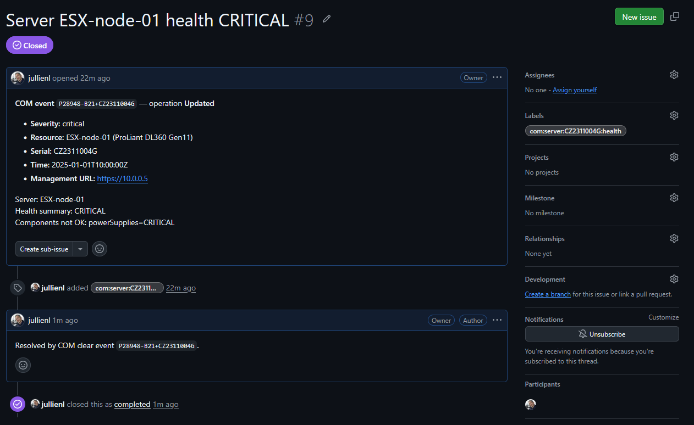

# Deploy the relay on Azure + run the on-prem shim — end-to-end runbook (GitHub Issues target)

A step-by-step guide to stand up the **cloud relay + on-prem shim** on
Azure and take it for a first real-world spin using the **GitHub Issues**
adapter: a COM *server health CRITICAL* opens an issue, and the matching
*recovery* closes it.

```
COM    ──webhook──►   [ RELAY on Azure Container Apps ]  ──►  Azure Service Bus queue
(cloud, public)         GET handshake + x-shim-secret          │
                                                               │ (outbound-only)
                              [ SHIM on-prem ] ──drains queue──┘
                                     │
                                     └──►  GitHub Issues  (open on raise / close on clear)
```

**What you deploy where**

| Piece | Where | Image | Role |
|-------|-------|-------|------|
| Relay | Azure Container Apps (public HTTPS) | `ghcr.io/jullienl/com-event-relay` | Answers COM handshake, validates the shared secret, enqueues events. |
| Queue | Azure Service Bus (Standard) | — | Durable buffer between receive and deliver. |
| Shim | Anywhere with **outbound** internet (your laptop/VM/on-prem) | `ghcr.io/jullienl/com-event-shim` | Drains the queue, forwards to GitHub. **No inbound ports.** |

> Why the split: the relay owns the only public endpoint; the shim reaches the
> queue and GitHub **outbound-only**, so nothing inbound touches your network.

---

## Contents

- [0. Prerequisites](#0-prerequisites)
- [1. Prepare the target application](#1-prepare-the-target-application)
- [2. Choose how to deploy the relay](#2-choose-how-to-deploy-the-relay)
- [3. Verify the relay before wiring COM](#3-verify-the-relay-before-wiring-com)
- [4. Configure the COM webhook](#4-configure-the-com-webhook)
- [5. Run the shim (drains the queue → GitHub)](#5-run-the-shim-drains-the-queue--github)
- [6. End-to-end test](#6-end-to-end-test)
- [7. Troubleshooting](#7-troubleshooting)
- [8. Tear down](#8-tear-down)

---

## 0. Prerequisites

- **This repo cloned locally** — needed **only** for the deploy **script**
  (Option A), the **synthetic-event test** (step 6, Path B), or running the shim
  **directly with Python** (step 5). The **Docker** shim and the manual
  walkthrough with a **real COM event** don't need it (they pull the published
  image and read env vars only):
  ```powershell
  git clone https://github.com/jullienl/HPE-COM-Event-Integrations.git
  cd HPE-COM-Event-Integrations
  ```
- **Azure CLI installed**, then logged in to the target subscription. If `az` isn't
  already on the machine, install it first (see
  [Install the Azure CLI](https://learn.microsoft.com/cli/azure/install-azure-cli)):
  - **Windows:** `winget install -e --id Microsoft.AzureCLI` (or the MSI from the link).
  - **macOS:** `brew install azure-cli`.
  - **Linux:** `curl -sL https://aka.ms/InstallAzureCLIDeb | sudo bash` (Debian/Ubuntu)
    or follow the distro instructions in the link.
  - Or skip the install entirely and use **Azure Cloud Shell** (`az` is preinstalled).

  Then sign in and select the subscription:
  ```powershell
  az login
  az account set --subscription "<your-subscription-id-or-name>"   # Use az account list --output table --refresh to see your subscriptions
  az account show --query "{sub:name, id:id}" -o table
  ```
- **Azure CLI Container Apps extension** (installed automatically below, but you can pre-add it):
  ```powershell
  az extension add --name containerapp --upgrade
  az provider register --namespace Microsoft.App
  az provider register --namespace Microsoft.ServiceBus
  ```
- **Docker** on the machine that will run the **shim** (to run the shim container). The relay itself needs no local Docker — Azure pulls its image.
- A **GitHub repository** you can create issues in (a throwaway repo is ideal for the test).
- Rights to create a **GitHub Personal Access Token** (see step 1).
- Access to configure a **COM webhook** in the HPE GreenLake / Compute Ops Management console.

> Region note: this runbook uses `westeurope`. Override `LOC` if you prefer another region.

---

## 1. Prepare the target application

This runbook uses **GitHub Issues** as the example target, so the steps below
create a repository and a token for it. **Any other target** (ServiceNow, Slack,
Jira, a generic webhook, …) works the same way — only the credential differs:
follow **that application's own documentation** to generate the API token / key /
webhook URL it needs, then pass it to the shim via that adapter's env vars (see
[shim/.env.example](../shim/.env.example) for every adapter's variables).

For the GitHub example:

1. Create (or pick) a repository, e.g. `your-org/com-issues`.
2. Create a **fine-grained PAT**: GitHub → *Settings → Developer settings →
   Personal access tokens → Fine-grained tokens → Generate new token*.
   - **Repository access:** *Only select repositories* → pick your repo.
   - **Permissions → Repository permissions → Issues: Read and write.**
   - (Classic PAT alternative: the `repo` scope also works.)
3. Copy the token — you'll pass it to the **shim** later (step 5) as `GITHUB_TOKEN`
   (nothing GitHub-related is configured on the relay; the relay never talks to GitHub).

The GitHub adapter reads: `GITHUB_REPO` (required, `owner/repo`), `GITHUB_TOKEN`
(required), and optionally `GITHUB_API_URL` (GitHub Enterprise Server) and
`GITHUB_LABELS` (extra labels on new issues).

---

## 2. Choose how to deploy the relay

With the prerequisites done and your target credential in hand, provision the
relay + queue **one of two ways**. The COM/target wiring afterwards
(steps 3–6) is identical either way.

### Option A — Scripted (fastest)

The relay + queue provisioning is scripted in
[deploy/azure/deploy-relay-azure.sh](../deploy/azure/deploy-relay-azure.sh). From
**Azure Cloud Shell** (bash) or **WSL/Git Bash** on Windows, in your clone:

```bash
cd com-event-relay/deploy/azure

# Run it (override any default via env vars on the same line)
RG=rg-com-relay LOC=westeurope bash deploy-relay-azure.sh
```

It prints the **Webhook URL** and the generated **shared secret** at the end —
copy both (you'll need them for COM in step 4). It creates only the **send**
policy, so add the `shim-listen` rule (Option B, step 2) before running the shim, then
**skip to step 3 (verify)**.

### Option B — Manual walkthrough (recommended for a first deploy)

#### 1 - Set the variables

First set the working variables you'll reuse throughout — run these in a
**PowerShell** terminal (locally, or the **PowerShell** option in Azure Cloud Shell):

```powershell
$RG      = "rg-com-relay"                                            # Azure resource group that holds every resource below
$LOC     = "westeurope"                                              # Azure region to deploy into (override if you prefer another)
$SB_NS   = "sbcomrelay$([System.Random]::new().Next(10000,99999))"   # Service Bus namespace name — must be GLOBALLY unique (random suffix)
$QUEUE   = "com-events"                                              # Service Bus queue name; the relay and shim must both use this value
$ACA_ENV = "aca-com-relay"                                           # Container Apps environment (the shared host for the relay app)
$APP     = "com-event-relay"                                         # Container App name for the relay
$IMAGE   = "ghcr.io/jullienl/com-event-relay:latest"                 # relay container image pulled by Azure (published by CI to GHCR)
$HDR     = "x-shim-secret"                                           # HTTP header COM sends carrying the shared secret (auth on every POST)

# 32-byte (64 hex char) shared secret, no openssl needed on Windows:
$SECRET  = -join ((1..32) | ForEach-Object { '{0:x2}' -f (Get-Random -Maximum 256) })
$SECRET   # copy this — COM will send it on every POST
```

> Keep `$SECRET` safe. You'll paste it into the COM webhook definition in step 4.

Then run the two sub-steps below, then continue to **step 3 (verify)**.

#### 2. Create the Service Bus queue + two least-privilege policies

The relay publishes with a **Send**-only key; the shim consumes with a
**Listen**-only key. Two separate keys = least privilege on each end.

> **Why SAS keys here (and not Managed Identity)?** This runbook uses scoped
> SAS connection strings for both ends because the **shim runs on-premises** —
> Azure Managed Identity is only available to Azure-hosted resources, so the
> shim would need a stored credential regardless. Using SAS keys on both ends
> keeps relay and shim symmetric and the runbook copy-paste simple, while the
> separate Send / Listen rules still give least privilege. For an
> Azure-hosted relay you *can* instead enable a Managed Identity and assign it
> the **Azure Service Bus Data Sender** role (the shim would use **Data
> Receiver** only if it too runs in Azure). That removes the stored relay
> secret but adds an identity, RBAC role assignments, and a few minutes of
> role-propagation delay — see the relay README's "Relay-owned settings" note.

```powershell
# Resource group — the container for every resource created below
az group create --name $RG --location $LOC -o none

# Service Bus namespace (Standard SKU — queues need Standard, not Basic)
az servicebus namespace create --resource-group $RG --name $SB_NS `
  --location $LOC --sku Standard -o none

# The queue itself — the durable buffer between relay (send) and shim (receive)
az servicebus queue create --resource-group $RG --namespace-name $SB_NS `
  --name $QUEUE -o none

# Relay: SEND-only authorization rule (the relay may only enqueue, not read)
az servicebus queue authorization-rule create --resource-group $RG `
  --namespace-name $SB_NS --queue-name $QUEUE --name relay-send --rights Send -o none

# Shim: LISTEN-only authorization rule (the shim may only receive, not enqueue)
az servicebus queue authorization-rule create --resource-group $RG `
  --namespace-name $SB_NS --queue-name $QUEUE --name shim-listen --rights Listen -o none

# Grab both connection strings (each carries its own scoped key)
# relay's send-only connection string -> relay app
$SB_SEND = az servicebus queue authorization-rule keys list --resource-group $RG `
  --namespace-name $SB_NS --queue-name $QUEUE --name relay-send `
  --query primaryConnectionString -o tsv

# shim's listen-only connection string -> shim container
$SB_LISTEN = az servicebus queue authorization-rule keys list --resource-group $RG `
  --namespace-name $SB_NS --queue-name $QUEUE --name shim-listen `
  --query primaryConnectionString -o tsv
```

#### 3. Deploy the relay to Azure Container Apps

```powershell
# Container Apps environment — the shared, managed host the relay app runs in.
# NOTE: this first run is SLOW (~2-5 min): Azure provisions the underlying
# managed Kubernetes control plane + a Log Analytics workspace + networking.
# It's a one-time setup and not hung — please be patient and let it finish.
az containerapp env create --resource-group $RG --name $ACA_ENV --location $LOC -o none

# Create the relay app and wire its config in one call:
#   --image                : relay image pulled from GHCR (set above)
#   --ingress/--target-port: public HTTPS in, forwarded to the app's port 8080
#   --min/--max-replicas   : keep >=1 warm (COM never retries); scale up to 3 under load
#   --secrets              : store the SB send-string + shared secret as named secrets
#   secretref:<name>       : env var resolves from a named secret above (not stored inline)
#   QUEUE_BACKEND          : tell the relay to publish to Azure Service Bus
#   SHARED_SECRET_HEADER   : header name the relay checks on each POST
#   QUEUE_NAME             : queue to publish to (must match the shim)
az containerapp create `
  --resource-group $RG --name $APP --environment $ACA_ENV `
  --image $IMAGE `
  --ingress external --target-port 8080 `
  --min-replicas 1 --max-replicas 3 `
  --secrets "sb-conn=$SB_SEND" "com-secret=$SECRET" `
  --env-vars `
    "QUEUE_BACKEND=servicebus" `
    "SERVICE_BUS_CONNECTION=secretref:sb-conn" `
    "COM_SHARED_SECRET=secretref:com-secret" `
    "SHARED_SECRET_HEADER=$HDR" `
    "QUEUE_NAME=$QUEUE" `
  -o none

# Fetch the public hostname Azure assigned to the app
$FQDN = az containerapp show --resource-group $RG --name $APP `
  --query properties.configuration.ingress.fqdn -o tsv

"Webhook URL : https://$FQDN/com/webhook"   # give this URL to COM (step 4)
"Secret hdr  : $HDR = $SECRET"               # COM sends this header/value on every POST
```

> **`--min-replicas 1` is deliberate.** COM sends **one POST per event and never
> retries**; if the relay had scaled to zero, the cold-start could drop that single
> delivery. Keeping one warm replica means the handshake and every event are
> always answered fast.

> **Which image?** This runbook uses the project's prebuilt relay image
> `ghcr.io/jullienl/com-event-relay:latest` — it's public and already contains
> everything (handshake, secret check, queue publisher), so **just use it**; that's
> the whole point. You only need your own image if you've forked and changed the
> relay code. In that case, if your fork's package is **private**, add registry
> credentials to the `create` call so Azure can pull it:
> ```powershell
>   --registry-server ghcr.io `
>   --registry-username <your-github-username> `
>   --registry-password <a-PAT-with-read:packages>
> ```

**Shortcut (bash):** prefer not to run these steps by hand? Use the
[deploy-relay-azure.sh](../deploy/azure/deploy-relay-azure.sh) script from
[Option A](#option-a--scripted-fastest) in step 2.

---

## 3. Verify the relay before wiring COM

Run these from the **same PowerShell terminal** you used in step 2 — they reuse
`$FQDN`, `$HDR` and `$SECRET` from there. If you deployed via **Option A** (the
script) or opened a fresh terminal, set them first from the values the script /
step 2 printed:

```powershell
$FQDN   = "<the FQDN from step 2>"          # e.g. com-event-relay.xxxx.westeurope.azurecontainerapps.io
$HDR    = "x-shim-secret"                   # the header name COM sends
$SECRET = "<the shared secret from step 2>" # the 64-hex secret printed at deploy time
```


**Liveness / readiness** (readiness returns `503` until the queue is reachable):

```powershell
curl.exe -s "https://$FQDN/healthz"    # should return {"status":"ok"}
curl.exe -s "https://$FQDN/readyz"     # should return {"status":"ready"}
```
  > **`curl.exe` vs `curl`:** the commands above use `curl.exe`, which is correct on
  > **Windows PowerShell** (there plain `curl` is an alias for `Invoke-WebRequest`).
  > In **Azure Cloud Shell** the shell runs on **Linux**, so use plain **`curl`**
  > (drop the `.exe`) — `curl.exe` won't be found there.

**Handshake** — COM proves it owns the endpoint via a `GET` with a challenge
header; the relay echoes it back as `{"verification": "<token>"}`:

```powershell
curl.exe -s "https://$FQDN/com/webhook" `
  -H "x-compute-ops-mgmt-verification-challenge: hello123"
# → {"verification": "hello123"}
```

**Auth check** — a POST without the secret must be rejected `401`; with the
correct header it returns `202` and lands a message on the queue:

```powershell
# Expect 401 (no secret)
curl.exe -s -o NUL -w "%{http_code}`n" -X POST "https://$FQDN/com/webhook" `
  -H "content-type: application/json" -d '{}'

# Expect 202 (valid secret) — same body, now WITH the secret header → enqueues a
# minimal but VALID-JSON test message. Keep the body valid JSON: the relay
# enqueues bytes without parsing, but the shim parses it later, and an invalid
# body is dead-lettered as `invalid-json` (shows up as Dlq=1). 
curl.exe -s -o NUL -w "%{http_code}`n" -X POST "https://$FQDN/com/webhook" `
  -H "content-type: application/json" -H "$HDR`: $SECRET" -d '{}'
```

> The relay validates the secret with a constant-time compare and caps the body
> at `MAX_BODY_BYTES` (default 256 KB → `413` if exceeded).
>
> **This `202` test leaves one real message on the queue.** When you start the
> shim (step 5) it drains this `{}`; with no `type` it maps via the normaliser's
> generic branch to a single harmless "COM event" item you can close — or purge
> the queue first if you'd rather start clean. (A payload without a `type`/
> `hardware` block is handled on purpose — nothing is dropped.)

---

## 4. Configure the COM webhook

> **Webhooks are created via the COM API, not the console UI.** The GreenLake /
> Compute Ops Management console does **not** expose webhook creation today, so
> you register the webhook with a `POST` to the COM webhooks API. The easiest way
> is the ready-made **"Create webhook"** requests in my public Postman collection:
>
> [Lionel Jullien's public workspace → HPE Compute Ops Management (v2) → Webhooks](https://www.postman.com/jullienl/lionel-jullien-s-public-workspace/)
>
> Fork/import that collection, set your COM API token, and run one of the
> **Create webhook** calls with the values below.
>
> **New to COM's API or Postman?** The collection's **Overview** page includes an
> **initial setup guide** that walks you through creating an HPE GreenLake API
> client, getting an access token, and configuring the Postman environment — do
> that first, then come back and run the **Create webhook** call.
>
> For a deeper walkthrough of COM webhooks — how to create one, the available
> event **filter** options, and the resources they cover — see the blog post
> [Implementing webhooks with COM](https://jullienl.github.io/Implementing-webhooks-with-COM/).

Register a webhook with these settings:

- **Destination URL:** `https://<FQDN>/com/webhook`  (from step 2)
- **Custom header:** name `x-shim-secret` (your `$HDR`), value = `$SECRET`.
  COM authenticates with a **static header only** — this is that header.
- **Event filter (`eventFilter`):** scope it to servers so only relevant events
  flow, e.g. server health changes. Filtering happens **server-side at COM**; the
  relay forwards whatever COM sends. **The resource type you filter on must match
  the shim's `SERVER_MONITORS` (step 5):** this runbook watches the **server**
  resource, so filter on server events. If you filter on a different resource
  type, the shim's server-condition logic won't apply.

A typical **Create webhook** call looks like this (replace the destination host
with your relay `<FQDN>` from step 2 and the secret with `$SECRET` from step 2):

```http
POST https://<COM-API-base-URL>/compute-ops-mgmt/<webhooks-API-version>/webhooks
```
```json
{
    "name": "Azure Relay - Webhook event for servers that get unhealthy",
    "destination": "https://com-event-relay.xxxx-xxxxx.westeurope.azurecontainerapps.io/com/webhook",
    "state": "ENABLED",
    "eventFilter": "type eq 'compute-ops/server' and old/hardware/health/summary eq 'OK' and changed/hardware/health/summary eq True",
    "headers": {
        "x-shim-secret": "<the shared secret from step 2>"
    }
}
```

**Create a second webhook for the recovery (clear).** A COM webhook only fires for
the transition its `eventFilter` selects, so the one above delivers *only* the
**raise** (health left `OK`). To have the shim **close** the GitHub issue when the
server becomes healthy again, register a **second** webhook pointing at the **same**
relay URL with the same secret header, filtering on the **opposite** transition
(health returned to `OK`):

```http
POST https://<COM-API-base-URL>/compute-ops-mgmt/<webhooks-API-version>/webhooks
```
```json
{
    "name": "Azure Relay - Webhook event for servers that recover",
    "destination": "https://com-event-relay.xxxx-xxxxx.westeurope.azurecontainerapps.io/com/webhook",
    "state": "ENABLED",
    "eventFilter": "type eq 'compute-ops/server' and new/hardware/health/summary eq 'OK' and changed/hardware/health/summary eq True",
    "headers": {
        "x-shim-secret": "<the shared secret from step 2>"
    }
}
```

The difference is `old/...` (raise: was `OK`, so it **left** `OK`) vs `new/...`
(clear: is now `OK`, so it **returned** to `OK`). Both events carry the same
`correlation_key` (`server:<serial>:health`), so the clear closes exactly the
issue the raise opened. **Without the clear webhook, issues open but never close.**

COM will first call `GET` (the handshake in step 3) and only enable the webhook
once it echoes the challenge over public HTTPS with a valid certificate — ACA
provides that TLS automatically.

**Verify the webhook was created and enabled.** In the same Postman collection,
run the **Get webhooks** call (or `GET https://<COM-API-base-URL>/compute-ops-mgmt/<webhooks-API-version>/webhooks`).
Your webhook should report:

```json
"state": "ENABLED",
"status": "ACTIVE"
```

`ENABLED` means the handshake succeeded; `ACTIVE` means COM will deliver events
to it. If you instead see `DISABLED` / `ERROR`, the handshake or recent deliveries
failed — recheck the destination URL, the certificate, and the relay health
(step 3), then re-run the create/enable call.

> Keep the webhook **healthy**: COM disables a webhook after **10 consecutive
> non-2xx** responses. The relay returns `202` as soon as the event is queued, so
> a slow/broken GitHub target never affects webhook health — that decoupling is
> the whole point of the queue.

> **Multiple webhooks, one relay/target.** The relay exposes a single URL and just
> **enqueues whatever COM sends** — it doesn't care about resource type. So you can
> register **several webhooks, each with a different `eventFilter`/resource type**
> (e.g. one on `server`, one on `alert`), **all pointing at this same relay URL**
> with the same secret header. They funnel into the same queue → same shim → same
> target. The shim's normaliser dispatches on each payload's `type`
> (`.../server` → server conditions, `.../alert` → alert, anything else → a
> generic mapping — nothing is dropped). (The shim's `SERVER_MONITORS` setting,
> introduced in step 5, only tunes the `server` branch — an `alert` webhook is
> unaffected by it.)

---

## 5. Run the shim (drains the queue → GitHub)

The shim is a container/process that drains the queue and forwards to GitHub. It
needs **outbound** internet only — nothing inbound is opened — plus the **listen**
connection string from step 2 and your GitHub details.

> **Egress firewall ports.** The shim opens only these **outbound** connections
> (no inbound rule is ever needed):
>
> | Destination | Protocol | Port |
> |-------------|----------|------|
> | Azure Service Bus (`<namespace>.servicebus.windows.net`) | AMQP over TLS | **5671** |
> | — fallback if `5671` is blocked | AMQP over WebSockets (TLS) | **443** |
> | GitHub API (`api.github.com`) | HTTPS | **443** |
>
> Service Bus uses AMQP on **5671** by default; if your egress policy only allows
> `443`, Service Bus also supports AMQP-over-WebSockets on **443**. GitHub (and any
> other target adapter) is plain HTTPS on **443**.

Two ways to run it, depending on your goal:

- **[5a — Test run](#5a--test-run-laptop)** — a quick, throwaway `docker run` on
  your laptop to validate the end-to-end flow.
- **[5b — Production run](#5b--production-run)** — a long-lived, auto-restarting
  workload with a persistent de-dup volume.

Both use the **same image and the same env vars** (listed in
[Env vars reference](#env-vars-reference) below); they differ only in how the
container is launched and where state lives.

### 5a — Test run (laptop)

> **Prerequisite.** **Docker Desktop** running, in **Linux containers** mode —
> verify with `docker version` (a **Server** section must print; if only the
> Client shows, the daemon isn't started). Start Docker Desktop and wait for the
> tray whale to go steady before `docker run`.
>
> **No Docker?** Run it straight with Python from your clone instead:
> `cd com-event-relay/shim` → `pip install -r requirements.txt` →
> `pip install ../../com-event-core` → set the env vars → `python worker.py`.

`--rm` throws the container away on stop and there's **no volume**, so the de-dup
store is ephemeral — fine for a test:

```powershell
docker run --rm --name com-event-shim `
  -e QUEUE_BACKEND=servicebus `
  -e "SERVICE_BUS_CONNECTION=$SB_LISTEN" `
  -e QUEUE_NAME=com-events `
  -e TARGETS=github `
  -e GITHUB_REPO=your-org/com-issues `
  -e GITHUB_TOKEN=<your-fine-grained-PAT> `
  -e SERVER_MONITORS=health `
  ghcr.io/jullienl/com-event-shim:latest
```

The shim logs each message it drains, the events it normalises, and the forward
result. Leave it running for the end-to-end test (step 6).

> **Lost `$SB_LISTEN` (new shell / lost Azure CLI)?** The `shim-listen` rule and
> its key still exist in Azure — the key is persistent, so just re-fetch it
> (don't redeploy). After `az login`:
> ```powershell
> $RG    = "rg-com-relay"
> $QUEUE = "com-events"
> # Rediscover the namespace (its name has a random suffix)
> $SB_NS = az servicebus namespace list --resource-group $RG --query "[0].name" -o tsv
> $SB_LISTEN = az servicebus queue authorization-rule keys list --resource-group $RG `
>   --namespace-name $SB_NS --queue-name $QUEUE --name shim-listen `
>   --query primaryConnectionString -o tsv
> ```

### 5b — Production run

Run the shim as a **long-lived workload**. Any of these hosts works — same image,
same env vars:

- **Azure Container Apps** (no ingress, outbound-only).
- **AKS or any on-prem / self-managed Kubernetes cluster** — a `Deployment` that
  maps the env vars below to the container's `env`, with the listen connection
  string / GitHub token in a `Secret`, and a `PersistentVolumeClaim` mounted at
  `/data` (see de-dup persistence below).
- **ECS**, or a **systemd** service on a VM.

For a plain Docker host, drop `--rm`, add `--restart unless-stopped`, and mount a
named volume at `/data` so the de-dup store survives restarts/upgrades (Docker
auto-creates the `com-dedup` volume on first use — no pre-create needed):

```powershell
docker run -d --name com-event-shim --restart unless-stopped `
  -v com-dedup:/data `
  -e QUEUE_BACKEND=servicebus `
  -e "SERVICE_BUS_CONNECTION=$SB_LISTEN" `
  -e QUEUE_NAME=com-events `
  -e TARGETS=github `
  -e GITHUB_REPO=your-org/com-issues `
  -e GITHUB_TOKEN=<your-fine-grained-PAT> `
  -e SERVER_MONITORS=health `
  ghcr.io/jullienl/com-event-shim:latest
```

> **Secrets from files (vault) — recommended for production.** Every sensitive
> value the shim reads (`SERVICE_BUS_CONNECTION`, `GITHUB_TOKEN`, and any adapter
> token) also accepts a **`<NAME>_FILE`** form: point it at a file and the shim
> reads the secret from there (trailing newline stripped) instead of the plain env
> var. File-backed secrets don't leak via `docker inspect`, `/proc/<pid>/environ`,
> or child processes, and any vault projects secrets **as files** — so use the
> `_FILE` form in production:
>
> ```powershell
> # Mount the vault-projected files and reference them via *_FILE:
> docker run -d --name com-event-shim --restart unless-stopped `
>   -v com-dedup:/data `
>   -v /run/secrets:/run/secrets:ro `
>   -e QUEUE_BACKEND=servicebus `
>   -e SERVICE_BUS_CONNECTION_FILE=/run/secrets/sb-listen `
>   -e QUEUE_NAME=com-events `
>   -e TARGETS=github `
>   -e GITHUB_REPO=your-org/com-issues `
>   -e GITHUB_TOKEN_FILE=/run/secrets/github-token `
>   -e SERVER_MONITORS=health `
>   ghcr.io/jullienl/com-event-shim:latest
> ```
>
> On **Kubernetes** mount an Azure Key Vault secret via the **Secrets Store CSI
> driver** (or a plain `Secret`) at a path and set `SERVICE_BUS_CONNECTION_FILE` /
> `GITHUB_TOKEN_FILE` to that mount; on **Azure Container Apps** mount the secret
> and point `_FILE` at it. Full step-by-step wiring (incl. systemd `LoadCredential`
> and Vault Agent) is in the relay README's
> [Secrets management](../README.md#secrets-management).

> **De-dup persistence.** The shim keeps a small SQLite de-dup store at
> `DEDUP_DB_PATH` (the image defaults it to `/data/dedup.db`, a writable dir);
> `/data` is a declared volume. Rows expire after `DEDUP_TTL_SECONDS` (default
> `3600`), so the store stays tiny (kilobytes–megabytes). On Kubernetes back
> `/data` with a small `ReadWriteOnce` `PersistentVolumeClaim`. If you **don't**
> persist `/data`, the only effect of a restart is that the in-flight de-dup
> window is lost — a redelivered event could produce a duplicate item until the
> TTL re-populates; nothing is corrupted.

### Env vars reference

Key env vars (full list in [shim/.env.example](../shim/.env.example)):

| Var | Value here | Notes |
|-----|-----------|-------|
| `QUEUE_BACKEND` | `servicebus` | Must match the relay. |
| `SERVICE_BUS_CONNECTION` | `$SB_LISTEN` | **Listen**-scoped (least privilege). |
| `QUEUE_NAME` | `com-events` | Must match the relay's `QUEUE_NAME`. |
| `TARGETS` | `github` | One name, or comma-separated to fan out (`github,slack`). |
| `GITHUB_REPO` / `GITHUB_TOKEN` | your repo + PAT | `GITHUB_REPO` is the **`owner/repo` slug only** (e.g. `jullienl/HPE-COM-Event-Integrations-HOL`), **not** a URL. Token needs **Issues: read/write**. |
| `SERVER_MONITORS` | `health` | Watch server health (default). Add more as a **comma-separated** list — `SERVER_MONITORS=health,power,connection,subscription`. Only applies when the webhook's `eventFilter` targets the **server** resource type (step 4). **Each monitor you add needs a matching COM webhook** targeting this same relay (e.g. adding `power` requires a webhook with a **power** `eventFilter` pointing at the same relay URL) — the shim only sees the events COM is configured to send. **A condition you *don't* list is simply not monitored** — no item ever opens or closes for it and no error is raised (e.g. without `power`, a powered-off server never opens an item and powering back on never closes one). |
| `DEDUP_TTL_SECONDS` | `3600` (default) | Suppresses duplicate/redelivered events within the window. |

---

## 6. End-to-end test

**Path A — real COM event.** Trigger (or wait for) a server health change that
matches your `eventFilter`. Within a few seconds you should see:
1. Relay logs a `202` for the POST.
2. Shim logs the drained message → `forwarded to GitHub`.
3. A new **issue** appears in your repo, labelled `com:server:<serial>:health`.
When the server returns to healthy, COM sends a *clear*; the shim finds the open
issue by that label and **closes** it (with a recovery comment).

**Path B — synthetic event (no waiting).** Post a sample server snapshot straight
at the relay to exercise the whole chain: a `raise` snapshot (unhealthy) opens an
issue, a `clear` snapshot (healthy) closes it. The two fixtures are just **static
JSON** — write them with your shell (no Python needed), then POST them. Pick the
block for your shell.

> **These are `server` *health* payloads — not `alert` payloads.** The fixtures
> use `type: compute-ops-mgmt/server` with a `hardware/health` block, so they
> exercise the **server health** condition. That means this test is only valid
> when the shim runs with `SERVER_MONITORS=health` (step 5) — the default — and
> mirrors a **compute/server** webhook (step 4, `type eq 'compute-ops/server'`),
> **not** an `alert` webhook. An `alert` payload has a completely different shape
> and normalises down a different branch, so it would neither open nor close an
> issue via the health condition. If you changed `SERVER_MONITORS` to something
> without `health`, this snapshot is (correctly) ignored — post a fixture for a
> condition you *do* monitor instead.

**PowerShell (Windows):**

```powershell
# 1. Write the two fixtures — a raise (health CRITICAL) and a clear (health OK).
@'
{
  "type": "compute-ops-mgmt/server",
  "id": "P28948-B21+CZ2311004G",
  "name": "ESX-node-01",
  "operation": "Updated",
  "updatedAt": "2025-01-01T10:00:00Z",
  "hardware": {
    "serialNumber": "CZ2311004G",
    "productId": "P28948-B21",
    "model": "ProLiant DL360 Gen11",
    "bmc": { "ip": "10.0.0.5" },
    "health": { "summary": "CRITICAL", "fans": "OK", "powerSupplies": "CRITICAL", "memory": "OK" }
  }
}
'@ | Set-Content -Encoding ascii raise.json

@'
{
  "type": "compute-ops-mgmt/server",
  "id": "P28948-B21+CZ2311004G",
  "name": "ESX-node-01",
  "operation": "Updated",
  "updatedAt": "2025-01-01T10:00:00Z",
  "hardware": {
    "serialNumber": "CZ2311004G",
    "productId": "P28948-B21",
    "model": "ProLiant DL360 Gen11",
    "bmc": { "ip": "10.0.0.5" },
    "health": { "summary": "OK", "fans": "OK", "powerSupplies": "OK" }
  }
}
'@ | Set-Content -Encoding ascii clear.json

# 2. POST the fixtures at the relay ($FQDN/$HDR/$SECRET are the deploy variables
#    from step 2/3 — re-set them if this is a fresh shell).
curl.exe -s -o NUL -w "%{http_code}`n" -X POST "https://$FQDN/com/webhook" `
  -H "content-type: application/json" -H "$HDR`: $SECRET" --data "@raise.json"   # → issue opens
curl.exe -s -o NUL -w "%{http_code}`n" -X POST "https://$FQDN/com/webhook" `
  -H "content-type: application/json" -H "$HDR`: $SECRET" --data "@clear.json"   # → same issue closes
```

**Linux/macOS:**

```bash
# 1. Write the two fixtures — a raise (health CRITICAL) and a clear (health OK).
cat > raise.json <<'JSON'
{
  "type": "compute-ops-mgmt/server",
  "id": "P28948-B21+CZ2311004G",
  "name": "ESX-node-01",
  "operation": "Updated",
  "updatedAt": "2025-01-01T10:00:00Z",
  "hardware": {
    "serialNumber": "CZ2311004G",
    "productId": "P28948-B21",
    "model": "ProLiant DL360 Gen11",
    "bmc": { "ip": "10.0.0.5" },
    "health": { "summary": "CRITICAL", "fans": "OK", "powerSupplies": "CRITICAL", "memory": "OK" }
  }
}
JSON

cat > clear.json <<'JSON'
{
  "type": "compute-ops-mgmt/server",
  "id": "P28948-B21+CZ2311004G",
  "name": "ESX-node-01",
  "operation": "Updated",
  "updatedAt": "2025-01-01T10:00:00Z",
  "hardware": {
    "serialNumber": "CZ2311004G",
    "productId": "P28948-B21",
    "model": "ProLiant DL360 Gen11",
    "bmc": { "ip": "10.0.0.5" },
    "health": { "summary": "OK", "fans": "OK", "powerSupplies": "OK" }
  }
}
JSON

# 2. POST the fixtures at the relay ($FQDN/$HDR/$SECRET are the deploy variables
#    from step 2/3 — re-set them if this is a fresh shell).
curl -s -o /dev/null -w "%{http_code}\n" -X POST "https://$FQDN/com/webhook" \
  -H "content-type: application/json" -H "$HDR: $SECRET" --data "@raise.json"    # → issue opens
curl -s -o /dev/null -w "%{http_code}\n" -X POST "https://$FQDN/com/webhook" \
  -H "content-type: application/json" -H "$HDR: $SECRET" --data "@clear.json"    # → same issue closes
```

> These fixtures are just static JSON copied from the project's shipped sample
> builder. If you'd rather **generate** them (or see how they *normalise* into
> `CanonicalEvent`s) with Python, run `python com-event-core/examples/dump_payloads.py
> server raise` from a venv (`pip install ./com-event-core`) — it prints the raw
> COM payload plus the resulting events.

**What you should see.** The `raise` opens a GitHub issue and the `clear` closes
the **same** issue:



The title (**Server ESX-node-01 health CRITICAL**), the
**`com:server:CZ2311004G:health`** label (the correlation key that ties the raise
to the clear), the body listing the non-OK component (`powerSupplies=CRITICAL`),
the **"Resolved by COM clear event"** comment, and the **Closed as completed**
state all come straight from the two fixtures above.

> First *clear* can occasionally race GitHub's search index (~1s lag); if the
> issue isn't found the message is abandoned and redelivered, and the retry
> closes it — no lost events.

---

## 7. Troubleshooting

| Symptom | Likely cause | Fix |
|---------|--------------|-----|
| COM won't enable the webhook | Handshake failed | Confirm `GET /com/webhook` echoes the challenge over **public HTTPS** with a valid cert (step 3). Check the URL has no typo and ends in `/com/webhook`. |
| `curl` to `/healthz` hangs / **stream timeout** / 0 bytes (but TLS connects) | Relay container **crashed on boot** — TCP+TLS reach the ingress but the app exited before binding `:8080`, so nothing answers | Check the container logs (below): a Python traceback / `ModuleNotFoundError` or a missing required env var means the app never started. Confirm `runningStatus` and that ingress `targetPort` is `8080`. Fix the cause, then roll a new revision (`az containerapp update --image …:latest`). |
| Relay returns `401` | Wrong/missing header | Header **name** must equal `SHARED_SECRET_HEADER` (`x-shim-secret`) and value must equal `$SECRET`. |
| Relay returns `413` | Body too large | Raise `MAX_BODY_BYTES` on the relay app if you genuinely send large payloads. |
| Relay returns `503` | Queue unreachable | Check the **send** connection string secret and that the namespace/queue exist; `GET /readyz` should be `200`. |
| `az containerapp create` can't pull image | Private GHCR package | Add `--registry-server ghcr.io --registry-username … --registry-password <read:packages PAT>` (step 4). |
| Shim starts then exits | Missing required env | It fails fast if `SERVICE_BUS_CONNECTION`/`QUEUE_NAME` (servicebus) are unset. Check the **listen** string is set. |
| No GitHub issue appears | Token/repo/scope | Verify `GITHUB_REPO=owner/repo` and the PAT has **Issues: read/write** on that repo. Watch the shim logs for the forward error. |
| Issue opens but never closes | Clear not delivered / label mismatch | Confirm a *clear* event actually fired; the shim matches the open issue by its `com:<correlation_key>` label. |
| Webhook shows WARNING/ERROR in COM | Repeated non-2xx from the relay | The relay should return `202` fast; if you see `5xx`, fix the queue first — sustained failures **disable** the webhook. |


Handy log/inspection commands:

```powershell
# 1. Is the Cloud Relay app actually running in Azure, and what port does ingress target?
az containerapp show --resource-group $RG --name $APP `
  --query "{running:properties.runningStatus, prov:properties.provisioningState, targetPort:properties.configuration.ingress.targetPort, image:properties.template.containers[0].image}" -o table

# 2. The real story — the container's own logs (boot errors / tracebacks including accepted webhooks)
az containerapp logs show --resource-group $RG --name $APP --tail 100

# 3. System/platform events (image pull failures, restarts, probe failures)
az containerapp logs show --resource-group $RG --name $APP --type system --tail 50

# 4. Revision health (are replicas actually healthy?)
az containerapp revision list --resource-group $RG --name $APP `
  --query "[].{name:name, active:properties.active, healthy:properties.healthState, replicas:properties.replicas}" -o table
#    Look for: the ACTIVE revision has active=True, healthy=Healthy, and replicas>=1
#    (min-replicas is 1, so a warm replica is always running). replicas=0 → nothing
#    running (COM's single POST could be dropped); healthy=Unhealthy → replicas start
#    but fail the readiness probe (often /readyz 503 = queue unreachable); if the
#    active revision isn't the one with your latest image, a new deploy didn't take.
#
#    A healthy relay looks like this (one active, healthy revision with a warm replica):
#    Name                          Active    Healthy    Replicas
#    ----------------------------  --------  ---------  ----------
#    com-event-relay--fix09080943  True      Healthy    1
```

```powershell
# Follow the relay logs live
az containerapp logs show --resource-group $RG --name $APP --follow
```

  > **Not a problem — expected log noise.** These relay log lines look alarming but
  > are healthy:
  > - **`event_type": "unknown"` on an enqueued event** — the relay reads the type
  >   from COM's `x-compute-ops-mgmt-event-type` header and defaults to `unknown`
  >   when it's absent (any synthetic/manual POST, or a caller that omits it). The
  >   relay never parses the body; the real classification happens later in the
  >   **shim**. `unknown` + `202` = accepted and queued correctly.
  > - **`GET / HTTP/1.1 404 Not Found`** — the relay only serves `/com/webhook`,
  >   `/healthz`, `/readyz`; hitting the base URL (browser, uptime pinger, port scan)
  >   correctly returns `404`. Harmless.
  > - **`azure.servicebus._pyamqp … Connection/Session/Link state changed …
  >   CLOSE_SENT/END/DETACHED`** — the Service Bus SDK tearing down an **idle** AMQP
  >   connection and transparently reconnecting on the next event. It's routine
  >   lifecycle churn logged at `INFO`, not an error. The relay quiets it to
  >   `WARNING` by default; set `AZURE_SDK_LOG_LEVEL=INFO` on the relay app to
  >   re-enable it when diagnosing Service Bus connectivity.

```powershell
# Messages sitting in the queue / dead-letter counts
az servicebus queue show --resource-group $RG --namespace-name $SB_NS `
  --name $QUEUE --query "{active:countDetails.activeMessageCount, dlq:countDetails.deadLetterMessageCount}" -o table
# Example output — 1 event waiting for the shim to drain, none dead-lettered:
#   Active    Dlq
#   --------  -----
#   1         0
# NOTE: use countDetails.* (not the top-level messageCount/deadLetterMessageCount).
# deadLetterMessageCount isn't a top-level field, so `dlq:deadLetterMessageCount`
# resolves to null and `-o table` silently DROPS any all-null column — which is why
# a Dlq column would go missing. countDetails.activeMessageCount /
# countDetails.deadLetterMessageCount are the real paths and always populate.
# active>0 with the shim running should drop to 0 within seconds (it's draining);
# a steadily growing active count means the shim isn't consuming (not running /
# wrong listen string / wrong QUEUE_NAME). 
# dlq>0 = messages the shim abandoned repeatedly (e.g. a target that keeps failing) 
```

---

## 8. Tear down

```powershell
docker rm -f com-event-shim 2>$null
az group delete --name $RG --yes --no-wait
```

Deleting the resource group removes the Container App, the Container Apps
environment, and the Service Bus namespace/queue in one shot.

---

### Where this maps in the code

- Relay app + endpoints: [relay/app.py](../relay/app.py) (`/com/webhook`, `/healthz`, `/readyz`)
- Relay config: [relay/.env.example](../relay/.env.example)
- Queue publisher/consumer: [relay/core/queue/](../relay/core/queue/) · [shim/core/queue/](../shim/core/queue/)
- Shim loop: [shim/worker.py](../shim/worker.py) · config: [shim/.env.example](../shim/.env.example)
- GitHub adapter: [../../com-event-core/com_event_core/adapters/github.py](../../com-event-core/com_event_core/adapters/github.py)
- Azure provisioning script: [deploy/azure/deploy-relay-azure.sh](../deploy/azure/deploy-relay-azure.sh)
